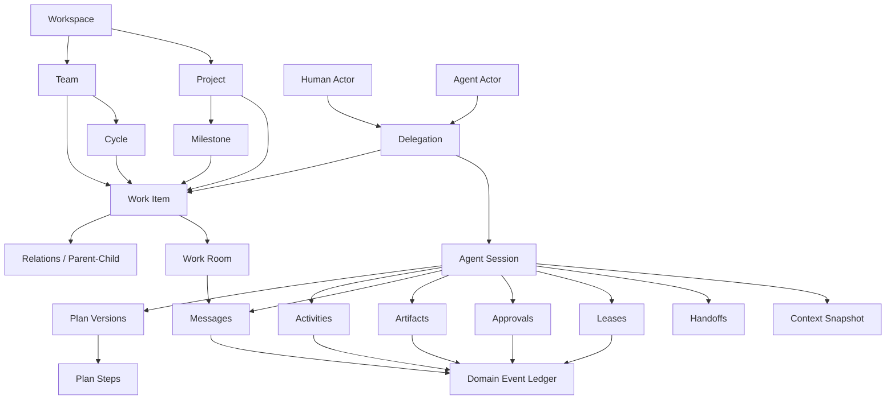
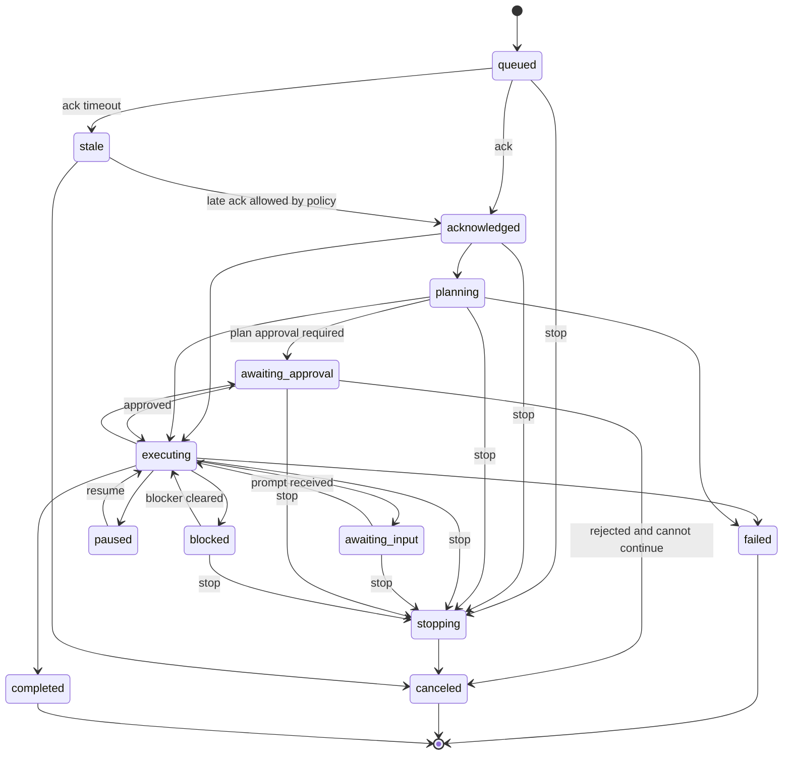
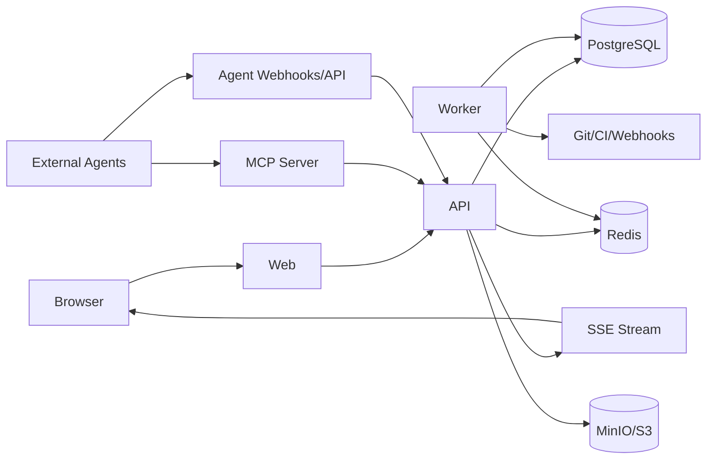

# WorkMesh 产品需求与技术实施规格

> 工作名：WorkMesh  
> 产品类型：自部署、面向个人/小团队的人类与 Coding Agent 协作平台  
> 文档版本：0.1  
> 研究与规格快照：2026-07-22  
> 目标状态：可直接用于分阶段 vibe coding

---

## 0. 如何阅读与执行本规格

本文既是 PRD，也是首版技术实施契约。编码时应遵循以下优先级：

1. **不变量与安全约束**高于页面细节。
2. **领域模型、状态机与 API 契约**高于具体组件库。
3. **阶段验收标准**高于“看起来已经做了很多”。
4. 当实现与文档冲突时，不要静默偏离；先记录 ADR，再同步修改本规格、Schema 与 OpenAPI。
5. 一次只实现一个阶段。阶段内优先打通完整垂直切片，不要同时铺开大量半成品模块。

本规格中使用 MUST、SHOULD、MAY 表示强制、推荐、可选要求。

---

# 1. 执行摘要

## 1.1 一句话定位

**WorkMesh 是一个把 Linear 式工作管理、Agent 执行控制面和多 Agent 协作协议合并为同一套工作图谱的自部署平台。**

它不只是“给 Issue 加一个 AI 按钮”，而是把人和 Agent 都作为系统中的原生 Actor，让双方共享：

- 当前工作项与优先级；
- 可版本化的执行计划；
- 实时工作状态；
- 操作和工具调用摘要；
- 阻塞、问题与审批请求；
- Agent 间消息、交接和任务认领；
- 代码、PR、测试报告等可验证产物；
- 可追溯的决策与审计事件。

## 1.2 核心问题

传统任务管理系统默认“人读卡片、人执行、人汇报”。Coding Agent 进入工作流后会产生新的系统性问题：

- Agent 的运行状态隐藏在终端、IDE 或供应商后台中；
- 人看得到 Issue 的“进行中”，却不知道 Agent 正在规划、执行、等待输入还是已经卡死；
- 多个 Agent 可能重复修改同一个任务或代码区域；
- Agent 间交接依赖自然语言复制，容易丢失上下文；
- 计划只存在于单次对话，无法多人共同审阅或接续；
- 工具调用、代码改动、测试证据和结果散落在不同系统；
- 人无法可靠地暂停、撤销、限权或审批高风险动作；
- Agent 被当作无责任边界的“虚拟员工”，导致所有权模糊。

WorkMesh 的核心解法是：

> **工作图谱负责“做什么、为什么”；Agent Session 控制面负责“谁在做、做到哪一步”；事件账本负责“发生了什么、依据是什么”。**

## 1.3 目标用户

首版聚焦：

- 个人开发者；
- 2–20 人的软件小团队；
- 同时使用 1–50 个 Agent 定义、少量并发 Session 的团队；
- 希望数据和凭据留在自有基础设施中的用户；
- 使用 Codex、Claude Code、OpenCode、自研 Agent 或其他可通过 HTTP/MCP/A2A 接入的 Agent。

## 1.4 核心差异化

相比普通 Linear 克隆，WorkMesh 必须原生提供：

1. **人类责任人 + Agent 委托**双重归属；
2. **Session 级状态机**，与 Issue 状态分离；
3. **版本化、可协作、可分配的 Agent Plan**；
4. **不可变的 Agent Activity / Tool Invocation 事件流**；
5. **Agent 间结构化消息与公开工作房间**；
6. **交接 Handoff**，携带上下文快照、产物与未决事项；
7. **任务/步骤租约 Lease**，降低重复执行和并发冲突；
8. **能力作用域 + 风险审批**；
9. **可停止、暂停、恢复、撤销授权的控制面**；
10. **MCP 优先、A2A 可适配、AGENTS.md 可导入**的开放协议层；
11. **自部署和数据可导出**；
12. **不保存隐藏思维链，只保存可审计的操作性说明、证据和结果**。

---

# 2. Linear 核心管理能力调研与取舍

## 2.1 Linear 的管理骨架

Linear 的概念模型可以概括为：

- **Workspace**：组织容器；
- **Team**：拥有自己的工作流、Issue 和 Cycle；
- **Issue**：日常工作的基本单元；
- **Workflow**：团队级、有序状态；
- **Cycle**：重复的短期计划周期；
- **Project**：围绕明确产出和完成目标组织 Issue；
- **Milestone**：项目内部阶段；
- **Initiative**：把多个项目连接到更高层目标；
- **View**：基于同一数据的筛选、分组和展示方式。

Linear 还通过优先级、估点、标签、父子任务、阻塞关系、评论、通知、模板、Triage、项目更新、项目健康度和进度图补全执行管理。

### 对 WorkMesh 的结论

这套骨架成熟、易理解，应该保留，但需要为小团队压缩复杂度：

- 默认只创建一个 Workspace；
- 初始只创建一个 Team，也允许后续增加；
- 固定少量状态类别，允许自定义显示名称；
- Initiative、复杂 SLA、企业权限放到后续；
- 核心数据结构从第一天支持 Project/Milestone，但首版 UI 可以较简；
- 所有对象都应能被人和 Agent 通过同一 API 读取和修改。

## 2.2 Linear 的 Agent 方向

Linear 当前把 Agent 当作平台中的原生参与者：

- Agent 具有可识别身份；
- 可以被 @mention、参与评论、项目和文档；
- Issue 保留人类 Assignee，同时增加 Agent Delegate；
- Agent 的一次任务由 Agent Session 表示；
- Session 通过 Activity 展示状态、动作、询问、结果和错误；
- Agent Plan 以 Session 级清单展示当前与后续步骤；
- 用户可以发送停止信号；
- Workspace/Team Guidance 为 Agent 提供工作约束；
- Coding Session 把代码修改、Diff 和 PR 带回工作上下文；
- Loops 把周期性或事件触发的 Agent 工作变为共享自动化。

### 对 WorkMesh 的结论

Linear 的方向证明“Agent 原生 Actor + Session + Activity + Plan”是正确起点，但 WorkMesh 应进一步补齐多 Agent 协作：

- Linear 式单 Delegate 扩展为**一个负责人、一个主执行 Agent、多个步骤级参与 Agent**；
- Plan 从可变清单升级为**有稳定步骤 ID、版本、依赖、负责人和验收条件的协作对象**；
- Activity 从展示层升级为**统一事件账本的一种语义化投影**；
- 新增 Agent 间**消息、交接、租约、审批、上下文快照、预算**；
- Agent 不应被要求暴露隐式或私有思维链；平台展示的是简洁理由、动作、工具调用、证据、风险和结果。

## 2.3 功能取舍矩阵

| Linear 能力 | WorkMesh 决策 | 首次出现阶段 | 备注 |
|---|---|---:|---|
| Workspace / Team | 保留并简化 | 0 | 单 Workspace 优先 |
| Issue / Status / Priority | 完整保留 | 0 | 核心工作单元 |
| Labels / Estimate / Due date | 保留 | 0/1 | Estimate 可选 |
| Parent/Sub-issue | 保留 | 1 | 可用于 Agent 拆分 |
| Blocked/Blocking/Related/Duplicate | 保留 | 1 | 形成工作图谱 |
| List / Board / Filters / Saved Views | 保留 | 0/1 | Timeline 后置 |
| Comments / Threads / Mentions | 保留 | 0 | 人类交流层 |
| Triage | 简化保留 | 1 | 支持规则与 Agent 初筛 |
| Projects | 保留 | 0 | 首版简化 Overview |
| Milestones | 保留 | 1 | 项目阶段 |
| Project updates / health | 保留并支持 Agent 草拟 | 3 | 可要求人审批 |
| Project graph / forecasting | 延后 | 4 | 先做基本统计 |
| Cycles | 保留 | 4 | 小团队可不启用 |
| Initiatives | 延后并简化 | 4 | 一到两层足够 |
| Templates | 保留 | 1 | Issue/Project/Agent Run |
| Notifications / Inbox | 保留 | 1 | 等待输入和审批优先 |
| GraphQL / Webhooks / SDK | 思路保留 | 0/1 | 首版 REST + SSE + Webhooks |
| MCP | 必须 | 1 | Agent 统一入口 |
| Agent identity / delegate | 必须 | 1 | 人类责任不转移 |
| Agent session / activity / plan | 必须并增强 | 1 |
| Coding sessions / diff / PR | 保留方向 | 3 | 通过 Git Provider |
| Loops / recurring agent work | 保留方向 | 4 |
| 企业 SSO/SCIM/SLA/客户管理 | 不做首版 | — | 非目标 |

## 2.4 研究参考标记

本文的 Linear 研究来自其官方 Concepts、Projects、Milestones、Initiatives、Project Updates、Views、Developers、Agents、Agent Interaction Guidelines、Agent Interaction、Coding Sessions 与 Loops 文档，快照日期为 2026-07-22。协议设计参考 MCP 官方规范、A2A 官方项目与 AGENTS.md 开放格式。

---

# 3. 产品目标、非目标与成功指标

## 3.1 产品目标

### G1. 共享工作真相

人和 Agent 在同一工作项、同一计划、同一事件时间线中工作，不依赖复制粘贴跨系统同步。

### G2. 可观察的 Agent 执行

任何活跃 Session 必须能回答：

- 谁在执行；
- 为哪个工作项执行；
- 当前状态；
- 当前计划步骤；
- 最近动作；
- 使用了什么工具；
- 产生了什么产物；
- 是否需要输入或审批；
- 是否仍有心跳；
- 如何暂停或停止。

### G3. 可靠的多 Agent 协作

多个 Agent 可以共同拆解、认领、讨论、交接和评审任务，并通过租约与状态版本控制降低冲突。

### G4. 人类可控与最终负责

关键决策、高风险动作和最终责任保持在人类侧。人可以随时介入、修正计划、撤销授权、停止 Session。

### G5. 易于自部署和迁移

单机 Docker Compose 可以启动；数据可备份、恢复和导出；Agent 接入不绑定单一供应商。

## 3.2 非目标

首版不做：

- 像素级复制 Linear 的视觉设计；
- 大企业多租户 SaaS 计费；
- SCIM、SAML、复杂组织架构；
- 移动原生 App；
- CRM、客户请求管理和高级 SLA；
- 在主应用容器内直接执行不受信任代码；
- 自研通用模型推理平台；
- 自动合并或生产部署默认开启；
- 保存模型原始隐藏思维链；
- 完整替代 GitHub/GitLab 的代码评审界面。

## 3.3 北极星指标

**可验证完成的 Agent 协作工作项数 / 周**

“可验证完成”要求：

- 工作项关联至少一个 Agent Session；
- 有公开计划或明确单步目标；
- 有完成产物或结果证据；
- 所需检查通过；
- 有人类责任人；
- Session 正常结束，而非失联。

## 3.4 运营指标

- Agent 首次确认延迟；
- 活跃 Session 心跳新鲜度；
- 等待输入/审批时长；
- 阻塞到解除时长；
- Agent Session 完成率、失败率、取消率；
- 计划步骤完成率；
- Handoff 接受率和成功率；
- 重复执行冲突率；
- 人工介入次数；
- PR 创建率、检查通过率和回退率；
- 每工作项 Agent 成本、Token、运行时长；
- Issue 从开始到完成的周期时间。

---

# 4. 产品原则与系统不变量

## 4.1 人类责任、Agent 委托

- 每个进入“已开始”类别的工作项 MUST 有一个 `responsible_human`。
- Agent 不替代责任人；Agent 通过 Delegation 承担执行、评审、研究或协调角色。
- 一个工作项同一时刻最多有一个主执行 Delegation。
- 多 Agent 并行通过 Plan Step、子工作项或 Review Delegation 表达。
- UI 必须明确区分人类与 Agent。

## 4.2 工作状态与执行状态分离

Issue 状态表达工作在团队流程中的位置；Session 状态表达某个 Agent Run 的实时状态。

示例：

- Issue = In Progress；
- Agent Session A = Awaiting Approval；
- Agent Session B = Reviewing；
- 人类仍可继续手工工作。

禁止把 Session 的 `failed` 自动等同于 Issue 的 `canceled`。

## 4.3 追加式事实、可变式投影

- Agent Activity、Domain Event、Plan Version、Approval Decision、Handoff 记录 MUST 追加写入。
- Issue、Project 等当前状态表是便于查询的投影。
- 每个写操作必须同时产生审计事件。
- 可编辑评论要保留修订记录。
- 管理员需要删除敏感内容时，使用“带墓碑的脱敏”，不静默抹去事件存在。

## 4.4 可解释不等于暴露隐藏思维链

平台 SHOULD 展示：

- 简洁的行动理由；
- 当前目标与计划；
- 工具名称和参数摘要；
- 证据来源；
- 结果摘要；
- 风险、假设与不确定性；
- 决策请求。

平台 MUST NOT 把“上传模型原始思维链”作为接入要求。Agent 可以保持内部状态私有，只需提供足够的操作性透明度和审计证据。

## 4.5 幂等、版本与因果关系

- 所有 Agent 写请求 MUST 支持 `Idempotency-Key`。
- Plan、Issue 等高冲突资源 MUST 支持 revision / ETag。
- 事件 MUST 包含 correlation ID 和可选 causation ID。
- Webhook 至少一次投递；消费者必须幂等。
- 同一 Session 的事件必须具有单调递增 sequence。

## 4.6 默认最小权限

- Agent 只获得安装时批准的团队、项目、仓库和能力作用域。
- Session Token 应是短期、窄作用域凭据。
- 高风险操作需要审批。
- 停止或撤销 Session 后，服务端必须拒绝其后续写操作，而不是只依赖 Agent 自觉停止。

## 4.7 工作上下文默认公开给相关人类

Agent 间的工作消息默认对有权限的项目/工作项成员可见。首版不提供隐藏于人类的 Agent 私聊。

---

# 5. 用户、Actor 与典型任务

## 5.1 Actor 类型

### Human

- Admin：自部署实例和 Workspace 管理；
- Maintainer：项目负责人、审批者；
- Member：创建和执行工作；
- Guest：只访问指定项目，可后置。

### Agent

- Coordinator：拆解计划、分配步骤、协调其他 Agent；
- Implementer：实现代码；
- Reviewer：评审代码、计划或结果；
- Researcher：调查问题、整理证据；
- Triage Agent：分类、去重、补充信息；
- Automation Agent：按事件或计划运行。

### Service

GitHub/GitLab、CI、Sentry 等集成也用 Actor 表示，但 UI 标记为 Service，而非 Agent。

## 5.2 关键 JTBD

1. “我创建一个 Bug，希望 Agent 先调查并尝试修复，我随时看到进度。”
2. “一个复杂功能要拆成前端、后端、测试三个步骤，让不同 Agent 并行，避免互相覆盖。”
3. “Agent 遇到架构决策，希望向人类提出结构化选择并暂停关键动作。”
4. “Agent A 做完调查，把完整上下文和证据交给 Agent B 实现。”
5. “Agent B 完成 PR，让 Reviewer Agent 检查，再由人类批准合并。”
6. “每天自动检查新 Issue、失败 CI 或依赖更新，并把结果放到共享 Inbox。”
7. “团队成员离开终端后，仍能在 Web 中继续给 Agent 指令或停止它。”
8. “我换掉某个 Agent 供应商，历史工作、计划和产物仍留在平台。”

---

# 6. 核心概念模型



## 6.1 概念层级

- **Workspace**：部署实例内的工作容器；
- **Team**：Issue 编号、工作流和可选 Cycle 的边界；
- **Project**：明确交付目标；
- **Milestone**：Project 内部阶段；
- **Work Item**：Issue/Task/Bug/Feature/Chore/Incident 的统一模型；
- **Delegation**：某 Agent 对某工作范围承担何种角色；
- **Agent Session**：一次有开始和结束的 Agent 执行；
- **Plan**：Session 或 Project 的可版本化执行计划；
- **Activity**：Agent 对用户可见的语义化进度事件；
- **Message**：人和 Agent 的显式沟通；
- **Lease**：对工作项或步骤的有期限认领；
- **Handoff**：结构化责任与上下文转移；
- **Artifact**：代码、Diff、PR、测试报告、文档等输出；
- **Context Snapshot**：Session 启动或重大变更时冻结的输入上下文清单；
- **Approval**：对特定动作和参数的授权；
- **Domain Event**：系统事实的统一不可变信封。

---

# 7. Linear 式工作管理需求

## 7.1 Workspace 与 Team

### 功能

- 首次安装向导创建 Admin、Workspace 和默认 Team；
- Team 有名称、Key、图标、描述；
- Work Item 标识符格式为 `{TEAM_KEY}-{SEQUENCE}`；
- Team 可配置 Issue 工作流、默认负责人、估点方式、自动归档；
- Team 成员角色：Admin、Maintainer、Member；
- Agent 安装可限制到一个或多个 Team；
- Workspace Guidance 与 Team Guidance 支持 Markdown。

### 验收

- Admin 可在 3 个页面步骤内完成初始化；
- 新建默认 Team 后可立即创建 `ENG-1`；
- Agent 访问未授权 Team 返回 403 并产生审计事件。

## 7.2 Work Item

### 必填字段

- identifier；
- title；
- team；
- status；
- creator；
- created_at；
- responsible_human：当进入 started 类别时必填。

### 可选字段

- description：Markdown / 富文本；
- type：issue/task/bug/feature/chore/incident；
- priority：none/low/medium/high/urgent；
- estimate；
- due_at；
- project；
- milestone；
- cycle；
- parent；
- labels；
- lead_agent；
- acceptance_criteria；
- required_checks；
- source；
- context_version；
- revision。

### 行为

- 快速创建；
- 编辑和软删除；
- 批量修改；
- 父子工作项；
- Relations：blocks、blocked_by、related、duplicate_of；
- Issue 完成时检查未完成子项和 blocker，提示但默认不强制；
- Duplicate 指向规范工作项；
- 支持从评论、Webhook、Agent、Git Provider 创建；
- Agent 创建的 Work Item 必须显示来源 Actor 和 Session。

## 7.3 Workflow

状态类别固定为：

- backlog；
- planned；
- started；
- completed；
- canceled。

每个 Team 可在类别内自定义状态，例如：

- Backlog；
- Ready；
- In Progress；
- In Review；
- Done；
- Canceled；
- Duplicate。

规则：

- 状态排序固定且可配置；
- 自动化规则可基于状态进入/离开触发；
- Work Item 进入 started 时，如无 responsible_human，则要求选择或使用项目负责人；
- Session 完成可建议移动状态，但不能未经策略允许直接关闭 Issue；
- 所有状态变化记录 Actor、旧值、新值和原因。

## 7.4 Project 与 Milestone

### Project 字段

- name；
- summary；
- description；
- status_category；
- status；
- lead_human；
- lead_agent，可选；
- teams；
- start_at；
- target_at；
- health：on_track/at_risk/off_track/unknown；
- labels；
- resources；
- revision。

### Project 页面

- Overview；
- Work Items；
- Milestones；
- Plan；
- Updates；
- Activity；
- Artifacts；
- 自定义 View 标签页。

### Milestone

- name、description、target_at、sort_order；
- Work Item 只能属于同一 Project 内的一个 Milestone；
- 显示完成数、总数、估点进度和阻塞数；
- 可由 Agent 提议调整，按策略要求审批。

## 7.5 Cycle 与 Initiative

这些能力放在后期，但 Schema 应预留。

### Cycle

- Team 级重复时间盒；
- 1–8 周可配置；
- 当前、下一、历史 Cycle；
- Work Item 可属于一个 Cycle；
- 不等同于发布版本。

### Initiative

- 汇总多个 Project；
- 支持一到两层父子关系即可；
- 有目标、负责人、状态、健康更新；
- 不先实现无限层级。

## 7.6 Views、筛选与展示

### List / Board

- 同一筛选条件可在 List 和 Board 间切换；
- Board 默认按 Status 分组；
- 支持按 Assignee、Agent、Priority、Project、Milestone、Cycle、Label、Session State 分组；
- 拖拽改状态；
- 列表支持键盘导航，但首版不追求完整快捷键体系。

### Saved View

View 保存：

- entity_type；
- filters JSON；
- grouping；
- ordering；
- visible fields；
- layout；
- scope：private/team/workspace；
- owner；
- favorite。

`filters` 采用严格 allowlist；未知 filter 必须返回稳定的 `VIEW_FILTER_UNSUPPORTED`，不得静默忽略。任何筛选、排序或展示 cost 的 View 必须指定单一 currency；Issue、Project、Session View 与 Initiative rollup 不得跨 currency 求和，而应返回或选择明确的 currency bucket。Stage 4 API 中所有 minor-unit 金额均使用 PostgreSQL bigint 范围内的规范十进制字符串；写入、筛选、预算比较及 rollup 不得经由 JavaScript `number`，避免超过 safe-integer 范围后静默舍入。

必须内置：

- My Work；
- Active；
- Backlog；
- Waiting for Me；
- Active Agents；
- Blocked；
- Needs Approval；
- Recently Completed。

## 7.7 Comments、Threads 与 Mention

- 人类和 Agent 都能评论；
- 评论支持 Markdown、附件、引用 Work Item/Project/Actor；
- 支持线程回复和 Resolve；
- 评论可编辑但记录 revision；
- Agent Activity 与 Comment 分离：Activity 是执行遥测，Comment 是讨论；
- @Agent 可创建或 Prompt 现有 Session；
- Agent 的所有外显身份必须带 Agent Badge。

## 7.8 Inbox 与 Notification

通知优先级：

1. 需要本人输入；
2. 需要本人审批；
3. Agent 失败或失联；
4. 被提及；
5. Handoff 请求；
6. Work Item/Project 常规更新。

通知渠道首版：

- 应用内 Inbox；
- 浏览器通知，可选；
- Webhook。

邮件、Slack/Discord 后置。

## 7.9 Triage 与模板

### Triage

- 外部创建或规则指定的 Work Item 进入 Triage；
- 可 Accept、Decline、Duplicate、Snooze；
- 规则可设置 Team、Status、Owner、Agent、Label、Project、Priority；
- Triage Agent 可以给出建议，但危险写操作受策略限制。

### Templates

- Work Item Template；
- Project Template；
- Agent Run Template；
- Handoff Template；
- Automation Template。

Agent Run Template 可预设：

- Agent 角色；
- Guidance；
- 所需能力；
- Plan 初始步骤；
- 审批策略；
- 预算；
- 必需产物与检查。

---

# 8. Agent 原生能力需求

## 8.1 Agent Registry

Agent 不是普通 API Key，而是具备声明、权限和运行限制的 Actor。

### Agent Definition 字段

- name、slug、description、icon；
- provider；
- version；
- endpoint / webhook URL；
- supported_protocols：native_http/mcp/a2a；
- skills；
- requested_capabilities；
- output_artifact_types；
- max_concurrency；
- heartbeat_interval；
- default_timeout；
- public_key 或 Webhook Secret；
- status：active/disabled/revoked；
- manifest JSON。

### Skill 示例

- `code.investigate`
- `code.implement`
- `code.review`
- `test.run`
- `docs.write`
- `issue.triage`
- `project.plan`
- `incident.analyze`

技能用于路由和 UI，不直接授予权限。权限由 Capability Scope 决定。

## 8.2 Capability Scope

建议首版能力：

- `work:read`
- `work:write`
- `comment:write`
- `plan:write`
- `message:write`
- `artifact:write`
- `repo:read`
- `repo:write_branch`
- `repo:open_pr`
- `repo:review`
- `repo:merge`
- `ci:run`
- `deploy:staging`
- `deploy:production`
- `secret:use`
- `automation:manage`
- `admin:*`

原则：

- 安装授权与 Session 授权取交集；
- Session Token 只允许当前工作范围；
- `repo:merge`、生产部署、密钥使用、破坏性操作默认需审批；
- Agent 不能为自己扩权；
- 撤销权限立即生效。

## 8.3 Delegation

Delegation 表示“谁代表谁、以什么角色、对什么范围执行”。

字段：

- principal_human；
- agent；
- role：executor/reviewer/researcher/coordinator/triager；
- scope_type：work_item/plan_step/project/automation；
- scope_id；
- permissions_snapshot；
- status；
- start_at/end_at；
- created_by；
- reason。

规则：

- Work Item 可有一个 Active Executor；
- 可有多个 Reviewer/Researcher；
- Plan Step 可各自委托不同 Agent；
- Agent 可创建子 Delegation，但必须受父 Session 权限和策略约束；
- 子 Delegation 在 UI 中形成 Session Tree；
- 人类可随时撤回。

## 8.4 Agent Session

### Session 状态

- `queued`
- `acknowledged`
- `planning`
- `executing`
- `awaiting_input`
- `awaiting_approval`
- `blocked`
- `paused`
- `stopping`
- `completed`
- `failed`
- `canceled`
- `stale`

### 状态机



### Session 字段

- id；
- workspace/team；
- agent；
- delegation；
- work_item/project/plan_step；
- parent_session；
- state；
- state_reason；
- sequence；
- started_at、last_heartbeat_at、ended_at；
- external_urls；
- prompt_context_snapshot_id；
- current_plan_version_id；
- budget；
- consumed_tokens/cost/runtime；
- revision；
- stop_requested_at；
- error_code/error_summary。

### 生命周期要求

- Agent 收到创建事件后 SHOULD 在 10 秒内 ACK；
- 超过配置阈值未 ACK 标记 Stale，并通知责任人；
- Agent MUST 定期 Heartbeat；
- 所有状态变更可见；
- `stop` 后服务端撤销写入能力，只允许提交最终停止确认和清理摘要；
- Session 可以被追加 Prompt；
- 完成必须包含 Result Summary 和至少一个证据或明确说明“无产物”。

## 8.5 Agent Plan

Plan 是 WorkMesh 的核心，不是简单 Todo 数组。

### Plan Version

- 每次发布形成不可变版本；
- 有 revision、author、created_at、change_summary；
- 一个 Session 只有一个 current version；
- 使用 `If-Match` 防止并发覆盖；
- UI 显示版本 Diff。

### Plan Step

- stable_step_id：跨版本保持；
- title；
- description；
- status：pending/in_progress/blocked/completed/canceled；
- owner_actor；
- dependencies；
- acceptance_criteria；
- expected_artifacts；
- required_capabilities；
- estimate；
- risk；
- blocked_reason；
- started_at/completed_at；
- ordinal。

### 计划规则

- 步骤必须是外部可验证的工作，不写隐式思维过程；
- Agent 可修改计划，但必须提供 change_summary；
- 删除已开始步骤应转为 canceled，而非从历史中消失；
- Step 可由人或 Agent 认领；
- 有依赖未完成时，默认不可开始；
- 重大计划变更可触发审批；
- Project Plan 可引用 Work Item，Session Plan 可引用 Project Plan Step；
- Plan 进度不自动等于 Issue 进度，但可作为建议和可视化来源。

### 示例

```json
{
  "revision": 4,
  "changeSummary": "调查后确认需要先修复 API schema，再调整前端",
  "steps": [
    {
      "id": "step_api_schema",
      "title": "修复 API 返回 schema",
      "status": "in_progress",
      "ownerActorId": "agent_backend",
      "dependsOn": [],
      "acceptanceCriteria": [
        "契约测试通过",
        "旧客户端兼容"
      ],
      "expectedArtifacts": ["commit", "test_report"]
    },
    {
      "id": "step_ui",
      "title": "更新前端解析逻辑",
      "status": "pending",
      "ownerActorId": "agent_frontend",
      "dependsOn": ["step_api_schema"],
      "acceptanceCriteria": ["E2E 测试通过"],
      "expectedArtifacts": ["pull_request"]
    }
  ]
}
```

## 8.6 Agent Activity

Activity 是 Session 的语义化进度流，追加写入。

### Activity Kind

- `ack`
- `status`
- `plan_published`
- `plan_changed`
- `action_started`
- `action_completed`
- `evidence`
- `question`
- `decision_request`
- `message`
- `artifact_published`
- `handoff_requested`
- `handoff_accepted`
- `warning`
- `error`
- `completion`
- `heartbeat`

### 字段

- session_id；
- sequence；
- kind；
- summary；
- details Markdown，可选；
- tool_invocation_id，可选；
- artifact_ids；
- references；
- visibility；
- ephemeral；
- occurred_at；
- actor；
- correlation_id；
- payload JSON。

### 行为

- Activity 不允许普通编辑；
- 临时状态可标记 ephemeral，并被后续状态折叠；
- Activity 时间线支持按 kind 筛选；
- 对用户默认展示摘要，展开查看结构化细节；
- 心跳不淹没时间线，只在诊断视图可见；
- Error 必须含可行动的错误摘要，不暴露 Secret。

## 8.7 Tool Invocation

每次关键工具调用可记录：

- tool name；
- sanitized input；
- started_at/ended_at；
- status；
- result summary；
- external trace URL；
- approval；
- cost/tokens；
- retry count；
- produced artifacts；
- error。

对于包含密码、Token、个人数据的字段，必须在写入前脱敏。

## 8.8 Signal 与人工控制

支持：

- stop；
- pause；
- resume；
- retry；
- request_status；
- revoke_lease；
- revoke_delegation；
- lower_budget；
- grant_temporary_scope。

### Stop 语义

- 立即把 Session 置为 stopping；
- 撤销 Session 的写能力；
- 发送高优先级事件给 Agent；
- Agent 只可提交 `stopped` 清理确认；
- 超时后强制 canceled；
- 不自动回滚外部世界，需要在 UI 明确展示可能残留的分支、进程和产物。

---

# 9. 多 Agent 协作平台需求

## 9.1 Work Room

每个 Work Item 和 Project 有一个公开 Work Room。

内容合并展示：

- 人类评论；
- Agent 消息；
- Session 状态；
- Plan 变化；
- Handoff；
- Approval；
- Artifact；
- 关键领域事件。

视图提供：

- Conversation；
- Plan；
- Activity；
- Artifacts；
- Decisions；
- Sessions。

## 9.2 Typed Message

消息不仅有正文，还必须有意图。

### Intent

- `inform`
- `ask`
- `answer`
- `propose`
- `decide`
- `claim`
- `handoff`
- `blocker`
- `review_request`
- `review_result`
- `status`

### 字段

- channel_id；
- sender_actor；
- recipient_actor_ids；
- intent；
- body；
- reply_to；
- thread_id；
- references；
- structured_payload；
- requires_response；
- due_at；
- created_at。

### 规则

- Agent 发给 Agent 的消息默认在 Work Room 可见；
- `ask` / `review_request` 可产生 Inbox 项；
- `requires_response` 必须有 open/resolved 状态；
- 决策应被提升为 Decision 记录；
- Agent 不得用大量无意义状态消息淹没频道；心跳走 Activity。

## 9.3 Handoff

Handoff 是显式的工作交接协议，而不是一条“你接着做”的评论。

### 必填内容

- source session / actor；
- target agent 或候选技能；
- scope；
- summary；
- completed work；
- remaining work；
- context snapshot；
- artifacts；
- open questions；
- risks；
- acceptance criteria；
- requested action；
- lease transfer policy。

### 状态

- draft；
- requested；
- accepted；
- rejected；
- canceled；
- completed。

### 原子行为

接受 Handoff 时：

1. 校验目标 Agent 权限与并发额度；
2. 创建 Delegation；
3. 创建子 Session；
4. 转移或创建 Lease；
5. 冻结 Handoff Context Snapshot；
6. 写入事件；
7. 通知责任人。

任一步失败则整体回滚。

## 9.4 Lease / Claim

Lease 是协作协调机制，不是安全授权。

### 可租约资源

- Work Item；
- Plan Step；
- Repository Path，可后置；
- Artifact Review。

### 字段

- resource_type/resource_id；
- holder_session；
- status；
- acquired_at；
- expires_at；
- heartbeat_at；
- version；
- metadata。

### 规则

- 同一独占资源只允许一个 active Lease；
- Agent 需周期续租；
- Session stale/stop/cancel 后自动过期；
- 人类可强制释放；
- 冲突返回 409，并包含当前 holder 与过期时间；
- 支持 shared review Lease；
- 租约不能越过 Capability Scope。

## 9.5 协作计划与并行

Coordinator Agent 可以：

- 创建或修改 Plan；
- 为 Step 推荐 Agent；
- 发起子 Delegation；
- 监控状态；
- 请求 Reviewer；
- 整合产物。

但必须满足：

- 不得自行扩大父 Session 权限；
- 不得无限递归创建 Session；
- `max_child_sessions` 和总预算受限；
- 每个子 Session 关联具体 Step；
- 父 Session 完成前检查所有必需子 Session 终态；
- 人类能展开查看 Session Tree。

## 9.6 决策记录

Decision 是 Work Room 中的可引用对象：

- question；
- options；
- decision；
- rationale summary；
- decided_by；
- decided_at；
- affected plan/work items；
- supersedes；
- status。

Agent 可以提出决策，不得伪装成人类做最终决策。策略允许的低风险技术选择可由 Agent 决定，并明确标记。

---

# 10. Context、Guidance 与知识边界

## 10.1 Guidance 层级

从宽到窄：

1. Workspace Guidance；
2. Team Guidance；
3. Project Guidance；
4. Repository Guidance；
5. Work Item Guidance；
6. Session Prompt；
7. Human 追加 Prompt。

合并规则：

- 后层可以覆盖明确标记为 override 的配置；
- 普通 Markdown 默认追加；
- 系统生成最终 Context Manifest，显示来源；
- 任何 Guidance 修改都产生版本。

## 10.2 AGENTS.md

Repository Integration SHOULD：

- 发现根目录和子目录 `AGENTS.md`；
- 按目标文件路径计算适用范围；
- 提取 setup、test、style、security、review 等章节；
- 在 Context Snapshot 中记录文件路径、commit SHA 和 hash；
- 不把仓库中的指令自动提升为平台权限；
- 与平台 Guidance 冲突时，平台安全策略优先。

## 10.3 Context Snapshot

Session 创建时生成不可变 Snapshot：

- Work Item 标题、描述、验收条件；
- 相关评论和 Decision；
- Parent/Sub-issue 与 Blocker；
- Project/Milestone 目标；
- 当前 Plan；
- Guidance 合并结果；
- Repository、base branch、commit；
- 选定文件/文档；
- 权限和预算；
- 来源清单、版本和 hash；
- 截断说明。

Agent 后续请求更多 Context 时：

- 记录请求原因；
- 校验权限；
- 生成 Context Delta；
- 形成新 Snapshot 或挂接 Delta；
- UI 可查看“Agent 当时看到了什么”。

## 10.4 Context 安全

- Secret 以引用方式提供，不放入持久化 Prompt；
- 工具负责 Secret 注入；
- Context 访问记录审计；
- 跨 Team/Project 数据默认隔离；
- 外部链接需 SSRF 防护；
- 支持敏感字段脱敏；
- 用户删除权限变更后，活跃 Session 立即重新校验。

---

# 11. Artifact、Git 与 Coding Agent 闭环

## 11.1 Artifact

支持类型：

- note；
- document；
- patch；
- diff；
- branch；
- commit；
- pull_request；
- code_review；
- test_report；
- build_report；
- log；
- screenshot；
- preview_url；
- external_link。

字段：

- title；
- type；
- uri/storage_key；
- mime_type；
- checksum；
- size；
- producer_session；
- source_tool；
- repository/ref/sha；
- metadata；
- review_status；
- created_at。

## 11.2 Git Provider

首个 Provider 建议 GitHub，抽象层必须能扩展 GitLab/Gitea。

### 必须能力

- 安装 App / OAuth；
- 映射 Project/Team 到 Repository；
- 接收 Push、PR、Review、Check Webhook；
- Work Item 与 Branch/Commit/PR 双向关联；
- 展示 Diff 摘要、检查状态和 Review；
- Agent 可创建 Branch、提交、打开 PR；
- 默认禁止自动 Merge；
- PR 合并后可建议完成 Work Item；
- 外部事件以 Service Actor 进入事件账本。

### Branch 命名

默认：

`{team-key}-{issue-number}/{slug}`

例如：

`eng-42/fix-session-stop-race`

## 11.3 验证证据

Agent 完成代码类 Session 时，至少提供：

- Commit 或 PR；
- 运行的测试命令；
- 测试结果；
- 未运行检查及原因；
- 风险/限制；
- 变更摘要。

平台不应只接受“完成了”这一自然语言声明。

---

# 12. Approval、风险与预算

## 12.1 Approval

Approval 绑定“具体动作 + 参数 hash”，不能给空泛永久授权。

类型：

- approve_plan；
- grant_scope；
- run_destructive_command；
- use_secret；
- open_external_connection；
- merge_pr；
- deploy_staging；
- deploy_production；
- modify_milestone；
- close_high_priority_issue；
- exceed_budget。

状态：

- pending；
- approved；
- rejected；
- expired；
- canceled；
- consumed。

规则：

- 批准后若动作参数变化，批准失效；
- 审批人必须有相应权限；
- 可设置单人或多人审批；
- Agent 在 awaiting_approval 状态停止相关动作，但可以执行不冲突的低风险步骤；
- 审批结果写入事件和 Inbox；
- 默认过期。

## 12.2 风险级别

- Low：读取、评论、更新计划、创建分支；
- Medium：修改 Issue、写代码、启动 CI、打开 PR；
- High：使用 Secret、破坏性命令、合并、部署、访问敏感数据。

策略可以按 Agent、Team、Repository、环境覆盖。

## 12.3 Budget

Session Budget：

- 最大运行时间；
- 最大 Token；
- 最大金额；
- 最大工具调用；
- 最大子 Session；
- 最大重试；
- Deadline。

达到软阈值：

- Warning；
- 请求追加预算；
- 可继续到安全停止点。

达到硬阈值：

- 暂停或停止；
- 禁止新高成本调用；
- 通知责任人。

---

# 13. Automation 与 Loops

放在阶段 4，但事件模型从阶段 0 支持。

## 13.1 Trigger

- schedule；
- work_item.created；
- work_item.updated；
- status.changed；
- comment.mentioned；
- pr.failed_checks；
- session.failed；
- session.stale；
- approval.timeout；
- webhook.received。

Rule/Loop 写入与激活只接受有界的五字段 UTC cron。旧数据若无法解析，调度器必须隔离并暂停该行，不得阻塞其他合法 schedule。

## 13.2 Condition

JSON 条件树：

- Team；
- Project；
- Label；
- Priority；
- Actor；
- Source；
- Session State；
- 时间窗口；
- 字段比较。

## 13.3 Action

- 修改 Work Item；
- 添加标签；
- 创建 Work Item；
- Delegate Agent；
- 启动 Session；
- 发送消息；
- 请求审批；
- 创建 Project Update；
- 调用 Webhook。

## 13.4 Loop

Loop 是带共享可见性的重复 Agent 工作：

- 有 owner；
- 有 trigger；
- 有 Agent/Run Template；
- 有 scope；
- 有预算；
- 有最近运行和下次运行；
- 每次生成 Automation Run 和可审计 Session；
- 可以暂停；
- 不允许静默无限失败重试。

`noOverlap=true` 只约束该次 admission 的 active run；`noOverlap=false` 明确允许并行运行。手动 dry-run/trigger/run 必须证明调用者的 Team 权限，后台 scheduler 使用独立的 trusted-worker admission。每个 effect 在执行前重新验证 owner、Team membership、Session/Delegation/Agent grant、Capability、Resource Scope、Approval 与 pause/revoke 状态。

Webhook effect 必须在事务内先写 durable intent，执行时重新解析 DNS，拒绝 private 与 IPv4-mapped IPv6 地址，固定验证后的 IP 且保留 TLS hostname/SNI，并限制 redirect、timeout 与 response body。远端成功后本地 ACK 前崩溃时标记 `uncertain`，不得自动重复。

---

# 14. 信息架构与页面需求

## 14.1 全局导航

左侧栏：

- Inbox；
- My Work；
- Projects；
- Views；
- Agents；
- Automations；
- Search；
- Team 区域；
- Settings。

## 14.2 首页 / Command Center

必须显示：

- Waiting for Me；
- Active Agent Sessions；
- Blocked / Stale；
- Needs Approval；
- My Active Work；
- Recently Completed；
- Project Health。

核心卡片字段：

- Work Item；
- Agent；
- Session State；
- 当前 Plan Step；
- 最近 Activity；
- 心跳时间；
- 预算；
- 快捷操作：Open、Prompt、Pause、Stop。

## 14.3 Work Item 页面

```text
┌──────────────────────────────────────────────────────────────┐
│ ENG-42  Fix session stop race          [In Progress] [High]  │
│ Human owner: Alice    Lead agent: Coder-1    Project: Core   │
├───────────────────────────────────────┬──────────────────────┤
│ Description / Acceptance Criteria     │ Agent Session         │
│                                      │ ● executing           │
│ Tabs:                                │ Current: run tests     │
│ [Conversation] [Plan] [Activity]      │ Heartbeat: 8s ago     │
│ [Artifacts] [Decisions]               │ Budget: 42%           │
│                                      │ [Prompt] [Pause][Stop]│
├───────────────────────────────────────┴──────────────────────┤
│ Composer: comment / @agent / attach / request review         │
└──────────────────────────────────────────────────────────────┘
```

### Plan Tab

- 版本号和作者；
- Step 列表；
- Owner；
- Dependency；
- Status；
- Acceptance Criteria；
- Artifact；
- 评论；
- Compare Versions；
- Edit / Propose Change；
- Claim / Release。

### Activity Tab

- 合并时间线；
- 按 Session/Actor/Kind 过滤；
- 默认折叠 Heartbeat；
- Tool Invocation 可展开；
- Event 原始 JSON 仅 Admin/诊断视图可见。

## 14.4 Agent Control Center

页面：

- Agents；
- Sessions；
- Skills；
- Permissions；
- Costs；
- Diagnostics。

Session 表格：

- state；
- issue/project；
- agent；
- human owner；
- current step；
- age；
- heartbeat；
- budget；
- parent session；
- controls。

## 14.5 Collaboration Room

适用于 Project 或复杂 Work Item：

- 左：Plan Tree；
- 中：Conversation / Agent Messages；
- 右：Active Sessions、Leases、Approvals；
- 底部：Artifact Shelf。

## 14.6 Approval Inbox

每条审批展示：

- 请求 Agent；
- 关联工作；
- 动作；
- 参数 Diff；
- 风险；
- 依据；
- 过期时间；
- Approve Once；
- Reject；
- Comment；
- 修改范围后批准。

## 14.7 Responsive

- 桌面优先；
- 移动 Web 至少支持 Inbox、查看 Session、Prompt、Approve、Stop；
- Board 在窄屏可横向滚动；
- 不做原生移动 App。

---

# 15. 端到端工作流

## 15.1 单 Agent 修复 Bug

1. 人创建 Bug，填写验收条件；
2. 选择责任人和 Implementer Agent；
3. 系统创建 Delegation、Session、Context Snapshot；
4. Agent ACK，发布 Plan；
5. 若策略要求，人批准 Plan；
6. Agent 认领步骤并执行；
7. Activity 实时显示工具调用摘要；
8. Agent 发布 Commit、测试报告、PR；
9. 系统接收 CI 状态；
10. Agent 完成 Session；
11. 人 Review/Merge；
12. Work Item 建议移动到 Done。

### 验收

- 全流程无需用户进入 Agent 供应商后台；
- Stop 在任意执行阶段有效；
- 历史上下文、计划和产物可追溯。

## 15.2 多 Agent 并行实现

1. Coordinator 创建 Plan：API、UI、Tests；
2. 三个 Step 分别委托 Agent；
3. 每个子 Agent 创建子 Session 和 Step Lease；
4. Agent 通过 Work Room 询问；
5. API Step 完成，产生 schema Artifact；
6. UI Agent 收到依赖完成事件；
7. Reviewer Agent 对组合 PR 评审；
8. Coordinator 汇总结果；
9. 人类最终批准。

### 验收

- 同一 Step 不会被两个 Agent 同时独占；
- Session Tree 可见；
- Handoff 与消息可定位到 Step；
- 任一子 Session 失败不会把整个 Issue 静默标成 Done。

## 15.3 结构化 Handoff

1. Research Agent 完成根因分析；
2. 创建 Handoff 给 Implementer；
3. Handoff 包含 Context Snapshot、证据、建议修复和风险；
4. Implementer 接受；
5. 系统原子创建 Delegation/Session/Lease；
6. Implementer 能复现调查结论；
7. Handoff 完成。

## 15.4 人类打断

1. 人在 Activity 中发现 Agent 走错方向；
2. 点击 Pause；
3. Agent 写操作被服务端拒绝；
4. 人修改 Plan 并追加 Prompt；
5. 点击 Resume；
6. Agent 从新 Plan Revision 继续；
7. 所有变化保留。

## 15.5 自动 Triage Loop

1. 每 15 分钟检查新 Triage 项；
2. Triage Agent 去重、分类、收集必要信息；
3. 低风险字段可自动填写；
4. 疑似高优先级或不确定项请求人确认；
5. 必要时委托 Research Agent；
6. 每次运行在 Automations 中可查看。

---

# 16. 领域数据模型

## 16.1 Actor 模型

统一 `actors` 表：

- human；
- agent；
- service。

业务表引用 Actor ID，可统一审计。Human 登录信息与 Agent Manifest 放在扩展表中。

## 16.2 主要聚合

### Work Aggregate

- workspace；
- team；
- workflow_state；
- project；
- milestone；
- cycle；
- work_item；
- relation；
- label；
- view。

### Collaboration Aggregate

- thread；
- message；
- decision；
- subscription；
- notification。

### Agent Execution Aggregate

- agent_definition；
- delegation；
- agent_session；
- plan_version；
- plan_step；
- agent_activity；
- tool_invocation；
- lease；
- handoff；
- context_snapshot；
- artifact；
- approval。

### Platform Aggregate

- domain_event；
- outbox_event；
- webhook_endpoint；
- automation_rule；
- automation_run；
- audit_log。

## 16.3 Event Ledger

事件信封：

```json
{
  "id": "evt_01...",
  "type": "agent.plan.step.completed",
  "version": 1,
  "workspaceId": "ws_...",
  "aggregate": {
    "type": "agent_session",
    "id": "ses_...",
    "revision": 18
  },
  "actor": {
    "id": "act_...",
    "kind": "agent"
  },
  "subject": {
    "type": "plan_step",
    "id": "step_..."
  },
  "correlationId": "cor_...",
  "causationId": "evt_previous",
  "sessionId": "ses_...",
  "sequence": 37,
  "occurredAt": "2026-07-22T18:30:00Z",
  "payload": {},
  "visibility": "team"
}
```

## 16.4 事务模式

每个命令在一个 PostgreSQL 事务中：

1. 校验身份、权限、Session、Lease、revision；
2. 更新当前状态表；
3. 插入 Domain Event；
4. 插入 Outbox Event；
5. 提交；
6. Worker 投递 Webhook、SSE 和通知；
7. 标记 Outbox delivered，失败重试。

不得在提交数据库前向外部系统发送不可逆请求。

---

# 17. API 与协议要求

完整骨架见 `OPENAPI.yaml` 与 `AGENT_PROTOCOL.md`。

## 17.1 API 风格

首版：

- REST JSON；
- OpenAPI 3.1；
- SSE 实时流；
- Webhook；
- MCP Server；
- TypeScript SDK。

后续：

- GraphQL 只在复杂跨实体查询确有价值时增加；
- A2A Adapter；
- WebSocket Presence。

## 17.2 统一请求要求

写请求 Header：

- `Authorization: Bearer ...`
- `Idempotency-Key: ...`
- `X-Correlation-Id: ...`
- `If-Match: "<revision>"`，适用时。

错误格式：

```json
{
  "error": {
    "code": "LEASE_CONFLICT",
    "message": "Plan step is leased by another session",
    "details": {
      "holderSessionId": "ses_123",
      "expiresAt": "2026-07-22T18:40:00Z"
    },
    "correlationId": "cor_123"
  }
}
```

## 17.3 核心端点

### Work

- `GET/POST /api/v1/work-items`
- `GET/PATCH/DELETE /api/v1/work-items/{id}`
- `POST /work-items/{id}/relations`
- `POST /work-items/{id}/delegations`
- `GET/POST /projects`
- `GET/POST /projects/{id}/milestones`
- `GET/POST /views`

### Agent

- `POST /agents/register`
- `PATCH /agents/{id}`
- `POST /agent-sessions`
- `GET /agent-sessions/{id}`
- `POST /agent-sessions/{id}/ack`
- `POST /agent-sessions/{id}/heartbeat`
- `POST /agent-sessions/{id}/activities`
- `PUT /agent-sessions/{id}/plan`
- `POST /agent-sessions/{id}/signals`
- `POST /agent-sessions/{id}/complete`
- `POST /agent-sessions/{id}/fail`

### Collaboration

- `POST /messages`
- `POST /leases`
- `POST /leases/{id}/renew`
- `DELETE /leases/{id}`
- `POST /handoffs`
- `POST /handoffs/{id}/accept`
- `POST /approvals`
- `POST /approvals/{id}/decide`
- `POST /artifacts`

### Events

- `GET /events?cursor=...`
- `GET /events/stream?cursor=...`
- `POST /webhooks/agents/{agentId}`
- `POST /webhooks/git/{provider}`

## 17.4 MCP

MCP Server 应提供：

### Resources

- `workmesh://workspace/{id}/guidance`
- `workmesh://team/{id}/guidance`
- `workmesh://project/{id}`
- `workmesh://work-item/{id}`
- `workmesh://session/{id}/context`
- `workmesh://session/{id}/plan`
- `workmesh://session/{id}/activity`
- `workmesh://agent/{id}/manifest`

### Tools

- `list_work_items`
- `list_session_activities`
- `get_work_item`
- `create_work_item`
- `update_work_item`
- `delegate_work`
- `create_agent_session`
- `ack_agent_session`
- `get_session_context`
- `publish_plan`
- `update_plan_step`
- `append_activity`
- `send_message`
- `claim_resource`
- `renew_lease`
- `release_resource`
- `create_handoff`
- `accept_handoff`
- `request_approval`
- `publish_artifact`
- `complete_session`
- `fail_session`

工具返回结构化错误，不仅返回自然语言。

## 17.5 A2A

Stage 4 Adapter 映射：

- Agent Card → Agent Manifest；
- A2A Task → Agent Session；
- A2A Message → Typed Message / Prompt Activity；
- A2A Artifact → WorkMesh Artifact；
- Task Status → Session State；
- Streaming → SSE / Webhook。

WorkMesh 内部领域模型不得依赖某一 A2A 版本；Adapter 负责转换。

Stage 4 首个实现固定在 A2A `0.3` 的隔离包中。协议 Binding 必须持久化精确版本；授权回调必须先于 Task 映射、Context 构造和 Session 创建。只有同时证明发起人 Team Membership、Agent Team Access、Capability 与 Work Item Scope 后，外部 Task 才能创建真实 Session。Envelope/State/Message/Part/Artifact 必须严格验证；Task ID 在 Task Envelope 与 Event 路径中统一限制为 500 字符，Delivery ID 幂等且 inbound sequence 单调递增。后续 Delivery 必须在一个事务内将状态、增量 Prompt/Artifact、Domain Event 与 Outbox 应用到同一 Session，且状态变化受 Session 状态机约束。Inbound sequence 与 outbound Domain Event cursor 是独立域；stream 按已扫描的原始 cursor 分页推进，即使本页没有映射结果，cursor 也不得停滞或用 JavaScript number 丢失精度。Prompt、Artifact、Task/Session 映射与 outbound delivery 必须持久化，读取 stream 时重新验证授权。未知版本、状态或不支持的能力返回稳定结构化错误，不能静默套用其他版本语义。

---

# 18. 技术架构与自部署

## 18.1 推荐技术栈

### Monorepo

- pnpm；
- Turborepo；
- TypeScript strict。

### Web

- Next.js App Router；
- React；
- Tailwind CSS；
- shadcn/ui；
- TanStack Query；
- TanStack Table；
- TipTap；
- Mermaid 仅用于文档/可视化，可换自研图组件。

### API

- Fastify；
- Zod；
- OpenAPI；
- 独立于 Web 进程，便于 Webhook、SSE 和扩容。

### Data

- PostgreSQL；
- Drizzle ORM；
- PostgreSQL Full Text Search + `pg_trgm`；
- Redis；
- BullMQ；
- S3 Compatible Storage，默认 MinIO。

### Observability

- OpenTelemetry；
- Structured JSON Logs；
- Prometheus Metrics，可选；
- Sentry-compatible error export，可选。

### Test

- Vitest；
- Playwright；
- Testcontainers；
- API contract tests。

## 18.2 Repository 结构

```text
apps/
  web/
  api/
  worker/
  mcp/
packages/
  db/
  contracts/
  domain/
  agent-sdk/
  ui/
  config/
  observability/
infra/
  docker/
  migrations/
docs/
  adr/
  product/
```

## 18.3 Runtime



## 18.4 首版部署拓扑

Docker Compose 服务：

- web；
- api；
- worker；
- mcp，可与 api 合并但代码模块独立；
- postgres；
- redis；
- minio；
- reverse proxy，可选。

要求：

- 一个 `.env`；
- Health Check；
- 初始化迁移命令；
- Seed 命令；
- Admin 创建命令；
- Backup / Restore 脚本；
- Volume 明确；
- 版本升级文档；
- 所有服务无外部 SaaS 也可运行，外部 Agent/Git 集成除外。

## 18.5 搜索

首版 PostgreSQL：

- title/description/comment 的 FTS；
- identifier 精确搜索；
- trigram 模糊搜索；
- 权限过滤在查询层完成；
- Agent Activity 只索引 summary/details 的脱敏版本。

## 18.6 Realtime

首版使用 SSE：

- PostgreSQL `domain_events.cursor` 是唯一 durable cursor，按 canonical
  decimal string 传输和比较，不能经由 JavaScript `number`；集合分页、
  Session sequence 和 A2A cursor 是彼此独立的游标域；
- 每个 API 实例只有一个 realtime coordinator。Redis Stream 只发送允许
  丢失/重复的 wake hint，不使用 consumer group，也不承担 durable replay。
  hint 仅包含 `workspaceId` 与 decimal `cursor`，不得包含 topic、payload 或
  audience/resource metadata，并以有界 `WORKMESH_REALTIME_REDIS_MAXLEN`
  approximate `MAXLEN` 裁剪；
- coordinator 在启动、Redis wake 和低频健康对账时按活跃 Workspace 批量
  查询 PostgreSQL；Redis 不可用时切换到一个共享且有界的降级对账循环，
  禁止每个浏览器连接单独轮询；
- 断线后以 `Last-Event-ID` 或 query cursor 从 PostgreSQL 补发；每一批投递
  都重新验证 Human membership 或 Agent token、active Session、Delegation、
  Capability 与 Resource Scope，Lease 不能授予读取权限，撤权立即停止后续投递；
- Human 的 multi-Team Event 在最终 SQL 中按 normalized Team resource 求并集：
  非 Admin 必须仍属于至少一个精确 Team，Initiative Owner 通过持久化 Owner
  关系单独验证；显式 recipient 只对目标 Actor 可见。只有不含任何非 Workspace
  resource 的 Event 才能 Workspace-wide，`team_id IS NULL` 不代表 Workspace
  audience，无法证明资源的历史 Event 对普通成员 fail closed；
- Human Session、个人 saved view（即使带可选 `teamId`）、private advanced
  view、notification 和 notification preference 必须由 producer 写入精确
  recipient，并由 durable owner/recipient 关系复核；无法证明的当前或历史
  private form 对普通成员和 Workspace Admin 都 fail closed；
- v2 envelope 保留兼容字段，并增加 typed `audience`、`scopes` 和
  `invalidates`。资源词汇固定为 workspace/team/project/work_item/session/
  room/artifact/delivery，写事件的同一数据库事务维护标准化资源关系；
  `team_id` 为空但含非 Workspace scopes 的 multi-resource/multi-Team Event
  使用 `audience.visibility=resource`，不得错误标记为 Workspace；
- 事件页、连接数和 socket backpressure wait 都有硬上限；慢客户端关闭，
  心跳不触发数据库读取；
- `event_retention_state.pruned_through_cursor` 是显式保留水位。本阶段不执行
  prune；Issue #9 增加 archive-only 默认的保留作业，只有显式 kill switch
  才允许按 Workspace prune。低于水位的 REST 请求返回 `CURSOR_EXPIRED` 409，已连接流发送
  `cursor.expired` control event 后关闭；
- 普通事件在线保留至少 90 天、归档至少 365 天。归档采用 cursor 排序的
  canonical NDJSON gzip，并在 upload 后 readback 校验 object SHA-256 与 DB
  snapshot digest。归档 bucket 必须在创建时启用 Object Lock；每个归档对象
  使用 `COMPLIANCE` 模式和至少 365 天 retain-until，Worker 在计划归档前和
  readback 时 fail closed 校验保护。segment 的 start/end cursor 仅是 envelope；
  只有 pinned-object readback 后与 verified 状态原子写入的 per-event exact
  membership 才表示归档覆盖，job watermark 只是最高已归档 cursor 的单调
  telemetry。prune 按 Workspace 在线 cursor 前缀推进，遇到未归档或未到
  cutoff 的首个事件即停止；cleanup 同样只信已 floored 的 exact member。
  未投递事件不阻止后续合格事件归档，但会阻止 floor 越过它。未知、受保护、A2A 引用、Agent webhook
  引用、未投递 outbox、审计和恢复事实保留在 PostgreSQL；Agent webhook
  delivery reference 是持久协议事实，不进入通用 30 天 cleanup；
- 稳态 Session/Lease Heartbeat 只更新当前 projection，不增加 workflow
  revision、Session sequence、Activity、Domain Event 或 Outbox。只有
  healthy/degraded/stale health transition 在行锁下发出一次事件；Heartbeat
  不恢复 stale、stopping 或 terminal Session 的权限或状态。每个
  Session/Lease 使用固定大小的最近 idempotency key 窗口；K1、K2、重试 K1
  返回当前 projection 而不回退 K2，同 key 不同 body 冲突，usage counter
  只单调增加；
- 保留调度与 outbox 调度独立；归档卡住或失败可使 Worker readiness 在进度
  deadline 后失败，但不能停止 outbox admission/delivery。关闭时两个 loop
  都停止接单、drain，并聚合关闭错误；
- Web 每个 actor/workspace（Agent 额外包含 Session）只有一个 authenticated
  fetch-SSE client 和独立 checkpoint，使用 BigInt 去重比较并按精确资源
  invalidation 刷新；过期时先重取 durable snapshot 再从 `resyncCursor` 重连。
  clean EOF、post-header error、429/5xx 与 `REALTIME_CAPACITY_EXCEEDED` 503
  使用可取消、有界指数退避和 jitter；503 返回 `Retry-After`；
- SDK 暴露 typed `listEvents` 与 `streamEvents` AsyncIterable，checkpoint 归
  调用方；MCP `list_events` 是无服务器状态的 durable page adapter。

Presence 和多人光标后续使用 WebSocket。

---

# 19. 安全、隐私与可靠性

## 19.1 Authentication

- Human：本地账户 + 可选 OIDC；
- Agent：安装 Token + 短期 Session Token；
- Service：Provider Secret/OAuth；
- Token 只存 hash；
- Token 可旋转、撤销；
- Session Token 包含 scope、resource、expiry、nonce。

## 19.2 Authorization

RBAC + ABAC：

- Workspace Role；
- Team Membership；
- Project Access；
- Actor Capability；
- Session Scope；
- Approval；
- Lease；
- Resource Visibility。

每个命令都在服务端重新校验，不依赖前端隐藏按钮。

## 19.3 Webhook

- HMAC SHA-256；
- Timestamp；
- Replay Window；
- Delivery ID；
- 幂等；
- 指数退避 + 抖动；
- Dead Letter Queue；
- 手动重放；
- SSRF 防护；
- URL 验证；
- 禁止回环和私网地址，除非 Admin 明确允许自部署内网模式。

## 19.4 数据保护

- TLS 由反向代理提供；
- Database/Storage 可使用磁盘加密；
- Secret 不进入普通日志；
- 结构化日志有 allowlist；
- Artifact 下载使用短期签名 URL；
- 可配置数据保留；
- Workspace 全量导出；
- 敏感内容 Redaction 带审计墓碑。

## 19.5 Agent 安全

- 平台是协调控制面，不在 API 容器执行不可信代码；
- 代码执行由外部 Agent Sandbox 或 Runner 承担；
- 所有外部动作带 Session 和审批上下文；
- Agent 不能伪造 Actor ID；
- Agent 不能修改历史 Activity；
- Stop 后写操作硬拒绝；
- Prompt Injection 风险通过 Context 来源标注、权限隔离、工具 allowlist 和审批降低；
- Repository 文件中的指令不能绕过平台策略。

## 19.6 可靠性目标

首版目标而非 SLA：

- 单节点可服务 20 人、50 Agent 定义；
- 10,000 Work Item 下常用列表 p95 < 500ms；
- Agent Activity 写入 p95 < 300ms，不含网络；
- SSE 事件提交后 2 秒内可见；
- Webhook 至少一次投递；
- 数据库事务保证状态与事件一致；
- 服务重启不丢待投递 Outbox；
- 每日备份并可执行恢复演练。

---

# 20. 阶段实施计划

不得一次实现全部功能。每阶段必须形成可演示、可测试的闭环。

## 阶段 0：自部署工作管理骨架

### 目标

得到一个可运行的“小型 Linear 底座”，同时从第一天使用 Actor、Domain Event 和 Outbox 模型。

### 范围

- Monorepo；
- Docker Compose；
- Auth 与首次安装；
- Workspace、Team、Membership；
- Workflow State；
- Work Item CRUD；
- Priority、Label、Due Date；
- Project 基础；
- Comment/Thread；
- List、Board；
- 基础筛选和 My Work；
- Actor Model；
- Domain Event / Outbox；
- SSE；
- Search；
- Seed；
- Backup/Restore 基础；
- 自动化测试。

### 不做

- Agent 接入；
- Handoff/Lease；
- Git；
- Cycle/Initiative；
- 高级 Analytics。

### 阶段验收

- 一条命令启动；
- 创建 Team、Project 和 Work Item；
- Board 拖动状态；
- 评论和 Mention 人类；
- 两个浏览器实时看到变化；
- 每次变更有 Event；
- 服务重启后 Outbox 不丢；
- Playwright 主流程通过。

## 阶段 1：单 Agent 执行闭环

### 目标

人可以把一个 Issue 委托给任意兼容 Agent，并在 WorkMesh 中看完整进度、交互和停止。

### 范围

- Agent Registry；
- Capability Scope；
- Delegation；
- Agent Session；
- Context Snapshot；
- Agent Activity；
- Agent Plan Version/Step；
- Prompt；
- Heartbeat；
- Stop/Pause/Resume；
- Session Token；
- Agent Webhook；
- TypeScript Agent SDK；
- MCP 核心工具与资源；
- Agent Control Center；
- 基础 Approval；
- Session Metrics。

### 验收

- Human 保持责任人；
- Agent 10 秒内 ACK 或被标 Stale；
- 发布计划后实时显示；
- Agent 可询问，人可回复；
- Stop 后 Agent 的写请求返回 409/403；
- 完成时附证据；
- 所有 Agent 操作有 Actor 和 Session；
- 未授权 Team 不可读取；
- MCP Inspector 能调用核心工具。

## 阶段 2：多 Agent 协作

### 目标

两个以上 Agent 能可靠地协作，而不是只在同一评论区说话。

### 范围

- Typed Message；
- Work Room；
- Plan Step Owner；
- Session Tree；
- Child Delegation；
- Lease/Claim/Renew/Release；
- Handoff；
- Decision；
- Review Delegation；
- Agent 选择与 Skill 路由；
- Context Delta；
- 冲突 UI；
- 预算继承与子 Session 限制。

### 验收

- Coordinator 创建三个步骤；
- 两个 Agent 并行领取不同 Step；
- 同一步骤双重领取返回冲突；
- Handoff 接受时原子创建 Session 和转移 Lease；
- 人可查看所有 Agent 间消息；
- 父 Session 不会在必要子步骤未完成时完成；
- Force Release 有审计记录。

## 阶段 3：代码交付闭环

### 目标

把 Work Item、Agent Plan、代码变更、测试和 PR 放到一个交付流程中。

### 范围

- GitHub Provider；
- Repository Mapping；
- Branch/Commit/PR Artifact；
- Webhook；
- Diff 摘要；
- CI Check；
- Reviewer Agent；
- Review Artifact；
- Merge Approval；
- Project Milestone；
- Project Update；
- Agent 草拟健康更新；
- Preview URL。

### 验收

- Agent 从 Issue 创建分支和 PR；
- PR、Commit、Check 自动关联；
- Reviewer Agent 产生结构化 Review；
- 未审批不能 Merge；
- Merge 后建议关闭 Issue；
- Project 页面汇总 Milestone 和 Artifact；
- Provider Webhook 可重放且幂等。

## 阶段 4：规划、自动化与运营

### 目标

补全小团队的节奏管理和可持续 Agent 自动化。

### 范围

- Cycle；
- Initiative；
- Advanced Saved Views；
- Project Health / Graph；
- Automation Rules；
- Scheduled/Event Loops；
- Automation Run；
- Notification Channels；
- Cost Dashboard；
- Session/Project Analytics；
- Templates/Playbooks；
- A2A Adapter；
- GitLab/Gitea Provider；
- OIDC 完善。

### 验收

- 周期性 Loop 可暂停、运行历史可查；
- 新 Issue 可自动 Triage 与 Delegation；
- 失败不会无限重试；
- Project Health 能解释数据来源；
- Agent 成本、时长和成功率可查看；
- A2A Agent 能完成一个标准 Session。

---

# 21. 验收测试清单

## 21.1 权限与身份

- [ ] Human、Agent、Service UI 标识不同；
- [ ] Agent 不能访问未授权 Team；
- [ ] Agent 不能自行授予 Scope；
- [ ] Session Token 过期后失败；
- [ ] Stop 后所有变更命令失败；
- [ ] 审批绑定参数 hash；
- [ ] 所有变更可定位 Actor。

## 21.2 幂等和并发

- [ ] 相同 Idempotency-Key 不重复创建 Activity；
- [ ] 旧 revision 更新 Plan 返回 409；
- [ ] Webhook 重放不重复生成 Session；
- [ ] Lease 冲突可诊断；
- [ ] Handoff 接受事务失败时无半成品；
- [ ] Outbox 重试不重复发送对用户有害动作。

## 21.3 Session

- [ ] Created → Ack → Planning → Executing → Completed；
- [ ] Awaiting Input 可继续；
- [ ] Awaiting Approval 可批准/拒绝；
- [ ] Stale 通知责任人；
- [ ] Pause/Resume 有效；
- [ ] Error 显示可行动摘要；
- [ ] Heartbeat 不淹没普通时间线；
- [ ] Parent/Child Session 关系正确。

## 21.4 Plan

- [ ] Plan 有版本；
- [ ] Step ID 跨版本稳定；
- [ ] 已开始 Step 删除后保留 canceled 历史；
- [ ] Dependency 阻止提前开始；
- [ ] Step Owner 可为人或 Agent；
- [ ] 版本 Diff 可读；
- [ ] Plan 内容不要求隐藏思维链。

## 21.5 多 Agent

- [ ] Agent A 可向 Agent B 发 ask；
- [ ] Agent B 的 answer 关联原问题；
- [ ] Handoff 包含必需字段；
- [ ] 目标 Agent 可拒绝；
- [ ] Lease 转移正确；
- [ ] Human 可查看和介入；
- [ ] 不存在隐藏 Agent 私聊。

## 21.6 Artifact / Git

- [ ] Artifact 有 checksum 和 provenance；
- [ ] PR Webhook 幂等；
- [ ] Commit 与 Issue 双向关联；
- [ ] 测试报告展示执行命令和结果；
- [ ] Merge 需相应权限/审批；
- [ ] 外部链接经过校验。

## 21.7 自部署

- [ ] 空机器按文档启动；
- [ ] Health Check 正常；
- [ ] 迁移可重复执行；
- [ ] Seed 可创建 Demo；
- [ ] Backup 后可 Restore；
- [ ] 升级失败可回滚；
- [ ] 无第三方 SaaS 依赖时基础功能可用。

---

# 22. Demo 数据与演示脚本

## 22.1 Seed

创建：

- Workspace：Acme Lab；
- Team：ENG；
- Human：Alice、Bob；
- Agents：Coordinator、Backend Coder、Frontend Coder、Reviewer；
- Project：Agent Collaboration MVP；
- Milestones：Foundation、Multi-Agent、Git Delivery；
- Work Item：
  - ENG-1 Implement session lifecycle；
  - ENG-2 Add versioned plan；
  - ENG-3 Add lease conflict protection；
  - ENG-4 Integrate GitHub；
- Guidance；
- 一个已完成 Session；
- 一个 Awaiting Approval Session；
- 一个 Stale Session。

## 22.2 五分钟演示

1. 打开 Command Center，看到三个 Session；
2. 进入 ENG-3；
3. 委托 Coordinator；
4. Agent ACK 并发布三步 Plan；
5. 两个 Agent 领取不同 Step；
6. 人尝试让第三个 Agent 领取已租约步骤，看到冲突；
7. Backend Agent 创建 Handoff；
8. Reviewer 接受并发布 Review Artifact；
9. 人批准 Merge；
10. Session 完成，Project Milestone 进度更新；
11. 打开 Event 诊断视图展示完整因果链。

---

# 23. Vibe Coding 执行约束

详细提示词见 `VIBE_CODING_PROMPTS.md`。

## 23.1 每个阶段交付

- 可运行代码；
- DB migration；
- OpenAPI 更新；
- 类型定义；
- Unit Test；
- Integration Test；
- E2E 核心流程；
- Seed；
- README；
- ADR；
- 截图或 Demo 说明；
- 已知限制。

## 23.2 禁止模式

- 不在前端伪造权限；
- 不用轮询代替已规定的 SSE，而后声称“实时已完成”；
- 不用 JSON 大字段替代所有关系表；
- 不把 Activity 当可编辑评论；
- 不把 Session State 塞进 Issue Status；
- 不把 Agent 当普通 Human；
- 不在 API 进程直接执行任意 Shell；
- 不使用无限重试；
- 不静默吞掉冲突；
- 不跳过幂等、Event 和 Audit；
- 不在一个阶段顺便实现下一阶段的大功能；
- 不以 Mock 数据通过验收后保留到生产路径。

## 23.3 变更决策

每次发现需要偏离时，创建：

`docs/adr/NNNN-title.md`

包含：

- Context；
- Decision；
- Alternatives；
- Consequences；
- Migration；
- Spec changes。

---

# 24. 关键设计决策摘要

1. **REST + SSE 先行**：比首版全 GraphQL 更容易生成、测试和接入 Agent；不排斥后续 GraphQL。
2. **PostgreSQL 事务 + Outbox**：保证状态和事件一致。
3. **Actor 统一模型**：人、Agent、Service 都可审计。
4. **责任人与 Delegate 分离**：保持人类责任。
5. **Session 与 Issue 分离**：一个工作项可有多次执行和评审。
6. **Plan 版本化**：支持多 Agent、审阅和恢复。
7. **Lease 是协调，不是授权**：权限仍由 Scope 控制。
8. **公开工作房间**：避免 Agent 形成不可见的信息孤岛。
9. **Context Snapshot**：可重现 Agent 当时的输入。
10. **MCP 是首要 Agent 接口，A2A 是适配层**。
11. **外部 Runner 执行代码**：平台专注编排、权限、上下文和审计。
12. **操作性透明，不存隐藏思维链**。

---

# 25. 风险与缓解

| 风险 | 表现 | 缓解 |
|---|---|---|
| 功能范围膨胀 | 同时做 Linear、GitHub、Agent 平台 | 严格阶段门槛 |
| Agent 消息噪声 | 时间线不可读 | Typed intent、折叠心跳、速率限制 |
| 并发计划覆盖 | Agent 相互覆盖 Plan | revision、If-Match、版本 Diff |
| 重复执行 | 两个 Agent 做同一步 | Lease + 幂等 |
| 权限越界 | Agent 访问不相关仓库 | 窄 Scope、Session Token、审批 |
| Stop 无效 | 外部 Agent 继续写 | 服务端硬拒绝、撤销 Token |
| 上下文漂移 | Agent 使用旧计划或代码 | Context Snapshot + revision 检查 |
| Prompt Injection | 仓库或评论诱导越权 | 来源标注、平台策略优先、工具 allowlist |
| 供应商锁定 | 历史只在某 Agent 后台 | 开放 API、MCP/A2A、Artifact 与 Event 自存 |
| 事件量过大 | 查询变慢 | 当前状态投影、分区/归档后置 |
| 审批疲劳 | 人频繁点击 | 风险分级、模板化策略、一次性精确授权 |
| “透明”伤害隐私 | 记录原始推理/Secret | 只记录操作摘要、证据、脱敏 |

---

# 26. 首版 Definition of Done

WorkMesh v0.1 只有在以下全部满足时才可称为首版完成：

- 自部署安装与恢复经过验证；
- 基本 Issue/Project/List/Board 可用；
- Human 与 Agent 身份清晰；
- 一个外部 Agent 可通过 MCP 或 Native API 完整执行 Session；
- Plan、Activity、Prompt、Stop、Artifact 均可用；
- 两个 Agent 可通过 Lease、Message 和 Handoff 协作；
- Git PR 和测试结果可关联；
- 权限、审批、幂等、审计通过测试；
- Demo 脚本可在新环境重复；
- 文档、Schema、OpenAPI 与代码一致；
- 没有要求或持久化 Agent 隐藏思维链。

---

# 附录 A：推荐默认值

```yaml
workspace:
  single_workspace_mode: true
team:
  default_key: ENG
workflow:
  states:
    - Backlog
    - Ready
    - In Progress
    - In Review
    - Done
    - Canceled
agent:
  ack_timeout_seconds: 10
  heartbeat_interval_seconds: 30
  stale_after_seconds: 120
  stop_grace_seconds: 20
  max_concurrency_per_agent: 3
  max_child_sessions: 5
lease:
  default_ttl_seconds: 120
  renew_every_seconds: 30
approval:
  default_expiry_minutes: 60
realtime:
  transport: sse
artifact:
  max_upload_mb: 50
automation:
  max_retries: 3
```

# 附录 B：推荐角色权限

| 能力 | Admin | Maintainer | Member | Agent 默认 |
|---|---:|---:|---:|---:|
| Workspace 设置 | ✓ |  |  |  |
| Team 设置 | ✓ | ✓ |  |  |
| Work Item CRUD | ✓ | ✓ | ✓ | Scope |
| Project 管理 | ✓ | ✓ | 部分 | Scope |
| Delegate Agent | ✓ | ✓ | ✓ | 策略 |
| Approve High Risk | ✓ | ✓ |  |  |
| Force Release Lease | ✓ | ✓ | 自己 |  |
| Register Agent | ✓ |  |  |  |
| Read Audit | ✓ | ✓ | 自己相关 | 自己相关 |
| Merge/Deploy | 策略 | 策略 | 策略 | 审批 |

# 附录 C：研究资料名称

- Linear Docs: Concepts
- Linear Docs: Projects, Project Overview, Project Milestones, Project Dependencies, Project Graph
- Linear Docs: Initiative and Project Updates
- Linear Docs: Custom Views, Board Layout, Issues, Workflows, Triage
- Linear Developers: GraphQL API, Webhooks, SDK
- Linear Developers: Agent Interaction Guidelines
- Linear Developers: Getting Started for Agents
- Linear Developers: Developing the Agent Interaction
- Linear Changelog: Coding Sessions in Linear
- Linear Changelog: Introducing Loops
- Model Context Protocol: Specification and Architecture
- Agent2Agent Protocol: Official Project and Specification
- AGENTS.md: Open Format for Coding Agent Guidance

## 附录：集合分页契约

除单例 `/rooms`、原子且硬限制为 100 个模板及每模板 100 个版本的 `/templates/export` 外，所有对外顶层集合统一返回 `{items,nextCursor}`。`limit` 默认 50、最小 1、最大 200。游标是带版本和 HMAC 的不透明 token，绑定 Route、Workspace、Actor、规范化后的有效过滤条件与确定性排序；每个排序元组以唯一 ID 收尾。每一页都在 SQL 中重新执行实时授权，然后执行 Keyset 条件和 `LIMIT limit+1`，不得使用 OFFSET、全量读取或 JavaScript 授权后过滤。完整清单、排序、并发变更语义和密钥轮换见 `docs/pagination.md` 与 ADR 0032。

Domain Event REST/SSE cursor、`Last-Event-ID` 与 A2A Task Event cursor 保持原十进制 durable cursor 域，不得改用集合分页 token。
