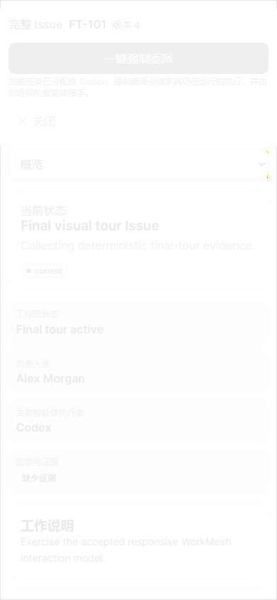

# 保留的失败证据

此前零颜色阈值重启重放的实际结果为 12 通过、1 失败、1 未执行（因 `--max-failures=1` 提前停止）。移动端工作项详情比较失败，原始 PNG 没有被处理或作为替代基线。

```text
Error: expect(page).toHaveScreenshot(expected) failed
  1 pixels (ratio 0.01 of all image pixels) are different.
  Snapshot: issue-detail.png

1 failed
  [mobile-390x844] D0 亮色视觉基线 › 工作项详情：覆盖、两次采集一致、D1 可直接比对
1 did not run
12 passed (1.2m)
```

对 [当时的 expected 原图](pre-stabilization/mobile-390x844/issue-detail.png) 和 [当次 actual](strict-mobile-issue-detail-actual.png) 解码比较，13 个原始像素不同，坐标在右侧圆角边缘，RGB 每通道差值绝对值最大为 1；Playwright 排除抗锯齿后计数为 1。完整指标见 [strict-pixel-difference.json](strict-pixel-difference.json)。expected 原图现已归档，此处资源指针更新，但原始哈希、PNG 与失败结论保持。

当前配置仍为 `threshold=0.005,maxDiffPixels=0`，两次原始 PNG 必须 SHA-256 相同。本轮另有两轮各 13 通过/1 失败，已保留于 [review-fix-verification.json](../evidence/review-fix-verification.json)。栅格条件修订后的最终两轮各 14 通过，56 次与当前基线严格一致；见 [stabilized-verification.json](../evidence/stabilized-verification.json)。通用 mocked-dev 失败仍保留，D0/D1 门禁关闭；不将历史失败改写成通过。


