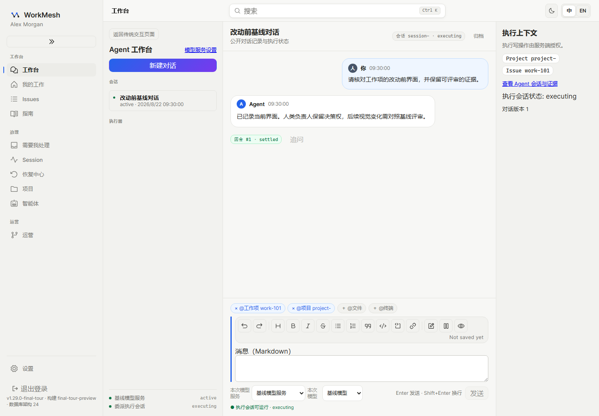
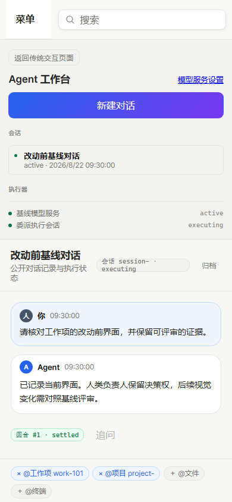

# D0 基线与验证记录

2026-10-07：仓库内基线已产出并通过重放，五项必需检查均成功退出。**D0 尚未关闭，D1 硬门禁保持关闭**：团队确无 WorkMesh MCP 连接，控制面归属等待用户裁决，AGENTS.md 要求的真实 WorkMesh 活动记录尚未同步。平台 Todos 仅提供任务引用，不视作 WorkMesh Project、WorkItem 或 Agent Session。

## 范围、文件与来源

改动前产品提交为 `32789cec4d50db0b85a63d91049cc425d9e917a2`。本轮只新增 e2e 配置、测试夹具、PNG 和证据文档；没有产品实现、token 值、数据库迁移、API 或事件变更。`git diff --exit-code -- packages/ui/src/tokens.css apps/web/app/styles.css` 返回 0。所有 token、样式、主题、夹具、锁文件与测试配置的 SHA-256 见 [manifest.json](manifest.json)。

来源为 [本地计划 D0](../../../../../docs/plan/2026-10-07-activation-onboarding-and-china-ecosystem.md)、ADR 0028、0045、0077。参考实测值 `G:\Projects\MetronX\todos-dev-analysis\design-tokens.md` 已阅读，但未迁入。ADR 0071 的 lite 部署不能作为当前基线环境的验收证明。

- [playwright.d0.config.ts](../../../playwright.d0.config.ts)：两个固定视口、亮色、Windows 快照目录与视觉比较策略。
- [d0-visual-baseline.mocked.spec.ts](../../mocked/d0-visual-baseline.mocked.spec.ts)：复用 final-tour 数据、补齐只读 DTO、两次独立上下文采集、页面就绪与错误断言、截图比较及哈希附件。
- [d0-screenshot.css](../../mocked/d0-screenshot.css)：仅隐藏 Next 开发工具浮层，不遮罩产品界面。
- 本目录 `win32/`：14 张改动前 PNG；[README.md](README.md)：开工前测试清单映射、DoD 与重放命令；[manifest.json](manifest.json)：机器可读的来源和逐项哈希；`evidence/` 与 `failures/`：实际检查记录和保留的失败证据。

## 测试清单与 DoD

测试文件：`apps/web/e2e/mocked/d0-visual-baseline.mocked.spec.ts`。组名：`D0 亮色视觉基线`。七个实际用例名均为下表“界面”后接 `：覆盖、两次采集一致、D1 可直接比对`，在 `desktop-1440x1000` 和 `mobile-390x844` 两个项目执行。三个清单项在开工前已映射到该文件与这些用例，结果如下：

- [x] 覆盖全部受影响界面：七个页面、两个视口，共 14 张基线。
- [x] 同一视口两次采集可重复：每个用例重置固定数据并新建两次浏览器上下文，PNG SHA-256 必须相同；服务重启后再执行完整 14 项。最终 56 次采集均与对应基线哈希相同。
- [x] 基线可被 D1 的视觉 diff 直接消费：重放使用 `--update-snapshots=none`，全部 `toHaveScreenshot` 直接读取已落盘 PNG；不生成替代基线。

DoD 原文：**基线产出并可重放；D1 开工前以此为门禁。** 仓库证据已满足基线测试清单；依照现有双轨规则，在控制面决定与真实记录同步之前，不能据此宣称整个 D0 已完成或启动 D1。

| 界面 | 固定路由 | 桌面基线 | 移动基线 |
| --- | --- | --- | --- |
| 工作台 | `/workbench` | [查看](win32/desktop-1440x1000/workbench.png) | [查看](win32/mobile-390x844/workbench.png) |
| 看板 | `/?view=projects&project=project-1&tab=board` | [查看](win32/desktop-1440x1000/board.png) | [查看](win32/mobile-390x844/board.png) |
| 项目总览 | `/?view=projects&project=project-1` | [查看](win32/desktop-1440x1000/project.png) | [查看](win32/mobile-390x844/project.png) |
| Agent 详情 | `/agents/agent%2F1` | [查看](win32/desktop-1440x1000/agent-detail.png) | [查看](win32/mobile-390x844/agent-detail.png) |
| 工作项列表 | `/?view=my-work` | [查看](win32/desktop-1440x1000/issues-list.png) | [查看](win32/mobile-390x844/issues-list.png) |
| 工作项详情 | `/?view=my-work&workItem=work-101` | [查看](win32/desktop-1440x1000/issue-detail.png) | [查看](win32/mobile-390x844/issue-detail.png) |
| 设置 | `/settings?team=team-page-2` | [查看](win32/desktop-1440x1000/settings.png) | [查看](win32/mobile-390x844/settings.png) |

## 可重放条件与实际结果

环境：Windows 11 专业工作站版 `10.0.26300`；Node `24.20.0`、pnpm `9.15.4`、Playwright `1.61.1`、Chromium `149.0.7827.55`。锁文件安装成功。视口固定为 `1440 × 1000` / `390 × 844`，DPR 1、`zh-CN`、UTC、亮色、固定时间 `2026-08-22T09:30:00.000Z`。等待字体加载，禁用截图动画与光标，浏览器使用软件渲染和 sRGB。

亮色不仅设置媒体偏好，还在启动前固定现有 `workmesh.theme=light`，并断言实际根节点 `data-wm-theme=light`。当前产品已支持暗色且默认暗色，规格“当前仅亮色”的前提过时；本次仍只采亮色。未修改主题功能。

固定夹具来自既有 `project-work-preview-server.mjs` 的 `final-tour`。补充工作台对话、消息、轮次、模型列表，以及 Agent Session context、预算利用率的只读 DTO。预算固定为 09:00 开始、09:30 观察，消耗 3600 秒预算的一半。不调用真实模型、不进行领域写入。原 tour 的设置 `?tab=workspace` 路由已失效，本次使用当前有效设置路由。

截图前要求页面标志数据已渲染，无可见加载态、页面异常、错误提示和 HTTP 4xx/5xx API 响应。保留既有实时连接状态、布局、文字、缺陷与内部滚动容器；`fullPage` 不会展开产品自己的滚动区域。当前字体依赖 Windows 系统字体，不能把不同系统的新截图直接当作此次验收。

| 运行 | 命令的关键参数 | 实际结果 |
| --- | --- | --- |
| 最终首次采集 | `--config playwright.d0.config.ts --update-snapshots=all` | 14 通过，1.4 分钟；每项两个独立上下文 |
| 最终重启重放 | `--config playwright.d0.config.ts --update-snapshots=none` | 14 通过，1.2 分钟；每项两个独立上下文 |
| 哈希核验 | 基线 + 两轮各两次采集 | 14 项均四次哈希一致，共 56 次；逐项值见 manifest |

比较配置是 `threshold=0.005`、`maxDiffPixels=0`。此前零颜色阈值重启检查出现一次圆角边缘取整噪声：移动端详情原始像素有 13 处 RGB 每通道最多相差 1，Playwright 排除抗锯齿后报告 1 像素，导致 12 通过、1 失败、1 未执行。已保留 [实际截图](failures/strict-mobile-issue-detail-actual.png)、[diff](failures/strict-mobile-issue-detail-diff.png) 与 [失败摘录](failures/README.md)，没有修图或更新基线掩盖该次失败。微小颜色阈值只用于视觉比较；用例内两次采集仍要求哈希完全相同。最终两轮恰好所有原始 PNG 哈希一致，不保证未来每次重启都没有该取整噪声。

## 五项必需检查

命令均实际执行，退出码均为 0。完整日志的 SHA-256、命令、结果与摘录见 [checks.json](evidence/checks.json) 和 [checks.md](evidence/checks.md)。

| 检查 | 实际结果 | 未执行范围 |
| --- | --- | --- |
| `pnpm lint` | 18 / 18 个 Turbo 任务成功 | 无 |
| `pnpm typecheck` | 18 / 18 个 Turbo 任务成功 | 无 |
| `pnpm test` | 29 / 29 个 Turbo 任务成功；18 个包的测试通过 | Worker 有 2 个 Linux 专属用例在 Windows 跳过，未声称已验收 |
| `pnpm test:integration` | DB 77、API 154、Worker 78 个用例通过；无失败 | 原运行跳过真实 MiniMax 调用、retention upgrade 与恢复各 1 项；后两项已分别启用并补验通过 |
| `pnpm test:e2e` | 74 / 74 个 Playwright 用例通过；12 / 12 个 Turbo 任务成功，3.4 分钟 | 无 |

补验命令 `pnpm test:integration:recovery`：`complete WorkMesh recovery bundle > backs up, safely resumes an interrupted empty-target restore, and verifies all state`，1 项通过；[恢复报告](evidence/recovery-report.json)。

补验命令 `pnpm --filter @workmesh/worker test:integration -- integration/retention-upgrade-barrier.integration.test.ts`（`RUN_RETENTION_UPGRADE_INTEGRATION=1`）：`retention upgrade barrier with real PostgreSQL and MinIO > proves one exact version with versioned HEAD and zero delete markers`，1 项通过。实际使用具有版本与 Object Lock 的 RustFS S3 服务，报告见检查摘录。

剩余跳过项：`retention-soak-lock.test.ts` 的 `passes a wrapper prelock across exec and rejects unlocked, unrelated, symlink, mode, and inode cases`；`retention-soak-formal-launch.test.ts` 的 `preserves the private prelocked FD through Node and the tsx registration loader`，两项由 `process.platform === "linux"` 控制；以及 `workbench-runner.integration.test.ts` 的 `runs an exact-session MiniMax-M3 Pi turn through the durable API`，由 `RUN_WORKBENCH_LIVE=1` 和 `MINIMAX_CN_API_KEY` 控制。本次使用确定性 fake Agent 和模型夹具，未为视觉基线请求真实模型凭据或产生调用费用。

此前必需检查未配置测试数据库而触发环境保护；补齐数据库、bootstrap、master key、Redis 限流夹具后，又发现 Stage 3 的两个上传用例因缺 S3 返回 500。失败信息已归档。配置独立 S3 后完整集成检查通过，产品代码未因这些环境问题变更。初版 D0 配置把 `reducedMotion` 放在不受支持的顶层选项，导致 lint/typecheck 失败；移入 `contextOptions` 后两项检查通过。旧定位器、只读 DTO 缺口与截图样式注入不一致导致的早期采集失败也保留在 [历次运行摘要](evidence/attempts.md)，没有将未执行项标记为成功。

所有服务均是本任务隔离测试资源：PostgreSQL 16、Redis 7、RustFS 1.0.0，分别使用 loopback 15432、16379、19000。正式 E2E、集成、恢复使用独立且名称含 `test` 的数据库；未连接用户实际 WorkMesh 数据库。测试夹具配置参照 `.github/workflows/ci.yml`，bootstrap 由既有脚本生成，检查证据不保存任何认证令牌。检查结束后已移除本任务三个测试容器及其临时卷，3100/3101/3200/3201 端口没有遗留测试监听；重放视觉基线仅需 mock 服务，不依赖这些已移除的数据库。

## 演示与 D1 消费

在仓库根目录执行 [README.md 的 PowerShell 命令](README.md)，会启动已有 mock API 和 Next Web、逐页采集并比对。必须保持对应 Windows、浏览器与字体环境；完整检查的服务配置按既有 CI 设置。Next dev 的正式和 mock 测试应顺序运行，避免同时写入 `apps/web/.next`。

D1 只有在门禁解除后，才可以改 token，并继续执行 `--update-snapshots=none`。差异会生成 expected / actual / diff，读取本目录现有 PNG，不会自动更新基线。视觉差异须人工评审后决定后续资产变更。

打开此 Markdown 在变更评审中的预览按钮即可查看证据与相对路径图片。以下为工作台的桌面与移动基线，其他页面见上表链接。

## 剩余阻塞与需要的输入

1. **控制面归属裁决**：当前团队无 WorkMesh MCP 连接，不能创建、写入或核对真实 Project / WorkItem / Agent Session 活动。本轮未改 AGENTS.md、源计划或 ADR 以绕过双轨规则，也未把 Todos 看板记录等同真实 WorkMesh。需要明确的控制面决定；若继续使用真实 WorkMesh，还需可调用连接及匹配的 Project / WorkItem / Session 标识，才能同步本报告并关闭门禁。
2. **必读文件缺失**：当前工作树及 Git 跟踪文件中没有 `WORKMESH_PRD.md`。已阅读存在的协议、OpenAPI、Schema 入口及相关 ADR。若该文件仍为有效要求，需提供正确仓库路径或明确替代文件；本轮没有杜撰 PRD。

原规格的测试清单和 DoD 均保留。已核实的偏差仅为当前暗色默认、旧设置路由与只读夹具 DTO 缺口，以及上述控制面/必读文件缺失；均记录在此，没有扩大到 D1 或整批迭代的产品实现。
