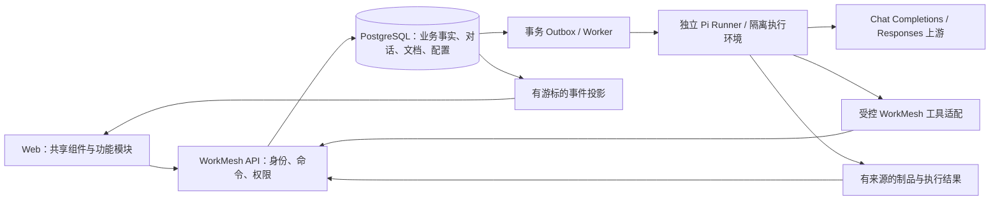

<!-- WM-WEBPI-20260924:ROADMAP -->
# WorkMesh 原型实装、Pi Agent 工作台与模型接入路线图

状态：规划完成后进入逐项实现；本路线图不代表功能已经交付。基线日期：2026-09-24。

## 目标与交付边界

将 `design/prototype` 的视觉与交互体系迁入现有 Next.js Web，补齐 Projects、Issues、Markdown 文档、模型配置和 Agent 工作台的真实业务闭环。引入 Pi 作为独立执行进程中的 Agent 引擎，通过 WorkMesh 的受控工具操作系统；用户可配置支持 Chat Completions 或 Responses 的 LLM 服务。

本阶段的“OpenAI 兼容”指 **WorkMesh 作为客户端连接用户配置的上游 LLM**：`POST /chat/completions` 与 `POST /responses`，不是默认新增一个向第三方开放的模型转售网关。后者若有实际需求，另立鉴权、配额和公开兼容性规范。

原型是视觉基线，真实 API、权限和业务状态决定控件行为。保留并补齐已有能力；不复制原型的模拟状态、硬编码版本号和成功结果。

## 现状分析与证据

分析代码基线：`71f45fc8132051600b468876932155a9b72f9469`（main 合并 #120）。开始时唯一未跟踪目录为 `design/`，本次未修改其内容。已读取 Agent Protocol、OpenAPI、schema 入口及关键 ADR；根目录 `WORKMESH_PRD.md` 实际缺失，必须在 W00 核实和恢复正确文档来源，不能把旧 ADR 对它的引用当作现存文件。

| 领域 | 已有真实基础 | 差距与实施判断 |
|---|---|---|
| 服务架构 | `apps/web` Next 15 / React 19；API/Fastify、Worker/BullMQ、MCP、PostgreSQL、Redis、MinIO；contracts/domain/db 分层 | 增加独立 Pi Runner；API/Web 不运行不可信 shell 或代码 |
| Web 组件 | `packages/ui/src/index.tsx` 已有 Button/Input/Select、Dialog/Drawer/Tabs、工作项、Attention、Run、Evidence 等；`tokens.css` | 重构现有组件的表现和模块组织，补齐原型控件，不从头建立平行组件库 |
| Web 应用层 | `features/work-items`、`features/rich-content`、统一 shell、Project Control Center、run timeline | 部分 DTO、请求和页面逻辑仍在 `app/`；迁移按功能纵向完成，不做纯 CSS 覆盖 |
| 内容 | `RichContent` 使用 react-markdown + remark-gfm；`RichTextEditor` 有格式工具、预览、撤销和本地草稿；Project 概览已渲染 Markdown | Project 创建等仍有普通 textarea；统一所有写入与查看入口，明确本地草稿和服务器保存；补充有名称、历史与引用的多文档能力 |
| Guidance | `v1/0003_versioned_guidance.sql` 已有独立文档/不可变修订与上下文固定 | Guidance 是受控指令，不等同 Project description 或普通文档；Agent 编辑业务文档不得获得发布 Guidance 的权限 |
| Agent 治理 | Connection、Coordination/Execution Session、claim/delegation、审批、lease、stop/retry、append-only activity、outbox、durable SSE | “支持 client_type=pi”仅表示接入身份，不是已经内建 Pi 推理与工具执行后端 |
| 模型接入 | 本次 package manifests、API/schema 检索未发现内建 Pi 依赖或 Chat/Responses LLM 配置域 | 需新建配置/密钥引用/模型能力/探测/用量适配，不把 Git provider 当作 LLM provider |
| 运维发布 | 四个现有应用镜像、迁移账本、恢复与验收资料 | 新 Runner 的隔离、存储、出站、资源限制、恢复和镜像兼容性需要独立交付 |

主要代码定位：`apps/web/app/page.tsx`、`project-control-center.tsx`、`agent-work-panel.tsx`、`agent-run-timeline.tsx`、`apps/web/features/rich-content/{editor,markdown}.tsx`、`packages/ui/src/{index.tsx,tokens.css}`、`apps/api/src/agent/guard.ts`、`apps/mcp/src/{index,coordination-product}.ts`、`packages/db/migrations/v1/`、`SCHEMA.sql`、`OPENAPI.yaml`。

现有 ADR 的重要约束：0028 frontend layering、0041 Guidance、0043 Connection、0055 Session controls、0064 unified shell。0029 富文本 ADR 的手写 parser/native undo 描述与当前 react-markdown/自管 undo 实现已有差异；0045 的仅浅色决策与本轮双主题目标也需显式更新。不能依靠陈旧文档进行接口推断。

## 原型实际查看结果

已通过运行中的 `http://localhost:4174` 查看 Agent 工作台、打开代码制品检查器、进入“我的工作”、打开 Issue 工作间、查看设置；另查看 390×844 手机工作台。桌面截图为约 1280×720。截图保存在本地 `.evidence/roadmap-20260924/`；本次只做抽样审查，不宣称全站或现有生产 Web 的运行验收。

1. 工作台三栏结构、对话、工具条、制品卡、验收区是可复用的设计基线；真实会话持久化、错误、重连和权限尚需接入。
2. 侧栏没有 Projects，设置没有 LLM provider/model 管理，需按同一设计语言补齐；不是把项目描述隐藏到聊天中。
3. “思考过程”改为“执行摘要/操作记录”，只显示公开理由、计划、工具状态、证据，拒绝保存/展示隐藏思维链。
4. Issue 行使用单击抽屉/双击详情，触屏与键盘发现性不足；加入明确详情链接、Enter 打开和焦点返回，双击仅作快捷方式。
5. 工作间选中“会话”时同时展示计划和活动，tab 与内容对应关系需在实装中明确；不能只改变选中样式。
6. 原型 `unstarted`、`awaiting_review` 等值不能直接写入服务端：实际 workflow category 有 `planned`，执行状态为 `awaiting_approval` 等。工作流和执行枚举分别适配。
7. “验收通过”是有权限、绑定具体证据/版本的领域操作，不能由前端动画完成；审阅结果和 Work Item 完成是两个事实。
8. 手机工作台已经有单列与底部输入器基线；长标题、软键盘、三栏切换、抽屉堆叠、焦点与触屏操作仍需逐项验收。截图无法证明屏幕阅读器、焦点约束或真实网络行为。
9. 原型底部“写操作需审批”需要改成符合具体权限/风险策略的状态提示；普通授权写入不应被误导为每次都要审批。

## 目标架构

### Pi 集成与会话边界

- Pi 负责模型循环、工具编排、上下文压缩和 Skill 装载；WorkMesh 负责 actor/principal、授权、委派、预算、业务 Session、Stop、审批、证据和最终状态。
- WorkbenchConversation 是用户交互容器，Turn 是一次输入及其执行请求；AgentSession 是受委派执行。三个 ID 显式关联，不能用一个聊天 ID 代替所有权限状态。讨论可在已授权的只读上下文中发生，写操作必须绑定有效执行/协调权限。
- 推荐 `apps/agent-runner` 包装 Pi SDK（最终名称由 W01 固定），进程与 API/Web 隔离；不 fork Pi，不把 Pi TUI 搬进 Web。受控数据适配器只暴露 SDK/MCP 允许的操作，所有写入回到现有命令路径。
- 默认禁用 Pi 自动发现任意扩展、`!command` 凭据配置、宿主全局设置以及无约束 read/write/edit/bash。只装载固定版本 Skill 与允许的工具；仓库/终端工具由受限 runner 提供，限制工作目录、路径、网络、时间与输出。
- Pi 本地 SessionManager 只管理模型上下文，不得成为第二套 WorkMesh 业务事实库。采用显式存储/重建适配；重启以持久化 turn/checkpoint + 业务状态恢复，未知副作用须对账，不能自动重做。
- 停止首先在服务端撤销/栅栏化写权限，Runner abort 模型并终止/收束工具；已发生的外部副作用如实标记，不能声称可回滚。Pause、resume、steer、retry 分别映射；Pi `agent_end` 不等于业务完成。

### 用户配置 LLM 与双协议

配置模型：`LlmConnection`（名称、API 类型、baseUrl、secretRef、owner/scope、revision、状态）+ `LlmModel`（model ID、能力、context/output 上限、可选计价）+ 会话使用的配置修订。首期支持管理员管理连接、授权成员使用；用户自己的连接按 owner/team 范围控制，普通用户不能发布全局连接或任意内网出口策略。

密钥只从服务端安全存储解析：支持写入/替换/吊销，只回传脱敏状态；不进 browser localStorage、Prompt、日志、事件或 Pi 项目配置。baseUrl 规范化只追加一次路径，拒绝 URL 凭据，控制重定向与 DNS/IP 出站；自托管 LAN 模型通过管理员明确允许的地址范围支持，不用“全部禁止内网”破坏产品用途。

| 项目 | Chat Completions | Responses |
|---|---|---|
| 请求 | messages、tool_calls/tool_call_id、tools | input items、function_call/function_call_output、call_id |
| 流处理 | choices[].delta、分片 arguments、finish_reason、[DONE] | 具名 SSE event、output/item/content index、文本/函数参数增量、completed/failed/incomplete |
| 会话 | WorkMesh 自有历史重建 | 默认自有历史；previous_response_id 仅在同连接/模型且能力确认时使用，不是业务权威 |
| 能力 | tools/JSON/reasoning/参数差异显式登记 | 对各上游逐项验证；不假定支持 OpenAI hosted tools、background、store 或所有事件 |
| 错误 | 401/403/404/429/5xx、超时、断流、上下文超限 | 同左，并区分中断/不完整/终态失败 |

两类 adapter 归一为文本增量、工具调用、使用量、结束原因、结构化错误；不把 Responses 压成字符串后丢失工具语义。只在完整参数完成并经 schema 校验后执行工具；重复调用采用本地稳定 operation ID；请求重试与工具副作用重放分离。协议由用户明确选择，探测失败给修复建议，禁止执行中静默切换模型或协议。`/models` 可选；手工输入 model ID 必须可用。unknown 用量/价格显示“未知”，不能按零计费或声称精确成本。

### 内容、组件与完整流程

组件分层保持 `packages/ui`（token/无 API 展示）→ `apps/web/features/*`（DTO/query/command/草稿）→ `apps/web/app`（URL/组合）。将原型颜色、字阶、圆角、密度、图标尺寸、动效与 light/dark 语义映射到一套 `--wm-*` token；不把原型 app.js 字符串模板整体搬入 React。

共享控件清单：Button/IconButton、Input/Textarea、Select/Combobox、Checkbox/Switch、Tabs、Menu/Popover/Tooltip、Dialog/Drawer、CommandPalette、Toast/Alert、Skeleton/Empty/Error、Pagination、Avatar、Badge/Priority/WorkflowState/ExecutionState、Table/FilterBar、WorkItemRow/Card、ApprovalCard、SessionTelemetry、PlanDiff、ActivityTimeline、EvidenceCard、ChatMessage/Composer/ContextChip、ArtifactInspector、MarkdownEditor/Viewer。领域组件只收 view model；错误、加载、禁用与键盘行为纳入同一组件契约。

业务导航覆盖：Agent 工作台、我的工作、Projects（Overview/Work/Attention/Runs/Documents）、Issues（List/Board/Backlog/Detail）、审批、Agents、Sessions、Recovery、Connections、Operations、Settings，以及无登录 shell 的 install/login。既有 URL/deep link 在 W00 逐条盘点；新路由沿用 Next router，原型 hash URL 不成为生产路由协议。

内容区分三类：①描述与评论（Markdown 原文）；②普通 Project/Issue 文档（命名文档、不可变修订、历史/diff、引用）；③Guidance（受控指令，沿用既有发布权限和上下文 pin）。优先复用现有编辑器，支持编辑/预览/分栏、代码/GFM 表格与任务列表、粘贴、草稿、保存失败恢复、并发冲突和附件。WYSIWYG、Mermaid、协同光标不作为首期前置条件。

完整主路径：配置并测试模型 → 选择 Project/Issue 与可见文档 → 建立对话/委派 → Agent 读取、计划、写入或请求审批 → 用户查看进度/介入/停止 → 制品与差异审阅 → 修订/重试 → 验收与归档证据。每一步有 loading/empty/error/forbidden/conflict/offline/reconnecting/feature-disabled 状态与恢复出口。

## 阶段与门槛

| 阶段 | 任务 | 退出门槛 |
|---|---|---|
| M0 基线与契约 | W00–W01 | 路由/能力矩阵、Pi/Node spike、schema/API/状态映射通过设计审查 |
| M1 UI 与内容 | W02–W06 | 双主题组件、导航、Project/Issue 和 Markdown/文档走真实 API |
| M2 模型与执行 | W07–W12 | 两类协议、持久化对话、受控 Runner、工具与 Skill 操作闭环 |
| M3 工作台与全站迁移 | W13–W16 | 对话/制品/治理/模型设置完整，原型主控件无假操作 |
| M4 验收与替换 | W17–W18 | 所有必需检查、真实模型/浏览器/恢复验收通过，完成可回滚切换 |

阶段是交付边界，不要求把所有任务串行。W01 后 UI（W02 起）和模型执行（W07/W09 起）可并行；W13 等待 W03/W05/W09/W10/W11/W12；W18 必须等所有必需任务通过。详见任务依赖表与每项的前置条件。并行执行时每个 PR 明确文件 ownership，避免同时改 shared tokens/contracts/schema；本次只制定路线图。

## 通用完成定义（适用于每项任务）

- D1：有明确输入、输出、权限与恢复行为；不遗失既有 Human/Agent、workflow/execution 区分。
- D2：变更同步 OpenAPI/contracts/route-policy/SDK/MCP、ADR、schema 与操作文档中受影响部分；无影响项明确写“无”。
- D3：领域功能覆盖 happy path、越权、非法状态、幂等重放、旧 revision、事务失败，以及适用的并发、job/webhook 重放、重启/outbox 恢复。
- D4：UI 的正常/空/加载/失败/无权限/冲突/断线均可退出；暗浅主题、中文/英文、桌面/手机、键盘与焦点有证据。
- D5：证据绑定提交 SHA、环境、配置版本和真实结果；模拟、静态检查与真实模型/部署验收分开记录；未知不记为通过。
- D6：无密钥或隐藏思维链泄漏；Agent 不使用 Human cookie、不自行批准权限/完成评审、不绕过 Stop。
- D7：本地任务正文与 GitHub/WorkMesh 互链；Issue 完成必须附实际测试结果、已知限制和残留工作，不能以“已实现按钮”结项。

必需最终检查：`pnpm lint`、`pnpm typecheck`、`pnpm test`、`pnpm test:integration`、`pnpm test:e2e`。集成测试使用经 `scripts/require-integration-env.mjs` 确认的独立可重置数据库，禁止对生产执行 test:reset。另运行 build、协议 conformance、Skill/route-policy 生成物检查及新 Runner 镜像检查。新命令由对应任务加入 package.json 并文档化，不假称当前已存在。

## 端到端验收用例

1. 新用户安装/登录，配置 Chat 类型模型，完成测试与一项受授权的 Issue/文档操作，刷新后内容和证据一致。
2. 切换 Responses 类型模型，执行同一场景，文本、工具、用量、取消和错误语义一致；两种协议分别通过真实 endpoint。
3. 用户从 Project 拆分 Issues/依赖，保留 responsible human；Agent 只能操作其 Team/Project 授权范围。
4. Agent 修改 Issue 文档，用户同时编辑触发冲突；双方都不会覆盖另一方已提交修订，草稿可比较并重提。
5. 执行中 pause/steer/stop，停止后的普通写入被拒绝；前端关闭/重连不丢会话，不擅自取消或重复执行。
6. 审批等待→批准/拒绝/过期/撤销→继续或结束；使用旧审批/旧 revision/旧 head 的提交均被拒绝。
7. 工具执行中进程崩溃，Runner/Worker 重启后对账；未知副作用不自动重做，事件游标恢复无重复业务事实。
8. Markdown GFM、长表格、代码、外链与附件在 Project/Issue/聊天/检查器一致；脚本 HTML、危险 URL 和越权附件被阻止。
9. 390/768/1280/1440 视口、200% 缩放、键盘和软键盘路径可完成核心工作；后台刷新不抢焦点、不丢输入。
10. 模型凭据吊销、预算耗尽、上下文超限、LLM 429/5xx、数据库/Redis/Runner 不可用时给出准确状态与恢复操作。

## 风险、范围控制与已有工作衔接

- Pi SDK 的 upstream main 是观察点，不是已通过部署验证的版本。W01 固定发布包/锁文件/许可、Node 与镜像基线后再接入。
- schema 当前使用 `v1/0001..0008`；新增连接、对话、普通文档等使用新的编号迁移，迁移从旧版和空库双向验证。禁止修改已应用迁移。
- 长输出、聊天历史、模型用量和文档历史必须分页/限量；不能逐 token 写 domain_events。事件持久化按可恢复语义分批，并明确重连粒度。
- 先完成一个真实纵向场景，再铺所有屏幕；移除旧实现以消费方迁移和替代测试通过为前提。生产只保留一个导航/组件体系，临时 release flag 有删除日期。
- 不把工程图、A2A、多 runtime 自动调度、WYSIWYG 实时协作或无限自动 Agent Loop 扩入首期。现有 GitHub #28（多 runtime）、#22（usage/budget）、#20（operations）、#21（项目管理）、#39（graph）保留自己的范围；有交集时复用验证，不能未经核实关闭。
- #75–#78 仍处于 open，但历史有修复工作；W00 按代码/测试/部署证据核对，不把它们重新列为未实现需求或直接关闭。
- 本次未运行仓库测试、没有模型推理、没有修改 runtime/API/schema、没有部署。原型浏览和静态研究只支撑规划。

## 上游资料（本次已实际读取）

- [Pi SDK，固定研究提交](https://github.com/earendil-works/pi/blob/a7d17e39aaa0091c7573d0790714751956f10bd1/packages/coding-agent/docs/sdk.md)：嵌入式 session、显式资源/工具配置、事件与 abort 边界。
- [Pi 模型配置](https://github.com/earendil-works/pi/blob/a7d17e39aaa0091c7573d0790714751956f10bd1/packages/coding-agent/docs/models.md)：兼容 endpoint 与显式 compat 行为；生产不接受执行命令式凭据。
- [Pi 包声明](https://github.com/earendil-works/pi/blob/a7d17e39aaa0091c7573d0790714751956f10bd1/packages/coding-agent/package.json)：研究版本 `@earendil-works/pi-coding-agent` 0.87.1，Node ≥22.19.0。当前项目 `.node-version` 22.15.0，已读 API 镜像 22.17.1，需实测升级影响。
- [OpenAI streaming](https://developers.openai.com/api/docs/guides/streaming-responses)：两种接口的流格式不同，需要分别处理。
- [OpenAI function calling](https://developers.openai.com/api/docs/guides/function-calling)：工具调用/结果与流式参数的契约依据。

这些是上游参考；第三方所谓“OpenAI compatible”仍须通过本项目的 endpoint conformance，不能由名称推定兼容。

## 持久引用

- 规划标识：`WM-WEBPI-20260924`。
- ADR：`docs/adr/0065-prototype-web-pi-workbench-and-llm-connections.md`。
- GitHub 总路线图：https://github.com/xurunxin/WorkMesh/issues/121。
- WorkMesh Project：`4170a135-df8a-4f1f-bbab-a4cf0a80b2a1`（GEN）；任务初始为 Backlog，尚未开始实施。
- 本地源文件：`docs/plan/2026-09-24-prototype-pi-agent-workbench.md`；精确映射：同名 `.index.json`。
- 本轮仅保存规划；文档尚未提交/推送，GitHub Issue 正文与 WorkMesh 副本可独立阅读。

## 任务清单与依赖

全部任务均为本轮交付必需，P1 表示排序，不表示可跳过。估算合计 72–117 人日，含实现与验证；按专长并行可缩短历时，W01 后重估，不能当成承诺日期。

| 任务 | 阶段 | 优先级 | 内容 | 前置 | 人日 |
|---|---|---|---|---|---|
| [W00](https://github.com/xurunxin/WorkMesh/issues/122) | M0 | P0 | 冻结代码、原型、路由和现有能力基线 | 无 | 2–3 |
| [W01](https://github.com/xurunxin/WorkMesh/issues/123) | M0 | P0 | 完成 Pi 兼容性 Spike 与工作台架构契约 | W00 | 3–5 |
| [W02](https://github.com/xurunxin/WorkMesh/issues/124) | M1 | P0 | 将原型令牌与全部基础控件收敛到共享组件库 | W01 | 5–8 |
| [W03](https://github.com/xurunxin/WorkMesh/issues/125) | M1 | P0 | 迁移统一应用外壳、导航、URL 与命令中心 | W02 | 3–5 |
| [W04](https://github.com/xurunxin/WorkMesh/issues/126) | M1 | P0 | 替换 Projects 与 Issues 主工作流页面 | W03, W05 | 5–8 |
| [W05](https://github.com/xurunxin/WorkMesh/issues/127) | M1 | P0 | 统一 Markdown 编辑、阅读、草稿与附件体验 | W02 | 3–5 |
| [W06](https://github.com/xurunxin/WorkMesh/issues/128) | M1 | P1 | 补齐 Project 与 Issue 的版本化普通文档 | W01, W04, W05 | 4–7 |
| [W07](https://github.com/xurunxin/WorkMesh/issues/129) | M2 | P0 | 实现用户 LLM 连接、模型目录与凭据管理域 | W01 | 4–6 |
| [W08](https://github.com/xurunxin/WorkMesh/issues/130) | M2 | P0 | 交付 Chat Completions 与 Responses 双协议适配及验证套件 | W07 | 4–6 |
| [W09](https://github.com/xurunxin/WorkMesh/issues/131) | M2 | P0 | 实现工作台对话、Turn 与可恢复事件流 | W01 | 4–7 |
| [W10](https://github.com/xurunxin/WorkMesh/issues/132) | M2 | P0 | 引入隔离 Pi Runner 并接入授权、控制与恢复 | W08, W09 | 5–8 |
| [W11](https://github.com/xurunxin/WorkMesh/issues/133) | M2 | P0 | 建立 WorkMesh 操作工具集与 Agent 行为权限矩阵 | W06, W10 | 3–5 |
| [W12](https://github.com/xurunxin/WorkMesh/issues/134) | M2 | P0 | 编写可执行操作 Skills、用户指南和评测场景 | W11 | 3–5 |
| [W13](https://github.com/xurunxin/WorkMesh/issues/135) | M3 | P0 | 实装 Agent 工作台对话、上下文与执行控制 | W03, W05, W09, W10, W11, W12 | 5–8 |
| [W14](https://github.com/xurunxin/WorkMesh/issues/136) | M3 | P0 | 实现制品检查器、修订反馈与成果验收闭环 | W06, W13 | 4–6 |
| [W15](https://github.com/xurunxin/WorkMesh/issues/137) | M3 | P0 | 迁移审批、Agents、Sessions、Recovery 与 Operations | W03, W04, W10 | 5–8 |
| [W16](https://github.com/xurunxin/WorkMesh/issues/138) | M3 | P0 | 完善模型设置、接入引导和全站配置体验 | W03, W07, W08, W10 | 3–5 |
| [W17](https://github.com/xurunxin/WorkMesh/issues/139) | M4 | P0 | 完成可靠性、性能、可访问性与隔离验证 | W04, W06, W12, W14, W15, W16 | 4–7 |
| [W18](https://github.com/xurunxin/WorkMesh/issues/140) | M4 | P0 | 真实环境验收、发布切换、回滚演练与旧 UI 清理 | W17 | 3–5 |

## 执行 Checklist

- [x] W00 https://github.com/xurunxin/WorkMesh/issues/122 — 冻结代码、原型、路由和现有能力基线（2026-09-24 完成，基线报告见同目录 `.baseline.md`）
- [ ] W01 https://github.com/xurunxin/WorkMesh/issues/123 — 完成 Pi 兼容性 Spike 与工作台架构契约
- [ ] W02 https://github.com/xurunxin/WorkMesh/issues/124 — 将原型令牌与全部基础控件收敛到共享组件库
- [ ] W03 https://github.com/xurunxin/WorkMesh/issues/125 — 迁移统一应用外壳、导航、URL 与命令中心
- [ ] W04 https://github.com/xurunxin/WorkMesh/issues/126 — 替换 Projects 与 Issues 主工作流页面
- [ ] W05 https://github.com/xurunxin/WorkMesh/issues/127 — 统一 Markdown 编辑、阅读、草稿与附件体验
- [ ] W06 https://github.com/xurunxin/WorkMesh/issues/128 — 补齐 Project 与 Issue 的版本化普通文档
- [ ] W07 https://github.com/xurunxin/WorkMesh/issues/129 — 实现用户 LLM 连接、模型目录与凭据管理域
- [ ] W08 https://github.com/xurunxin/WorkMesh/issues/130 — 交付 Chat Completions 与 Responses 双协议适配及验证套件
- [ ] W09 https://github.com/xurunxin/WorkMesh/issues/131 — 实现工作台对话、Turn 与可恢复事件流
- [ ] W10 https://github.com/xurunxin/WorkMesh/issues/132 — 引入隔离 Pi Runner 并接入授权、控制与恢复
- [ ] W11 https://github.com/xurunxin/WorkMesh/issues/133 — 建立 WorkMesh 操作工具集与 Agent 行为权限矩阵
- [ ] W12 https://github.com/xurunxin/WorkMesh/issues/134 — 编写可执行操作 Skills、用户指南和评测场景
- [ ] W13 https://github.com/xurunxin/WorkMesh/issues/135 — 实装 Agent 工作台对话、上下文与执行控制
- [ ] W14 https://github.com/xurunxin/WorkMesh/issues/136 — 实现制品检查器、修订反馈与成果验收闭环
- [ ] W15 https://github.com/xurunxin/WorkMesh/issues/137 — 迁移审批、Agents、Sessions、Recovery 与 Operations
- [ ] W16 https://github.com/xurunxin/WorkMesh/issues/138 — 完善模型设置、接入引导和全站配置体验
- [ ] W17 https://github.com/xurunxin/WorkMesh/issues/139 — 完成可靠性、性能、可访问性与隔离验证
- [ ] W18 https://github.com/xurunxin/WorkMesh/issues/140 — 真实环境验收、发布切换、回滚演练与旧 UI 清理

## 完整任务正文

<!-- WM-WEBPI-20260924:W00 -->
# W00 冻结代码、原型、路由和现有能力基线

阶段：M0；优先级：P0；估算：2–3 人日（W01 后复估）。状态：**已执行（2026-09-24）**，交付记录见 `docs/plan/2026-09-24-prototype-pi-agent-workbench.baseline.md` 与 GitHub #122。

总路线图：https://github.com/xurunxin/WorkMesh/issues/121

本地源：`docs/plan/2026-09-24-prototype-pi-agent-workbench.md` / W00。ADR：`docs/adr/0065-prototype-web-pi-workbench-and-llm-connections.md`。

WorkMesh：`GEN-551` / `e56e506d-8064-4ea5-9710-abc1e75c2249`。

GitHub：https://github.com/xurunxin/WorkMesh/issues/122

## 前置依赖

无；本任务是唯一开工入口。

完成后解锁：W01。依赖未通过时，不以模拟结果宣称本任务完成。

## 改动边界与实现范围

- `design/`
- `docs/plan/`
- `docs/adr/`
- `WORKMESH_PRD.md（核实缺失来源）`
- `apps/web/app/`
- `package.json`

- 记录 checkout SHA、原型文件校验值、路由/控件/权限矩阵；保留未提交 design 资产，后续用明确提交纳入版本管理。
- 逐项标注复用、重构、新建、延期；覆盖所有现存 Web 页面、入口、deep link、操作与服务端 feature flag。
- 核对 PRD 缺失、ADR ignored 状态、0029 富文本文档漂移、0045 仅浅色约定与双主题目标；对照旧 Issues #20/#21/#22/#28/#75–#78，建立 overlap 表。
- 采集当前真实 Web 与原型在同视口同状态的截图，补模型设置、Projects、文档和错误状态的交互规格。

## 必须执行的验证

- 检查路由清单与 app/page 文件、导航、API 操作相互覆盖，列出不可访问/未验证项目。
- 建立当前五项必需检查基线；环境不具备则记录具体阻塞，禁止把旧报告当本轮 PASS。
- 所有原型主按钮均对应真实命令或明确禁用原因；桌面/手机采样截图有时间和状态。

受影响模块测试先行；最终必须通过 `pnpm lint`、`pnpm typecheck`、`pnpm test`、`pnpm test:integration`、`pnpm test:e2e`。集成测试仅连接经检查的独立可重置数据库。新检查命令在实现中加入 package.json；本 Issue 未声称任何测试已通过。

## 本任务完成条件

- 交付带来源的能力差距表、原型→组件→页面→API 映射和可追溯设计基线。
- 确认 UI 替换范围及文档恢复方案；没有重复开启已完成的历史修复。

## 继承规范的通用 DoD

- D1：有明确输入、输出、权限与恢复行为；不遗失既有 Human/Agent、workflow/execution 区分。
- D2：变更同步 OpenAPI/contracts/route-policy/SDK/MCP、ADR、schema 与操作文档中受影响部分；无影响项明确写“无”。
- D3：领域功能覆盖 happy path、越权、非法状态、幂等重放、旧 revision、事务失败，以及适用的并发、job/webhook 重放、重启/outbox 恢复。
- D4：UI 的正常/空/加载/失败/无权限/冲突/断线均可退出；暗浅主题、中文/英文、桌面/手机、键盘与焦点有证据。
- D5：证据绑定提交 SHA、环境、配置版本和真实结果；模拟、静态检查与真实模型/部署验收分开记录；未知不记为通过。
- D6：无密钥或隐藏思维链泄漏；Agent 不使用 Human cookie、不自行批准权限/完成评审、不绕过 Stop。
- D7：本地任务正文与 GitHub/WorkMesh 互链；Issue 完成必须附实际测试结果、已知限制和残留工作，不能以“已实现按钮”结项。

## 交付记录模板

- 实现提交/PR 与精确环境：
- 数据迁移 / API / events / Skill 变更（无则明确写无）：
- 实际测试命令、结果、失败/skip：
- 浏览器/真实模型/恢复证据（适用时）：
- 演示步骤、已知限制、规范偏差及 follow-up：

---

<!-- WM-WEBPI-20260924:W01 -->
# W01 完成 Pi 兼容性 Spike 与工作台架构契约

阶段：M0；优先级：P0；估算：3–5 人日（W01 后复估）。状态：完成（2026-09-24，交付记录见下）。

总路线图：https://github.com/xurunxin/WorkMesh/issues/121

本地源：`docs/plan/2026-09-24-prototype-pi-agent-workbench.md` / W01。ADR：`docs/adr/0065-prototype-web-pi-workbench-and-llm-connections.md`。

WorkMesh：`GEN-552` / `9d692d9e-6eac-484c-b30b-3c2d5aa6d54d`。

GitHub：https://github.com/xurunxin/WorkMesh/issues/123

## 前置依赖

- W00 — https://github.com/xurunxin/WorkMesh/issues/122

完成后解锁：W02, W06, W07, W09。依赖未通过时，不以模拟结果宣称本任务完成。

## 改动边界与实现范围

- `docs/adr/`
- `AGENT_PROTOCOL.md`
- `OPENAPI.yaml`
- `packages/contracts/`
- `packages/domain/`
- `infra/docker/`

- 在独立临时验证程序中固定 Pi 发布包/commit、license、Node ≥22.19 与 Linux/Windows 支持，测试 SDK 事件、noTools/customTools、ResourceLoader、SessionManager、abort 与 settle。
- 冻结 Conversation/Turn/AgentSession/RunnerAttempt 的关联、单 writer/fencing、队列、幂等、Stop、权限撤销、上下文 pin 和重启协议；表与 REST/MCP/event DTO 先于实现。
- 冻结 LLM connection/model/secret、普通 documents/revisions、工具调用账本、使用量和 retention 的最小关系模型，避免与 Guidance/Artifacts/现有 usage 重复。
- 明确 coordinator 与执行 Session 的启动方式、负责 Human、实际额度与审批；一个对话不能隐式获得全 Team 写权。

## 必须执行的验证

- 精确锁定的 Pi 在两个协议 fake endpoint 上完成一次带工具结果的多轮调用并可取消，证明没有默认宿主工具/扩展泄漏。
- 模拟恢复与重复任务：旧 Runner 权限失效，新 attempt 不重放未知副作用。
- 编译一个最小 SDK consumer；记录原版本和升级版本的 engine/bundle/license/镜像检查结果。

受影响模块测试先行；最终必须通过 `pnpm lint`、`pnpm typecheck`、`pnpm test`、`pnpm test:integration`、`pnpm test:e2e`。集成测试仅连接经检查的独立可重置数据库。新检查命令在实现中加入 package.json；本 Issue 未声称任何测试已通过。

## 本任务完成条件

- ADR 决策、schema/API/event/状态映射和 threat-boundary 表可评审，重大未决项有明确结论。
- 若最新版不兼容，给出已验证的固定版本或明确阻塞，不以 latest 占位。

## 继承规范的通用 DoD

- D1：有明确输入、输出、权限与恢复行为；不遗失既有 Human/Agent、workflow/execution 区分。
- D2：变更同步 OpenAPI/contracts/route-policy/SDK/MCP、ADR、schema 与操作文档中受影响部分；无影响项明确写“无”。
- D3：领域功能覆盖 happy path、越权、非法状态、幂等重放、旧 revision、事务失败，以及适用的并发、job/webhook 重放、重启/outbox 恢复。
- D4：UI 的正常/空/加载/失败/无权限/冲突/断线均可退出；暗浅主题、中文/英文、桌面/手机、键盘与焦点有证据。
- D5：证据绑定提交 SHA、环境、配置版本和真实结果；模拟、静态检查与真实模型/部署验收分开记录；未知不记为通过。
- D6：无密钥或隐藏思维链泄漏；Agent 不使用 Human cookie、不自行批准权限/完成评审、不绕过 Stop。
- D7：本地任务正文与 GitHub/WorkMesh 互链；Issue 完成必须附实际测试结果、已知限制和残留工作，不能以“已实现按钮”结项。

## 交付记录模板

- 实现提交/PR 与精确环境：
- 数据迁移 / API / events / Skill 变更（无则明确写无）：
- 实际测试命令、结果、失败/skip：
- 浏览器/真实模型/恢复证据（适用时）：
- 演示步骤、已知限制、规范偏差及 follow-up：

### W02 交付记录（2026-09-24）

- 实现提交/PR 与精确环境：分支 `codex/wm-webpi-w02-ui-library`（基于 297d6c7，PR 叠放于 #142）。环境：Windows 11，宿主 Node v24.20.0（仓库钉住 22.19.0）；web 生产级渲染证据经 Docker Linux 容器（node:22-alpine，`next dev` 于容器内）产出——容器方案规避本机 G:/S: 双盘符分裂（见已知限制）。
- 数据迁移 / API / events / Skill 变更：数据迁移无。REST API 无变更（OPENAPI.yaml 无需改动）；新增页面路由 `apps/web/app/ui-catalog/`（纯视觉 fixtures，无 API 调用，不受鉴权影响）。events 无变更。Skill 无变更。`packages/ui` 拆分为 internal/primitives/layout/domain 模块 + barrel 纯导出；import-boundary 契约测试（`index.test.ts` FORBIDDEN_AUTHORITY_STRINGS 递归扫描全部模块）确保不引用 Next router、API、contracts/domain/db。
- 实际测试命令、结果、失败/skip：`pnpm lint` 17/17 成功；`pnpm typecheck` 17/17；`pnpm test` 28 项目全过（`@workmesh/ui` 45 用例：controls 契约 + SSR 渲染 + catalog fixtures；`@workmesh/web` 696 用例，含新增 `ui-layout-contract` 零 hex 契约 13 用例——styles.css 硬编码主题色 333 处 → 3 处 allowlist）。`pnpm test:integration:db` 77/77；`:api` 123/123；`:worker` 78 过 1 skip（既有 skip）；`:recovery` 1/1（配方与 CI 一致：RUN_INTEGRATION=1、专用可重置库 workmesh_integration_test、规范 base64url bootstrap token、限流 burst 调高、跑前 redis flushdb）。`pnpm test:e2e` 本机 BLOCKED（与 W01 同因：pnpm virtual store 在 G:（NTFS），仓库经 S:（ReFS Dev Drive）访问，跨盘符号链接使 `next dev` 编译报 `fallback-build-manifest.json ENOENT`，本轮复现日志在案）；由 PR CI 的 Linux e2e job 作为门禁覆盖。
- 浏览器/真实模型/恢复证据：Docker 构建镜像后起临时容器，playwright 同 viewport（1280×900）截取 `/ui-catalog` dark/light 对比、dark+compact 密度、390×844 触控视口、deviceScaleFactor=2（200% 缩放）共 5 张，存档 `.evidence/roadmap-20260924/w02-ui-library/`。真实模型/恢复证据不适用（本任务无 LLM/执行语义改动）。
- 演示步骤、已知限制、规范偏差及 follow-up：演示 = 访问 `/ui-catalog` 切换 light/dark/密度，对照 `design/prototype` 同 viewport 视觉。已知限制：(1) `styles.css` 保留 3 处 allowlist hex（`.config-preview` 恒暗终端风面板专用前景/背景/边框，双模式下刻意不翻转，待未来新增恒暗表面令牌后移出，契约测试防新增）；(2) 旧硬编码色（如亮橙 #d97706、亮红 #dc2626）映射语义家族后明度略降，属迁移设计系统调色板的预期视觉收敛；(3) e2e 本机阻塞同 W01。规范偏差：无。follow-up：W03 将应用外壳/导航/命令中心迁移到共享控件；功能页逐步替换自实现控件（W03+）。

### W01 交付记录（2026-09-24）

- 实现提交/PR 与精确环境：分支 `codex/wm-webpi-w01-pi-spike`（基于 W00 分支，PR 叠放于 #141）。环境：Windows 11，宿主 Node v24.20.0（仓库 CI/Docker 钉住 22.19.0），docker compose 全栈 postgres:16-alpine / redis:7-alpine / MinIO，`@earendil-works/pi-coding-agent@0.87.1`（MIT，engines node ≥22.19.0）。Spike 工程位于仓库外 `G:\Projects\MetronX\wm-pi-spike\`。
- 数据迁移 / API / events / Skill 变更：数据迁移无（DDL 属后续编号迁移，本任务只冻结 `workbenchRelationModel`）。REST API 无变更（OPENAPI.yaml 仅加注释声明）。事件无投递变更（`workbench.*` 12 个事件 schema 冻结于 `packages/contracts/src/pi-workbench-contracts.ts`，未接入 outbox）。新增 13 个错误码进入统一 `apiErrorCodeSchema`。AGENT_PROTOCOL.md 新增 §25 规划边界声明。Skill 无变更。
- 实际测试命令、结果、失败/skip：Spike `node spike.mjs` 5/5 PASS（P1 身份 / P2 chat-completions 多轮工具 / P3 responses 多轮工具 / P4 无宿主工具泄漏 / P5 abort→settle+上游断连 / P6 密封 agent 目录），证据存档 `.evidence/roadmap-20260924/w01-pi-spike/`。`pnpm lint` 17/17 任务成功；`pnpm typecheck` 17/17；`pnpm test` 28/28（contracts 新增 25 用例）。`pnpm test:integration:db` 77/77；`:api` 123/123；`:worker` 78 过 1 skip（既有 skip）；`:recovery` 1/1。`pnpm test:e2e` 本机 BLOCKED：pnpm virtual store 在 G:（NTFS，.npmrc 本地配置规避 ReFS EPERM），仓库经 S:（ReFS Dev Drive）访问，跨盘符号链接使 `next dev` 编译报 `Can't resolve './G:/...'` 与 `fallback-build-manifest.json ENOENT`；该限制先于本任务存在（W00 基线已记录），由 PR CI 的 Linux e2e job 作为门禁覆盖。
- 浏览器/真实模型/恢复证据：不适用（本任务无 UI/真实模型改动）。恢复协议在契约层冻结：单 writer fencing（`RUNNER_FENCE_STALE`）、attempt_no 单调、`external_effects_reconciled` 对账门槛（测试断言见 `pi-workbench-contracts.test.ts`）；真实 Runner 恢复演练属 W10。
- 演示步骤、已知限制、规范偏差及 follow-up：演示 = 阅读 ADR 0065"W01 验证结果与钉住基线"+ 运行 spike 工程。已知限制：e2e 本机阻塞如上；契约未接线实现。follow-up：W02 组件库、W06/W07/W09 领域契约与端点、W10 Runner 执行/恢复。

---

<!-- WM-WEBPI-20260924:W02 -->
# W02 将原型令牌与全部基础控件收敛到共享组件库

阶段：M1；优先级：P0；估算：5–8 人日（W01 后复估）。状态：实现完成，待评审合并（2026-09-24）。

总路线图：https://github.com/xurunxin/WorkMesh/issues/121

本地源：`docs/plan/2026-09-24-prototype-pi-agent-workbench.md` / W02。ADR：`docs/adr/0065-prototype-web-pi-workbench-and-llm-connections.md`。

WorkMesh：`GEN-553` / `46d0c2af-2f95-4556-b4ad-c15a7b8faa40`。

GitHub：https://github.com/xurunxin/WorkMesh/issues/124

## 前置依赖

- W01 — https://github.com/xurunxin/WorkMesh/issues/123

完成后解锁：W03, W05。依赖未通过时，不以模拟结果宣称本任务完成。

## 改动边界与实现范围

- `packages/ui/src/`
- `apps/web/app/styles.css`
- `design/figma-plugin/src/00-tokens.js（读取基线）`

- 把原型 light/dark、typography、spacing、density、radius、elevation、focus、motion 映射为唯一 --wm-* token 源；消除页面硬编码主题颜色。
- 沿用 Phosphor 和现有 UI，按 primitives/layout/domain 展示职责拆出可维护模块，保留清晰 exports。
- 实现/统一 Button/IconButton、输入、选择/组合框、开关、多选、菜单、tooltip、tabs、dialog/drawer、toast、空/错/加载、表格、分页及命令面板。
- 提供组件状态目录与视觉 fixtures，纳入禁用/忙碌/错误/长文案、主题、密度和尺寸，不引入第二套样式或业务客户端。

## 必须执行的验证

- 组件 keyboard/focus/escape/嵌套 overlay/焦点返回/reduced-motion 测试；role/name/state 可访问性断言。
- 相同 viewport 下 light/dark 截图对比原型，检查 200% 缩放和 390px 触控目标。
- import-boundary 检查确保 packages/ui 不引用 Next router、API、contracts/domain/db。

受影响模块测试先行；最终必须通过 `pnpm lint`、`pnpm typecheck`、`pnpm test`、`pnpm test:integration`、`pnpm test:e2e`。集成测试仅连接经检查的独立可重置数据库。新检查命令在实现中加入 package.json；本 Issue 未声称任何测试已通过。

## 本任务完成条件

- 路线图控件清单全部有共享实现或明确复用映射；功能页不再自己实现同类基本控件。
- 组件外观与原型一致，可读性和状态不会仅依赖颜色。

## 继承规范的通用 DoD

- D1：有明确输入、输出、权限与恢复行为；不遗失既有 Human/Agent、workflow/execution 区分。
- D2：变更同步 OpenAPI/contracts/route-policy/SDK/MCP、ADR、schema 与操作文档中受影响部分；无影响项明确写“无”。
- D3：领域功能覆盖 happy path、越权、非法状态、幂等重放、旧 revision、事务失败，以及适用的并发、job/webhook 重放、重启/outbox 恢复。
- D4：UI 的正常/空/加载/失败/无权限/冲突/断线均可退出；暗浅主题、中文/英文、桌面/手机、键盘与焦点有证据。
- D5：证据绑定提交 SHA、环境、配置版本和真实结果；模拟、静态检查与真实模型/部署验收分开记录；未知不记为通过。
- D6：无密钥或隐藏思维链泄漏；Agent 不使用 Human cookie、不自行批准权限/完成评审、不绕过 Stop。
- D7：本地任务正文与 GitHub/WorkMesh 互链；Issue 完成必须附实际测试结果、已知限制和残留工作，不能以“已实现按钮”结项。

## 交付记录模板

- 实现提交/PR 与精确环境：
- 数据迁移 / API / events / Skill 变更（无则明确写无）：
- 实际测试命令、结果、失败/skip：
- 浏览器/真实模型/恢复证据（适用时）：
- 演示步骤、已知限制、规范偏差及 follow-up：

---

<!-- WM-WEBPI-20260924:W03 -->
# W03 迁移统一应用外壳、导航、URL 与命令中心

阶段：M1；优先级：P0；估算：3–5 人日（W01 后复估）。状态：实现完成，待评审合并（2026-09-24，交付记录见下）。

总路线图：https://github.com/xurunxin/WorkMesh/issues/121

本地源：`docs/plan/2026-09-24-prototype-pi-agent-workbench.md` / W03。ADR：`docs/adr/0065-prototype-web-pi-workbench-and-llm-connections.md`。

WorkMesh：`GEN-554` / `4937dd69-5b0d-429b-9871-e12178c33587`。

GitHub：https://github.com/xurunxin/WorkMesh/issues/125

## 前置依赖

- W02 — https://github.com/xurunxin/WorkMesh/issues/124

完成后解锁：W04, W13, W15, W16。依赖未通过时，不以模拟结果宣称本任务完成。

## 改动边界与实现范围

- `apps/web/app/`
- `apps/web/features/navigation/（拟新增）`
- `packages/ui/src/`

- 把原型 sidebar/header/搜索/主题切换应用于所有认证页面，保留 team/actor/连接状态、版本和退出入口。
- 加入明确 Projects 与 Agent 工作台导航；保持现有 canonical URL、Project tabs 和 browser history 的单一所有权，新路径由 W00 路由表确定。
- 统一 command palette 的搜索/跳转/操作结果与权限，敏感动作进入既有受控对话框。
- 实现桌面/平板/手机导航、SSR 主题初始值和无闪烁切换；login/install 使用匹配的独立认证外壳。

## 必须执行的验证

- 刷新、返回/前进、分享深链、显式不存在 Project、Team 切换与旧请求晚到的回归测试。
- 命令面板键盘搜索/关闭/焦点恢复；导航 Tab/Enter、菜单和手机抽屉交互测试。
- 主题持久化、SSR hydration、中文/英文长文案、shell footer 完整性。

受影响模块测试先行；最终必须通过 `pnpm lint`、`pnpm typecheck`、`pnpm test`、`pnpm test:integration`、`pnpm test:e2e`。集成测试仅连接经检查的独立可重置数据库。新检查命令在实现中加入 package.json；本 Issue 未声称任何测试已通过。

## 本任务完成条件

- 所有生产路由进入同一导航与主题体系，用户可从任一页面到达 Projects/Issues/工作台。
- 没有复制原型 hash router 或引入第二套鉴权/导航状态。

## 继承规范的通用 DoD

- D1：有明确输入、输出、权限与恢复行为；不遗失既有 Human/Agent、workflow/execution 区分。
- D2：变更同步 OpenAPI/contracts/route-policy/SDK/MCP、ADR、schema 与操作文档中受影响部分；无影响项明确写“无”。
- D3：领域功能覆盖 happy path、越权、非法状态、幂等重放、旧 revision、事务失败，以及适用的并发、job/webhook 重放、重启/outbox 恢复。
- D4：UI 的正常/空/加载/失败/无权限/冲突/断线均可退出；暗浅主题、中文/英文、桌面/手机、键盘与焦点有证据。
- D5：证据绑定提交 SHA、环境、配置版本和真实结果；模拟、静态检查与真实模型/部署验收分开记录；未知不记为通过。
- D6：无密钥或隐藏思维链泄漏；Agent 不使用 Human cookie、不自行批准权限/完成评审、不绕过 Stop。
- D7：本地任务正文与 GitHub/WorkMesh 互链；Issue 完成必须附实际测试结果、已知限制和残留工作，不能以“已实现按钮”结项。

## 交付记录（2026-09-24）

- 实现提交/PR 与精确环境：分支 `codex/wm-webpi-w03-shell-nav`（基于 39c651f，PR 叠放于 #143）。环境：Windows 11，宿主 Node v24.20.0（仓库钉住 22.19.0）；渲染证据经 Docker compose web 容器（`next dev` 于容器内，localhost:3000，compose api/postgres/redis/minio 全栈）产出——规避本机 G:/S: 双盘符分裂（同 W01/W02 已知限制）。浏览器证据 Chromium 1280×900 桌面 + 390×844 移动视口。
- 数据迁移 / API / events / Skill 变更：数据迁移无。REST API 无变更（OPENAPI.yaml 无需改动）。events 无变更。Skill 无变更。前端新增 `apps/web/features/navigation/`（`theme.tsx`：`data-wm-theme` 挂 `<html>`、localStorage 键 `workmesh.theme`、`?theme=` URL 参数覆盖、`<head>` 前内联 bootstrap 脚本 SSR 无闪烁、`ThemeToggle` 控件与 i18n 双语标签）与 `apps/web/app/workbench/` 占位路由（W13 实装前的导航首项目的地）。全部认证页经 `AuthenticatedWorkspaceShell` 自动获得页头主题切换与既有 team/actor/连接状态/版本/退出入口；login/install/connect 独立认证外壳接入同一 `ThemeToggle`；命令中心 registry 新增静态导航项 `navigate:workbench`（双语标题、权限无关）；`shortcut-scope` 认证路由表加入 `/workbench`；`ui-unification-contract` shell 路由清单加入 workbench。canonical URL/Project tabs/browser history 单一所有权未动（无 hash router、无第二套鉴权/导航状态）。
- 实际测试命令、结果、失败/skip：`pnpm lint` 17/17 成功；`pnpm typecheck` 17/17 成功；`pnpm test` 全过（`@workmesh/web` 109 文件 709 用例，含新增 theme bootstrap jsdom 用例组——默认 light/存储 dark/`?theme=` 覆盖/非法值忽略防 XSS/applyTheme 持久化/ThemeToggle 切换、workbench 页壳与导航断言、workspace-navigation workbench 一等目的地、command-center registry、shortcut-scope；`@workmesh/api` 32 文件 168 用例、`@workmesh/worker` 23 文件 163 过 2 skip 均既有）。`pnpm test:integration:db` 77/77；`:api` 123/123（主跑 121 过，stage3-delivery 2 用例首跑因宿主缺 `S3_*` 环境变量报 500 INTERNAL_ERROR `S3_BUCKET, S3_ACCESS_KEY_ID and S3_SECRET_ACCESS_KEY are required`——补齐 MinIO 配置后该文件 12/12 全过，属宿主环境缺配非代码回归）；`:worker` 78 过 1 skip（既有 skip）；`:recovery` 1/1（需 `RUN_RECOVERY_INTEGRATION=1` + 源/目标 test 库 + MinIO S3 + `WORKMESH_POSTGRES_TOOL_CONTAINER` 变量，本轮补齐后通过）。`pnpm test:e2e` 本机 BLOCKED（与 W01/W02 同因：pnpm virtual store 在 G:（NTFS）、仓库经 S:（ReFS Dev Drive）访问——webServer `next dev` 报 `Module not found: Can't resolve './G:/Projects/MetronX/.wm-virtual-store/next@…/app-next-dev.js' in 'S:\…\apps\web'` 与 `ENOENT …\.next\fallback-build-manifest.json`，`/` 500），由 PR CI 的 Linux e2e job 门禁覆盖；各套件日志归档于 `.evidence/roadmap-20260924/w03-shell-nav/logs/`。
- 浏览器/真实模型/恢复证据：Playwright 驱动 Docker compose web 截 8 张存档 `.evidence/roadmap-20260924/w03-shell-nav/`：login light/dark（独立认证外壳含主题切换）、home dark/light（全站主题生效、侧栏「工作台」居首、页头 ThemeToggle、页脚版本/退出完整）、workbench light（占位空态+导航激活）、命令中心搜 "work" 命中工作台导航项、390×844 手机抽屉完整（版本/退出在列）；重载后 `document.documentElement.dataset.wmTheme` 持久化断言输出通过。真实模型证据不适用（无 LLM/执行语义改动）。
- 演示步骤、已知限制、规范偏差及 follow-up：演示 = 登录 → 点页头 ThemeToggle 观察全站无闪烁明暗切换 → 刷新验证主题保持 → `/?theme=dark` 验证 URL 覆盖 → 侧栏首位「工作台」进入 `/workbench` 占位 → Ctrl+K 搜 "work" 跳转 → 390px 宽验证手机抽屉。已知限制：(1) `/workbench` 为占位页，对话式工作台实装属 W13；(2) 主题默认 light（延续当前生产身份），原型默认 dark——按钮或 `?theme=dark` 可达，属 W02 记录的规范收敛延续；(3) e2e 本机阻塞同 W01/W02。规范偏差：无。follow-up：W04 Projects/Issues 主工作流页面、W13 工作台实装、W15 审批/运营页迁移。

---

<!-- WM-WEBPI-20260924:W04 -->
# W04 替换 Projects 与 Issues 主工作流页面

阶段：M1；优先级：P0；估算：5–8 人日（W01 后复估）。状态：实施中（2026-09-25）；开始收敛 Project 主流程，整页替换与 Issue 闭环仍待完成。

总路线图：https://github.com/xurunxin/WorkMesh/issues/121

本地源：`docs/plan/2026-09-24-prototype-pi-agent-workbench.md` / W04。ADR：`docs/adr/0065-prototype-web-pi-workbench-and-llm-connections.md`。

WorkMesh：`GEN-555` / `3ad20f14-df9c-4f0d-a909-dad7bb7c1ce0`。

独立 Docker 测试 WorkMesh：Project `630b5ede-448f-4a60-8170-f3552b17d2ed`，W04 WorkItem `b2d94868-3609-4e72-816e-8e9396ddbf52`；与持久 WorkMesh 实例隔离。

GitHub：https://github.com/xurunxin/WorkMesh/issues/126

## 前置依赖

- W03 — https://github.com/xurunxin/WorkMesh/issues/125
- W05 — https://github.com/xurunxin/WorkMesh/issues/127

完成后解锁：W06, W15, W17。依赖未通过时，不以模拟结果宣称本任务完成。

## 改动边界与实现范围

- `apps/web/features/work-items/`
- `apps/web/app/project-control-center.tsx`
- `apps/web/app/project-workspace.tsx`
- `apps/web/app/page.tsx`
- `packages/ui/src/`

- 完成 Project 列表、创建/编辑、Overview/Work/Attention/Runs；保留 summary/description、里程碑和真实完成进度。
- 迁移 Issue List/Board/Backlog/Detail/create/edit、筛选/排序/分页/保存视图、标签/优先级/负责 Human/依赖/子项。
- 明确工作项状态与 Agent 执行状态；看板移动和非拖拽替代操作均走当前 revision 的命令并可回滚。
- 明确详情链接与工作间抽屉，支持键盘和触屏；项目切换不串数据，创建/编辑复用 Markdown 控件。

## 必须执行的验证

- Project→Issue→关系/里程碑→详情→返回的浏览器闭环；筛选与 URL/history 保持。
- 无权限/不存在/旧 revision/双击重复提交/并发移动/分页和空队列路径。
- pointer、keyboard、touch 与菜单移动产生相同结果，失败时恢复原状态。

受影响模块测试先行；最终必须通过 `pnpm lint`、`pnpm typecheck`、`pnpm test`、`pnpm test:integration`、`pnpm test:e2e`。集成测试仅连接经检查的独立可重置数据库。新检查命令在实现中加入 package.json；本 Issue 未声称任何测试已通过。

## 本任务完成条件

- Projects/Issues 的全部已有生产动作在新 UI 有真实入口，无占位成功提示。
- 不丢领域约束、不用 Agent 替换 responsible human、不用 Session 完成自动改 Issue 状态。

## 继承规范的通用 DoD

- D1：有明确输入、输出、权限与恢复行为；不遗失既有 Human/Agent、workflow/execution 区分。
- D2：变更同步 OpenAPI/contracts/route-policy/SDK/MCP、ADR、schema 与操作文档中受影响部分；无影响项明确写“无”。
- D3：领域功能覆盖 happy path、越权、非法状态、幂等重放、旧 revision、事务失败，以及适用的并发、job/webhook 重放、重启/outbox 恢复。
- D4：UI 的正常/空/加载/失败/无权限/冲突/断线均可退出；暗浅主题、中文/英文、桌面/手机、键盘与焦点有证据。
- D5：证据绑定提交 SHA、环境、配置版本和真实结果；模拟、静态检查与真实模型/部署验收分开记录；未知不记为通过。
- D6：无密钥或隐藏思维链泄漏；Agent 不使用 Human cookie、不自行批准权限/完成评审、不绕过 Stop。
- D7：本地任务正文与 GitHub/WorkMesh 互链；Issue 完成必须附实际测试结果、已知限制和残留工作，不能以“已实现按钮”结项。

## 交付记录模板

- 实现提交/PR 与精确环境：W04 本段实现提交 `1c523da`；隔离 Docker Compose `workmesh-webpi-stage`，Web `127.0.0.1:3110`、API `127.0.0.1:3111`。本轮未推送或创建 PR。
- 数据迁移 / API / events / Skill 变更：无迁移、事件或 Skill 变更。`GET /api/v1/projects/{projectId}/control-center` 的 `project.progress` 新增整个 Project 中非取消 Issue 总数和已完成 workflow Issue 数；OpenAPI 和 contracts 同步。进度与 Agent Session 完成态分离；ETag 和数据新鲜度纳入整个 Project 的 Issue 修订、更新时间及数量。
- 实际测试命令、结果、失败/skip：`pnpm lint` 18/18 PASS；`pnpm typecheck` 18/18 PASS；`pnpm test` 29/29 PASS（Web 725/725，API 171/171）；聚焦 Web 28/28 PASS，追加空 Project 检查 6/6 PASS；`pnpm test:e2e` 68/68 PASS。`pnpm test:integration` 最终完整重跑：DB 77/77、API 135 PASS / 1 skip、Worker 78 PASS / 1 skip、Recovery 1 skip；随后新增跨分页进度断言的 Human Attention 集成单测 1/1 PASS。首轮集成运行时 ETag 修复尚未加载，产生 1 个失败；最终代码复测通过，保留此诊断记录。
- 浏览器/真实模型/恢复证据：改动前隔离 Docker Projects 页面截图见 `.evidence/webpi-stage-projects.png`；改动后 Project、Work、Issue 详情和深色工作页截图见 `.evidence/webpi-stage-w04-project.png`、`.evidence/webpi-stage-w04-work.png`、`.evidence/webpi-stage-w04-issue.png`、`.evidence/webpi-stage-w04-work-dark.png`（均为忽略目录）。真实容器浏览器验证项目说明折叠/展开、Project 切换无旧数据、工作列表使用完整内容宽度且筛选器无横向溢出；真实 API 进度 `total=1, completed=0` 与页面 `0/1` 一致，未出现 hydration 错误。E2E 覆盖项目工作区几何、进度和 hydration。
- 演示步骤、已知限制、规范偏差及 follow-up：登录 Docker 测试环境 → 打开 W04 Project → 看到摘要和 `0/1` 完成进度 → 展开项目说明 → 切换“工作”查看全宽列表和 Issue 详情 → 切换 W11 Project 检查无旧内容。Project header 优先展示摘要，长描述保留在可展开区域；命令中心在页头 hydration 后挂载，避免开发环境报错。W04 仍需完成页面整体替换、Issue 全路径与权限/并发/移动交互矩阵，不能关闭任务。

### W04 追加验证与修复（2026-09-25）

Project 编辑 E2E 在创建第二个 Issue 后曾从“工作”跳回“概览”，原因是子组件只更新本地 surface，父页面仍保留旧 tab；刷新 Issue 后旧 URL 重新投影覆盖了当前视图。现由 `ProjectControlCenter` 的工作入口调用父页面 `onWorkViewChange`，由单一页面路由负责状态；代码提交 `2a8ff3f`。相关浏览器用例 9/9 通过，完整 E2E 68/68 通过；Web 组件单测 725/725，通过真实隔离 Docker Web 镜像重建与首页 200 检查。W04 仍是进行中；未扩充 REST、迁移或事件。

---

<!-- WM-WEBPI-20260924:W05 -->
# W05 统一 Markdown 编辑、阅读、草稿与附件体验

阶段：M1；优先级：P0；估算：3–5 人日（W01 后复估）。状态：已实现（2026-09-25，分支 `codex/wm-webpi-w05-rich-content`，基于 W03）。

总路线图：https://github.com/xurunxin/WorkMesh/issues/121

本地源：`docs/plan/2026-09-24-prototype-pi-agent-workbench.md` / W05。ADR：`docs/adr/0065-prototype-web-pi-workbench-and-llm-connections.md`。

WorkMesh：`GEN-556` / `1cd36e62-ee3e-470f-a7bf-4022ca4e9bd1`。

GitHub：https://github.com/xurunxin/WorkMesh/issues/127

## 前置依赖

- W02 — https://github.com/xurunxin/WorkMesh/issues/124

完成后解锁：W04, W06, W13。依赖未通过时，不以模拟结果宣称本任务完成。

## 改动边界与实现范围

- `apps/web/features/rich-content/`
- `packages/ui/src/`
- `apps/web/app/`

- 扩展现有 RichTextEditor/RichContent，统一工具栏、编辑/预览/分栏、GFM、代码复制、链接和长表格；不重建已有能力。
- 复用到 Project/Issue 描述、评论、文档、聊天与制品预览；样式/density 通过 props 控制。
- 状态区准确区分已存本地草稿、保存中、服务器已保存、保存失败、版本冲突；草稿按 workspace/team/actor/resource/field/revision 隔离。
- 完善 IME、粘贴、undo/redo、离页保护、草稿过期/清除与附件上传/取消/重试/授权下载；图片加载遵守 content policy。

## 必须执行的验证

- Markdown corpus：表格/任务列表/代码/Unicode/长文/恶意 HTML、危险 URL、带凭据链接。
- 中文输入合成中不误发快捷键，编辑预览切换不丢 selection/history；服务器保存失败不会显示已发布。
- 并发 revision 和跨用户/Team 切换草稿隔离；附件 checksum、取消、失败重试、短期 URL 过期。

受影响模块测试先行；最终必须通过 `pnpm lint`、`pnpm typecheck`、`pnpm test`、`pnpm test:integration`、`pnpm test:e2e`。集成测试仅连接经检查的独立可重置数据库。新检查命令在实现中加入 package.json；本 Issue 未声称任何测试已通过。

## 本任务完成条件

- 所有目标表面使用同一 Markdown renderer/editor 契约，源文本 round-trip 不丢内容。
- 用户始终分得清草稿与已提交内容；不静默覆盖服务端新版本。

## 继承规范的通用 DoD

- D1：有明确输入、输出、权限与恢复行为；不遗失既有 Human/Agent、workflow/execution 区分。
- D2：变更同步 OpenAPI/contracts/route-policy/SDK/MCP、ADR、schema 与操作文档中受影响部分；无影响项明确写“无”。
- D3：领域功能覆盖 happy path、越权、非法状态、幂等重放、旧 revision、事务失败，以及适用的并发、job/webhook 重放、重启/outbox 恢复。
- D4：UI 的正常/空/加载/失败/无权限/冲突/断线均可退出；暗浅主题、中文/英文、桌面/手机、键盘与焦点有证据。
- D5：证据绑定提交 SHA、环境、配置版本和真实结果；模拟、静态检查与真实模型/部署验收分开记录；未知不记为通过。
- D6：无密钥或隐藏思维链泄漏；Agent 不使用 Human cookie、不自行批准权限/完成评审、不绕过 Stop。
- D7：本地任务正文与 GitHub/WorkMesh 互链；Issue 完成必须附实际测试结果、已知限制和残留工作，不能以“已实现按钮”结项。

## 交付记录模板

- 实现提交/PR 与精确环境：
  - 分支 `codex/wm-webpi-w05-rich-content`（base=`codex/wm-webpi-w03-shell-nav`，叠 #144）；PR 见 issue #127 关闭评论；本机 Windows 11 + Docker compose（postgres/redis/minio/api/web 全容器）。
  - 变更文件：`features/rich-content/editor.tsx`（编辑/分栏/预览三视图、`DraftSaveState` 五态、`ServerSave` 管线与 409 冲突识别、IME 合成守卫、Ctrl+S、beforeunload 离页保护）、`features/rich-content/artifacts.tsx`（上传中取消：AbortController + 取消 API）、`app/lib/i18n.tsx`（zh/en 编辑器文案 + `useLocale().editorCopy` 暴露）、`app/page.tsx`（指南页统一到编辑器内置三视图 + 字数统计 + 本地化文案）、`app/work-room.tsx`（Work Room 评论编辑器接本地化文案）、`features/work-items/detail/work-item-detail.tsx`（内联 editorCopy 补全新键）、`app/styles.css`（分栏网格、状态配色、预览面板、删除旧 guidance 预览样式）。
- 数据迁移 / API / events / Skill 变更：无（纯 web 层；草稿仍在 localStorage，附件 API 未变）。
- 实际测试命令、结果、失败/skip：
  - `pnpm lint`（17/17 包通过）、`pnpm typecheck`（17/17 包通过）。
  - `pnpm test`：全仓单测通过，其中 apps/web 109 文件 720 用例（含新增 rich-content 28 用例：三视图/selection 保持/草稿隔离/IME/服务器保存管线 409 与重试/离页守卫；artifacts 上传取消用例）。
  - `pnpm test:integration`：db 77/77、api 123/123、worker 78+1skip、recovery 1/1（本机配方见项目记忆，含限流 burst 环境变量）。
  - `pnpm test:e2e`：本机 BLOCKED（`next dev` 因 S:/G: 同卷双盘符无法启动；证据 `.evidence/roadmap-20260924/w05-rich-content/e2e-blocked.log`）；`e2e/rich-content.spec.ts` 已存在由 CI 执行，本机未新增 e2e 用例（D5：未知不记通过）。
  - 存量问题（与 W05 无关，git stash 基线验证）：`check:i18n` 9 个 I18N_HARDCODED_UI_COPY 错误（work-room.tsx、collaboration-hub.tsx、work-item-execution-workspace.tsx）。
- 浏览器/真实模型/恢复证据（适用时）：Docker web 容器（localhost:3000，light 主题 + 中文 locale）截图 7 张：`.evidence/roadmap-20260924/w05-rich-content/`（login-light、guidance-edit/split/preview 三视图含草稿状态区与字数统计、workitem-detail-editor、workroom-comment-editor、workitem-attachments）。
- 演示步骤、已知限制、规范偏差及 follow-up：
  - 演示：登录 → 指南页输入 Markdown（草稿状态"已存本地草稿"）→ 工具栏切换 编辑/分栏/预览；Issue 详情 → 详情页签描述编辑器；完整页面 → 讨论 → 会话（评论编辑器）/ 证据（附件区，上传中可取消）。
  - 已知限制：`onSave` 服务器保存管线当前无内置调用方（Issue 描述保存仍走表单提交），供 W04+ 接入；分栏视图 ≤640px 自动退化为单列；guidance/Work Room 编辑器文案本地化在本次补齐，其余硬编码文案属存量问题。
  - follow-up：W04 接入 `onSave` 管线实现描述/评论的服务器保存与 409 冲突 UI；check:i18n 存量 9 错误另开清理任务。

---

<!-- WM-WEBPI-20260924:W06 -->
# W06 补齐 Project 与 Issue 的版本化普通文档

阶段：M1；优先级：P1；估算：4–7 人日（W01 后复估）。状态：功能实现与独立测试完成（2026-09-25）；前置 W04 的主流程替换仍待完成，暂不关闭任务。

总路线图：https://github.com/xurunxin/WorkMesh/issues/121

本地源：`docs/plan/2026-09-24-prototype-pi-agent-workbench.md` / W06。ADR：`docs/adr/0065-prototype-web-pi-workbench-and-llm-connections.md`。

WorkMesh：`GEN-557` / `1ff6448e-a739-4db8-bed8-13b79df5be86`。

独立 Docker 测试 WorkMesh：Project `f5884215-8b1c-48bb-9b7f-717fa9994cd5`，W06 WorkItem `9007b561-aabd-4a9a-b5fc-42b006a7db3b`。该环境与上述持久 WorkMesh 实例隔离。

GitHub：https://github.com/xurunxin/WorkMesh/issues/128

## 前置依赖

- W01 — https://github.com/xurunxin/WorkMesh/issues/123
- W04 — https://github.com/xurunxin/WorkMesh/issues/126
- W05 — https://github.com/xurunxin/WorkMesh/issues/127

完成后解锁：W11, W14, W17。依赖未通过时，不以模拟结果宣称本任务完成。

## 改动边界与实现范围

- `packages/contracts/`
- `packages/domain/`
- `packages/db/migrations/v1/`
- `SCHEMA.sql`
- `OPENAPI.yaml`
- `apps/api/`
- `apps/web/features/documents/（拟新增）`
- `packages/agent-sdk/`
- `apps/mcp/`

- 新增普通 Document 与 immutable Revision：owner Project 或 WorkItem、标题、Markdown、作者、base revision/content hash、current pointer、归档状态；与 Guidance 和 evidence artifact 分开。
- Project/Issue Documents 页面支持创建、查看、编辑、历史、diff、修订引用、恢复旧内容为新修订、导出 .md；软归档恢复走受控权限。
- description 保留原语义且不强制迁移；文档引用携带精确 revision/hash，Session context 固定引用，附件复用现有管道。
- Human/Agent 共用领域命令，MCP 暴露授权读取/普通编辑；指令发布、权限扩大和不可逆删除不通过普通文档工具完成。

## 必须执行的验证

- 从 v1/0008 和空库迁移、事务失败回滚、revision 唯一性及跨 Team/Project owner 约束。
- 重复创建/更新幂等、并发编辑冲突、归档/恢复、上下文固定旧修订、agent 作者来源。
- Web 与 MCP 操作同一文档读回一致；Markdown 导出重导入文本一致。

受影响模块测试先行；最终必须通过 `pnpm lint`、`pnpm typecheck`、`pnpm test`、`pnpm test:integration`、`pnpm test:e2e`。集成测试仅连接经检查的独立可重置数据库。新检查命令在实现中加入 package.json；本 Issue 未声称任何测试已通过。

## 本任务完成条件

- Project 和 Issue 均可管理多个真实文档，历史不可变、来源可追溯。
- 已有描述/Guidance/附件无隐式重分类，新增 API/SDK/MCP/事件/文档同步。

## 继承规范的通用 DoD

- D1：有明确输入、输出、权限与恢复行为；不遗失既有 Human/Agent、workflow/execution 区分。
- D2：变更同步 OpenAPI/contracts/route-policy/SDK/MCP、ADR、schema 与操作文档中受影响部分；无影响项明确写“无”。
- D3：领域功能覆盖 happy path、越权、非法状态、幂等重放、旧 revision、事务失败，以及适用的并发、job/webhook 重放、重启/outbox 恢复。
- D4：UI 的正常/空/加载/失败/无权限/冲突/断线均可退出；暗浅主题、中文/英文、桌面/手机、键盘与焦点有证据。
- D5：证据绑定提交 SHA、环境、配置版本和真实结果；模拟、静态检查与真实模型/部署验收分开记录；未知不记为通过。
- D6：无密钥或隐藏思维链泄漏；Agent 不使用 Human cookie、不自行批准权限/完成评审、不绕过 Stop。
- D7：本地任务正文与 GitHub/WorkMesh 互链；Issue 完成必须附实际测试结果、已知限制和残留工作，不能以“已实现按钮”结项。

## 交付记录（2026-09-25）

- 实现环境：`codex/wm-webpi-implementation` 本地提交 `5ac75d0`；隔离 Docker Compose `workmesh-webpi-stage`，Web `http://127.0.0.1:3110`、API `http://127.0.0.1:3111`；原有服务端口未变，无 PR。
- 迁移 / API / events：新增 `v1/0011_versioned_documents.sql`，Project/Issue 多文档 CRUD、历史、diff、恢复、归档、Markdown 导出；`document.*` 领域事件与事务 outbox；OpenAPI、contracts、route policy、SDK、MCP 和 ADR 0066 同步。Skill 尚未变更，归 W12。
- 测试：从 `v1/0008` 和空库迁移及注入失败回滚通过；`pnpm lint` 18/18、`pnpm typecheck` 18/18、`pnpm test` 29/29、`pnpm test:integration` DB 77/77、API 132 通过/4 skip、Worker 78 通过/1 skip、Recovery 1 skip、`pnpm test:e2e` 68/68、`pnpm check:route-policy` 通过。集成和 E2E 使用独立可重置数据库、Redis 与 Docker Web。
- 运行证据：Docker API 探针完成 Project/Issue 创建、修订、过期修订冲突、历史、Markdown 导出与 hash 验证；浏览器 Project/Issue 文档用例通过。该任务不涉及真实模型请求。
- 演示：打开 Project 或 Issue 的“文档”，创建 Markdown 文档，修改后查看历史与 diff、恢复旧版本、导出 `.md`。已知限制：W04 主页面改造尚未通过前置门禁；持久 WorkMesh `GEN-557` 与隔离 Docker 测试实例不互通，后者已同步本地 ADR 与 W06 正文，前者待可用控制面同步。

---

<!-- WM-WEBPI-20260924:W07 -->
# W07 实现用户 LLM 连接、模型目录与凭据管理域

阶段：M2；优先级：P0；估算：4–6 人日（W01 后复估）。状态：计划，未开始实现。

总路线图：https://github.com/xurunxin/WorkMesh/issues/121

本地源：`docs/plan/2026-09-24-prototype-pi-agent-workbench.md` / W07。ADR：`docs/adr/0065-prototype-web-pi-workbench-and-llm-connections.md`。

WorkMesh：`GEN-558` / `1f7f1909-4984-4ef0-a235-c02828f22416`。

GitHub：https://github.com/xurunxin/WorkMesh/issues/129

## 前置依赖

- W01 — https://github.com/xurunxin/WorkMesh/issues/123

完成后解锁：W08, W16。依赖未通过时，不以模拟结果宣称本任务完成。

## 改动边界与实现范围

- `packages/contracts/`
- `packages/domain/`
- `packages/db/`
- `packages/config/`
- `apps/api/`
- `OPENAPI.yaml`
- `SCHEMA.sql`

- 实现 LlmConnection/LlmModel 的 owner/workspace/team 使用范围、API 类型、baseUrl、model ID、能力、上下文/输出限制、默认选择与禁用。
- 密钥使用 secretRef/受保护密文，写入、替换、吊销有审计；响应只有 hasSecret/redacted fingerprint，不向 Agent 文本上下文返回原文。
- baseUrl/重定向/DNS 与出站访问策略：默认安全，管理员可明确授权 LAN 模型；无 auth/key 的本地 provider 按显式配置支持。
- 配置更新 revisioned/idempotent，禁用/轮换对正在执行和新任务的行为固定；探测端点先限制成本、时长和流量。

## 必须执行的验证

- owner/成员/admin/跨 Team 权限矩阵，密钥日志/错误/事件脱敏、轮换与撤销并发。
- 重复 base path、恶意 URL、重定向、DNS 变化、允许 LAN 和拒绝未授权内部目标。
- 迁移/事务失败/幂等与 stale revision，旧任务配置引用与新任务默认选择。

受影响模块测试先行；最终必须通过 `pnpm lint`、`pnpm typecheck`、`pnpm test`、`pnpm test:integration`、`pnpm test:e2e`。集成测试仅连接经检查的独立可重置数据库。新检查命令在实现中加入 package.json；本 Issue 未声称任何测试已通过。

## 本任务完成条件

- 用户可以保存、更新、禁用一个 Chat 或 Responses 连接和手动 model ID；密钥全程留在服务端边界。
- 运行配置具备稳定修订和可解释权限，没有全局共享隐式凭据。

## 继承规范的通用 DoD

- D1：有明确输入、输出、权限与恢复行为；不遗失既有 Human/Agent、workflow/execution 区分。
- D2：变更同步 OpenAPI/contracts/route-policy/SDK/MCP、ADR、schema 与操作文档中受影响部分；无影响项明确写“无”。
- D3：领域功能覆盖 happy path、越权、非法状态、幂等重放、旧 revision、事务失败，以及适用的并发、job/webhook 重放、重启/outbox 恢复。
- D4：UI 的正常/空/加载/失败/无权限/冲突/断线均可退出；暗浅主题、中文/英文、桌面/手机、键盘与焦点有证据。
- D5：证据绑定提交 SHA、环境、配置版本和真实结果；模拟、静态检查与真实模型/部署验收分开记录；未知不记为通过。
- D6：无密钥或隐藏思维链泄漏；Agent 不使用 Human cookie、不自行批准权限/完成评审、不绕过 Stop。
- D7：本地任务正文与 GitHub/WorkMesh 互链；Issue 完成必须附实际测试结果、已知限制和残留工作，不能以“已实现按钮”结项。

## 交付记录模板

- 实现提交/PR 与精确环境：
- 数据迁移 / API / events / Skill 变更（无则明确写无）：
- 实际测试命令、结果、失败/skip：
- 浏览器/真实模型/恢复证据（适用时）：
- 演示步骤、已知限制、规范偏差及 follow-up：

---

<!-- WM-WEBPI-20260924:W08 -->
# W08 交付 Chat Completions 与 Responses 双协议适配及验证套件

阶段：M2；优先级：P0；估算：4–6 人日（W01 后复估）。状态：计划，未开始实现。

总路线图：https://github.com/xurunxin/WorkMesh/issues/121

本地源：`docs/plan/2026-09-24-prototype-pi-agent-workbench.md` / W08。ADR：`docs/adr/0065-prototype-web-pi-workbench-and-llm-connections.md`。

WorkMesh：`GEN-559` / `b8e339b6-2f39-4e9a-bc2f-85db770f05a0`。

GitHub：https://github.com/xurunxin/WorkMesh/issues/130

## 前置依赖

- W07 — https://github.com/xurunxin/WorkMesh/issues/129

完成后解锁：W10, W16。依赖未通过时，不以模拟结果宣称本任务完成。

## 改动边界与实现范围

- `packages/llm/（W01 决定的 adapter 包）`
- `packages/contracts/`
- `packages/observability/`
- `apps/api/`
- `packages/conformance/`

- 优先通过固定 Pi provider 能力实现适配，WorkMesh 包装错误/计量/配置；仅为已证实缺口补 shim，不自行再写一套通用 LLM SDK。
- 分别处理 Chat messages/tool_calls/deltas 与 Responses items/call_id/具名 SSE/终态，覆盖 non-stream 与 streaming。
- 能力矩阵明确 tools、parallel calls、JSON/schema、reasoning 参数、usage、context、store/previous_response_id；不支持项在发请求前报告。
- 实现 bounded timeout、abort、429 backoff、context limit、部分输出、参数完整性校验与请求诊断；不得把连接测试或文本成功等同工具兼容。

## 必须执行的验证

- fake server wire fixtures：工具 arguments 任意分片/交错、UTF-8 切分、空 delta、usage-only chunk、未知事件、重复/缺失终态。
- 401/403/404/429/5xx、超时、断流、取消、invalid JSON、incomplete 与非流结果；验证不重复执行工具。
- 每种协议至少一个授权真实 endpoint 完成文本→工具→结果→总结；记录请求 ID、模型/连接修订，不保存密钥/隐藏思维链。

受影响模块测试先行；最终必须通过 `pnpm lint`、`pnpm typecheck`、`pnpm test`、`pnpm test:integration`、`pnpm test:e2e`。集成测试仅连接经检查的独立可重置数据库。新检查命令在实现中加入 package.json；本 Issue 未声称任何测试已通过。

## 本任务完成条件

- 两种上游协议都通过同一语义 conformance，探测结果按能力展示。
- 没有静默降级/协议切换/虚构 token 或成本；缺失能力给可操作错误。

## 继承规范的通用 DoD

- D1：有明确输入、输出、权限与恢复行为；不遗失既有 Human/Agent、workflow/execution 区分。
- D2：变更同步 OpenAPI/contracts/route-policy/SDK/MCP、ADR、schema 与操作文档中受影响部分；无影响项明确写“无”。
- D3：领域功能覆盖 happy path、越权、非法状态、幂等重放、旧 revision、事务失败，以及适用的并发、job/webhook 重放、重启/outbox 恢复。
- D4：UI 的正常/空/加载/失败/无权限/冲突/断线均可退出；暗浅主题、中文/英文、桌面/手机、键盘与焦点有证据。
- D5：证据绑定提交 SHA、环境、配置版本和真实结果；模拟、静态检查与真实模型/部署验收分开记录；未知不记为通过。
- D6：无密钥或隐藏思维链泄漏；Agent 不使用 Human cookie、不自行批准权限/完成评审、不绕过 Stop。
- D7：本地任务正文与 GitHub/WorkMesh 互链；Issue 完成必须附实际测试结果、已知限制和残留工作，不能以“已实现按钮”结项。

## 交付记录模板

- 实现提交/PR 与精确环境：
- 数据迁移 / API / events / Skill 变更（无则明确写无）：
- 实际测试命令、结果、失败/skip：
- 浏览器/真实模型/恢复证据（适用时）：
- 演示步骤、已知限制、规范偏差及 follow-up：

---

<!-- WM-WEBPI-20260924:W09 -->
# W09 实现工作台对话、Turn 与可恢复事件流

阶段：M2；优先级：P0；估算：4–7 人日（W01 后复估）。状态：计划，未开始实现。

总路线图：https://github.com/xurunxin/WorkMesh/issues/121

本地源：`docs/plan/2026-09-24-prototype-pi-agent-workbench.md` / W09。ADR：`docs/adr/0065-prototype-web-pi-workbench-and-llm-connections.md`。

WorkMesh：`GEN-560` / `8f34d0cd-2ade-43c4-9a0b-402ce470e895`。

GitHub：https://github.com/xurunxin/WorkMesh/issues/131

## 前置依赖

- W01 — https://github.com/xurunxin/WorkMesh/issues/123

完成后解锁：W10, W13。依赖未通过时，不以模拟结果宣称本任务完成。

## 改动边界与实现范围

- `packages/contracts/`
- `packages/domain/`
- `packages/db/`
- `apps/api/`
- `apps/worker/`
- `OPENAPI.yaml`
- `SCHEMA.sql`

- 实现 Conversation/Message/Turn/Attempt 与现有 AgentSession、Project/Issue、context references 的显式关联，作用域与作者由服务端派生。
- 发送请求事务内写用户消息、turn、执行意图和 outbox；worker 提交后调度。一个 conversation 的并发输入按明确队列/steer/follow-up 规则接收。
- 持久化完成消息、工具状态和可恢复文本 checkpoint；分批写流式投影，复用 durable cursor/replay 与授权订阅。
- 定义断线/刷新、取消、重试、失败、部分结果、历史分页、retention/删除策略；retry 新 attempt 不改写旧事实。

## 必须执行的验证

- 双击发送/丢响应/跨标签并发/同 key 不同 body、旧 revision、跨 Team 订阅和读取拒绝。
- 事务失败无 orphan turn；worker/outbox 重放只 admission 一次；SSE gap、cursor expired、断连重连和 server restart 恢复。
- 长会话分页和背压，模型未知结束/工具未知副作用显示为明确待对账状态。

受影响模块测试先行；最终必须通过 `pnpm lint`、`pnpm typecheck`、`pnpm test`、`pnpm test:integration`、`pnpm test:e2e`。集成测试仅连接经检查的独立可重置数据库。新检查命令在实现中加入 package.json；本 Issue 未声称任何测试已通过。

## 本任务完成条件

- 关闭页面、刷新或断网不丢已接受输入，不自动重复触发业务写入。
- PostgreSQL 是业务事实唯一来源，浏览器/Pi 文件不是恢复权威。

## 继承规范的通用 DoD

- D1：有明确输入、输出、权限与恢复行为；不遗失既有 Human/Agent、workflow/execution 区分。
- D2：变更同步 OpenAPI/contracts/route-policy/SDK/MCP、ADR、schema 与操作文档中受影响部分；无影响项明确写“无”。
- D3：领域功能覆盖 happy path、越权、非法状态、幂等重放、旧 revision、事务失败，以及适用的并发、job/webhook 重放、重启/outbox 恢复。
- D4：UI 的正常/空/加载/失败/无权限/冲突/断线均可退出；暗浅主题、中文/英文、桌面/手机、键盘与焦点有证据。
- D5：证据绑定提交 SHA、环境、配置版本和真实结果；模拟、静态检查与真实模型/部署验收分开记录；未知不记为通过。
- D6：无密钥或隐藏思维链泄漏；Agent 不使用 Human cookie、不自行批准权限/完成评审、不绕过 Stop。
- D7：本地任务正文与 GitHub/WorkMesh 互链；Issue 完成必须附实际测试结果、已知限制和残留工作，不能以“已实现按钮”结项。

## 交付记录模板

- 实现提交/PR 与精确环境：
- 数据迁移 / API / events / Skill 变更（无则明确写无）：
- 实际测试命令、结果、失败/skip：
- 浏览器/真实模型/恢复证据（适用时）：
- 演示步骤、已知限制、规范偏差及 follow-up：

---

<!-- WM-WEBPI-20260924:W10 -->
# W10 引入隔离 Pi Runner 并接入授权、控制与恢复

阶段：M2；优先级：P0；估算：5–8 人日（W01 后复估）。状态：计划，未开始实现。

总路线图：https://github.com/xurunxin/WorkMesh/issues/121

本地源：`docs/plan/2026-09-24-prototype-pi-agent-workbench.md` / W10。ADR：`docs/adr/0065-prototype-web-pi-workbench-and-llm-connections.md`。

WorkMesh：`GEN-561` / `80547fd9-4eca-45b6-94b9-5de35eb4a0bf`。

GitHub：https://github.com/xurunxin/WorkMesh/issues/132

## 前置依赖

- W08 — https://github.com/xurunxin/WorkMesh/issues/130
- W09 — https://github.com/xurunxin/WorkMesh/issues/131

完成后解锁：W11, W13, W15, W16。依赖未通过时，不以模拟结果宣称本任务完成。

## 改动边界与实现范围

- `apps/agent-runner/（拟新增）`
- `packages/agent-sdk/`
- `packages/domain/`
- `apps/worker/`
- `infra/docker/`
- `docker-compose.yml`
- `docker-compose.production.yml`

- 固定 SDK/Node/依赖锁，使用显式 model/runtime/storage/resource loader、默认禁用宿主 tools/extensions；只在独立进程/容器中运行。
- 从调度意图取得 exact-session authority，执行 ACK/heartbeat/plan/activity/result，连接现有 budget、lease、concurrency admission。
- 映射 prompt/steer/follow-up/abort/settled 与 WorkMesh pause/resume/stop/retry；server stop 先 fence，拒绝旧 writer/旧 credential。
- 受限 filesystem/command runtime、资源上限与出站策略；恢复持久化上下文时记录 compaction/skill/model pin，未知效果先对账。

## 必须执行的验证

- 模型流式中、工具调用前后、审批等待中 Stop；权限撤销/lease 失效后写入均拒绝。
- kill/restart、重复 dispatch、旧 Runner 回来、双 worker claim、预算/并发超限。
- 确保 API/Web 没有执行子进程，Runner 无宿主个人 Pi 配置/密钥/任意 extension；Linux 镜像启动与目标架构验证。

受影响模块测试先行；最终必须通过 `pnpm lint`、`pnpm typecheck`、`pnpm test`、`pnpm test:integration`、`pnpm test:e2e`。集成测试仅连接经检查的独立可重置数据库。新检查命令在实现中加入 package.json；本 Issue 未声称任何测试已通过。

## 本任务完成条件

- Pi 完成真实受控工作并发布结果/证据，UI 断开不会破坏业务生命周期。
- Runner 的启动、健康、清理、恢复、镜像与运行参数有可复现部署说明。

## 继承规范的通用 DoD

- D1：有明确输入、输出、权限与恢复行为；不遗失既有 Human/Agent、workflow/execution 区分。
- D2：变更同步 OpenAPI/contracts/route-policy/SDK/MCP、ADR、schema 与操作文档中受影响部分；无影响项明确写“无”。
- D3：领域功能覆盖 happy path、越权、非法状态、幂等重放、旧 revision、事务失败，以及适用的并发、job/webhook 重放、重启/outbox 恢复。
- D4：UI 的正常/空/加载/失败/无权限/冲突/断线均可退出；暗浅主题、中文/英文、桌面/手机、键盘与焦点有证据。
- D5：证据绑定提交 SHA、环境、配置版本和真实结果；模拟、静态检查与真实模型/部署验收分开记录；未知不记为通过。
- D6：无密钥或隐藏思维链泄漏；Agent 不使用 Human cookie、不自行批准权限/完成评审、不绕过 Stop。
- D7：本地任务正文与 GitHub/WorkMesh 互链；Issue 完成必须附实际测试结果、已知限制和残留工作，不能以“已实现按钮”结项。

## 交付记录模板

- 实现提交/PR 与精确环境：
- 数据迁移 / API / events / Skill 变更（无则明确写无）：
- 实际测试命令、结果、失败/skip：
- 浏览器/真实模型/恢复证据（适用时）：
- 演示步骤、已知限制、规范偏差及 follow-up：

---

<!-- WM-WEBPI-20260924:W11 -->
# W11 建立 WorkMesh 操作工具集与 Agent 行为权限矩阵

阶段：M2；优先级：P0；估算：3–5 人日（W01 后复估）。状态：实施中（2026-09-25）；受控 Project/Issue/Document 读取、普通创建/编辑、Issue 关系、证据制品、审批申请、lease 查询/获取/释放、handoff 提议、完整 plan 发布、Session 活动与完成意图已接入 Pi；崩溃恢复和完整权限拒绝矩阵仍待实现。

总路线图：https://github.com/xurunxin/WorkMesh/issues/121

本地源：`docs/plan/2026-09-24-prototype-pi-agent-workbench.md` / W11。ADR：`docs/adr/0065-prototype-web-pi-workbench-and-llm-connections.md`、`docs/adr/0067-governed-pi-workmesh-tools.md`、`docs/adr/0068-atomic-workbench-turn-session-completion.md`；操作矩阵：`docs/agent-tool-permissions.md`。

WorkMesh：`GEN-562` / `3999d97e-9aa1-4b39-b899-f05834cb6e50`。

独立 Docker 测试 WorkMesh：Project `19a58123-88c7-4d5e-9bc7-619165bfc818`，W11 WorkItem `ee2e9dbd-a657-47e5-8cb1-0b488df99ab3`；与持久 WorkMesh 实例隔离。

GitHub：https://github.com/xurunxin/WorkMesh/issues/133

## 前置依赖

- W06 — https://github.com/xurunxin/WorkMesh/issues/128
- W10 — https://github.com/xurunxin/WorkMesh/issues/132

完成后解锁：W12, W13。依赖未通过时，不以模拟结果宣称本任务完成。

## 改动边界与实现范围

- `apps/agent-runner/`
- `apps/mcp/`
- `packages/agent-sdk/`
- `packages/contracts/`
- `packages/conformance/`

- 把现有 MCP/SDK 操作作为工具来源，schema 驱动输入校验和发现；不足处先补规范再补 adapter，禁止浏览器私有 API 捷径。
- 覆盖发现身份、查 Project/Issue/文档、创建/普通编辑、拆解依赖、plan、活动/证据、审批申请、lease、handoff 与 completion。
- 建立操作矩阵：可读取、普通授权写入、需 Approval、Human-only、未支持；Human-only 不提供可执行工具。
- 把 tool_call ID 关联稳定 operation ID、exact session、revision、approval hash、作用域与来源；工具结果结构化且有大小限制。

## 必须执行的验证

- 相同操作经 Web/REST/MCP/Pi 的最终领域事实与拒绝码一致；无直接 DB 写和 Human cookie。
- prompt injection、跨 scope、旧 revision、停机、重复 tool call、失去 lease、过期审批、错误工具参数。
- Agent 在普通文档中遇到权限升级指令不会修改 Guidance/授权策略或批准自己的结果。

受影响模块测试先行；最终必须通过 `pnpm lint`、`pnpm typecheck`、`pnpm test`、`pnpm test:integration`、`pnpm test:e2e`。集成测试仅连接经检查的独立可重置数据库。新检查命令在实现中加入 package.json；本 Issue 未声称任何测试已通过。

## 本任务完成条件

- Agent 能在授权范围内完成日常 Project/Issue/文档操作，每一步均可在人类 UI 审计。
- 权限矩阵与 live capability manifest 一致，Skill 不承担安全边界。

## 继承规范的通用 DoD

- D1：有明确输入、输出、权限与恢复行为；不遗失既有 Human/Agent、workflow/execution 区分。
- D2：变更同步 OpenAPI/contracts/route-policy/SDK/MCP、ADR、schema 与操作文档中受影响部分；无影响项明确写“无”。
- D3：领域功能覆盖 happy path、越权、非法状态、幂等重放、旧 revision、事务失败，以及适用的并发、job/webhook 重放、重启/outbox 恢复。
- D4：UI 的正常/空/加载/失败/无权限/冲突/断线均可退出；暗浅主题、中文/英文、桌面/手机、键盘与焦点有证据。
- D5：证据绑定提交 SHA、环境、配置版本和真实结果；模拟、静态检查与真实模型/部署验收分开记录；未知不记为通过。
- D6：无密钥或隐藏思维链泄漏；Agent 不使用 Human cookie、不自行批准权限/完成评审、不绕过 Stop。
- D7：本地任务正文与 GitHub/WorkMesh 互链；Issue 完成必须附实际测试结果、已知限制和残留工作，不能以“已实现按钮”结项。

## 交付记录模板

- 实现提交/PR 与精确环境：本地提交 `2249e05`；隔离 Docker Compose 项目 `workmesh-webpi-stage`，Web `127.0.0.1:3110`，API `127.0.0.1:3111`，Agent Runner 容器由 `agent` profile 启动。
- 数据迁移 / API / events / Skill 变更：W11 本段无迁移、REST API、事件或 Skill 变更；Pi Runner 新增受 live capability manifest 控制的 WorkMesh 工具。Compose API 服务补齐与 Runner 共用的服务令牌环境变量。
- 实际测试命令、结果、失败/skip：新增 plan/活动工具后 `pnpm lint` 18/18 PASS、`pnpm typecheck` 18/18 PASS、`pnpm test` 29/29 PASS（Runner 11/11）；`pnpm test:integration`：DB 77/77、API 135 PASS/1 skip、Worker 78 PASS/1 skip、Recovery 1 skip；单独启用真实 M3 的 Runner 集成测试 4/4 PASS；`pnpm test:e2e` 68/68 PASS；Docker `agent` profile 最终镜像构建与 API health PASS。
- 浏览器/真实模型/恢复证据：2026-09-25，最终 Runner 镜像在隔离 Docker 环境以真实 `MiniMax-M3` 执行 Turn `cf23e217-a387-4c5f-b091-aeb1ec637439`，状态 `settled`，生成 Issue `ee2e9dbd-a657-47e5-8cb1-0b488df99ab3` 的普通文档 `Docker M3 proof 24328233`；首次运行的 Runner 日志证实调用 `workmesh_session_context`、`workmesh_create_document` 两个工具。密钥在 API vault 中，Runner 未接收模型密钥。此前 `RUNNER_ASSIGNMENT_DISCOVERY_FAILED` 定位为 Compose API 未传入服务令牌，补齐后发现接口 200，Runner 正常执行。
- 演示步骤、已知限制、规范偏差及 follow-up：使用有授权的 Agent 与 M3 连接创建 Workbench 对话并发送“读取会话上下文并创建 Issue 文档”请求，查看 Turn、文档和 Session 审计活动。该首段验收时尚未覆盖 lease 释放、Session 完成和完整权限拒绝矩阵；后续真实完成验收见下。`acceptHandoff` 是 Human-only，不列为待实现 Agent 工具。前置 W04 主流程未完成，不关闭 W11。持久 WorkMesh `GEN-562` 与隔离 Docker 测试实例不互通，前者待可用控制面同步。

### W11 追加交付记录（2026-09-25）

- 实现提交/PR 与精确环境：本地 `codex/wm-webpi-implementation` 分支代码提交 `2a8ff3f`，未推送或创建 PR；隔离 Compose 项目 `workmesh-webpi-stage` 的新 Runner 镜像。重建 Runner 容器须使用 `.evidence/webpi-docker.env` 中的安装令牌和共享服务令牌；首次未传 env 文件时 Runner 报 `WORKMESH_AGENT_INSTALLATION_TOKEN_REQUIRED`，补齐后同一待执行 Turn 成功。
- 数据迁移 / API / events / Skill 变更：本段无迁移、REST API、事件或 Skill 变更。Runner 增加 lease 列表/释放工具；Session 完成工具先验证共享契约并排队，公开 Turn `settled` 后再用指定 If-Match 和稳定幂等键调用现有完成端点。若完成失败，Turn 保持已提交，Runner 尝试写可见 warning。handoff 接受始终由 Human 执行。
- 实际测试命令、结果、失败/skip：Runner 工具单测 13/13 PASS；最终 `pnpm lint` 18/18、`pnpm typecheck` 18/18、`pnpm test` 29/29 PASS（Web 725/725，API 171/171）。`pnpm test:integration` 第一次因未设置专用测试环境变量被环境保护脚本拒绝，未运行 DB 重置；使用 `.evidence/run-webpi-integration.ps1` 指向独立测试库后 DB 77/77、API 135 PASS/1 skip、Worker 78 PASS/1 skip、Recovery 1 skip。E2E 首轮 Project 编辑场景因 W04 子/父路由状态不一致而 67/68，通过修复后聚焦用例 9/9、最终完整 `pnpm test:e2e` 68/68 PASS。
- 浏览器/真实模型/恢复证据：真实中国区 `MiniMax-M3`，Docker Turn `3ab00210-848e-4251-a54e-76ec045c8139`；Runner 日志工具顺序为 `workmesh_session_context`、`workmesh_create_document`、`workmesh_get_session`、`workmesh_complete_session`，输出 `sessionCompletion: completed`。API 回读 Turn `settled`、Session `completed`，Issue 文档 `Docker completion proof 84a85db4` 存在；记录存于本地忽略的 `.evidence/webpi-stage-live-m3-complete.json`。
- 演示步骤、已知限制、规范偏差及 follow-up：在测试环境以 M3 发送创建 Issue 文档并完成 Session 的任务，回读公开回答、Session 状态与文档。Runner 若在 Turn 落库与 Session 完成请求之间崩溃，当前内存中的完成意图可能丢失；须增加持久对账与恢复测试。仍需完整权限/Stop/旧 revision/幂等矩阵、跨传输一致性与 W04 主流程，W11 保持实施中。

### W11 原子结算追加记录（2026-09-25）

- 决策与范围：ADR 0068 将公开回答、Turn 结算、Session 完成及其 domain event/outbox 归入同一事务，取代上述两次提交的崩溃窗口。Runner 使用稳定结算幂等键；完成被明确拒绝时，以独立幂等键结算 Turn 并尝试记录 warning。W11 仍需完整权限、Stop、重放和外部效果对账矩阵。
- 数据迁移 / API / events：无迁移、无新增事件类型；`OPENAPI.yaml` 和共享契约为 Runner settle 请求增加可选 `sessionCompletion`，响应标明完成结果。现有 `agent.session.completed` 与 `workbench.*` 事件在同一提交中写入。
- 集成证据：独立 Docker 测试库的 Runner API 集成 4 PASS/1 skip；新用例证明旧 Session revision 与强制 outbox 事务失败时，Turn/公开回答/Session 均回滚，再以同一幂等键重试后同时提交，且完成事件只有一条。成功响应同键重放初轮发现路由前置策略把终态 Session 拦在幂等账本之前（`SESSION_NOT_ACTIVE`）；结算路由现容许该重放进入事务，而新写入由事务内 active-Session guard 以 `SESSION_STOPPED` 拒绝。完整集成最终 DB 77/77、API 136 PASS/1 skip、Worker 78 PASS/1 skip、Recovery 1 skip。
- 完整检查与真实模型：`pnpm lint` 18/18、`pnpm typecheck` 18/18、`pnpm test` 29/29、`pnpm test:e2e` 68/68 PASS。首次全量单测因命令抽取后的锁顺序静态清单与守卫源扫描未更新而失败，修正清单与守卫测试后复跑通过。E2E 在并行测试压力下曾因 Windows `net::ERR_NO_BUFFER_SPACE` 为 67/68，非产品断言失败；串行完整复测 68/68 PASS，原失败的 Issue 列表/看板用例通过。重建 Docker API/Runner 后，真实中国区 `MiniMax-M3` Turn `f9548e9c-385e-49d6-8ab0-2aa4180c7c95` 调用受控工具并返回 `sessionCompletion: completed`；API 回读 Turn `settled`、Session `completed` 和新 Issue 文档 `Docker completion proof 8600f8d8`。本地忽略证据 `.evidence/webpi-stage-live-m3-complete.json`。W11 仍需完整权限/恢复矩阵，不据此关闭。

---

<!-- WM-WEBPI-20260924:W12 -->
# W12 编写可执行操作 Skills、用户指南和评测场景

阶段：M2；优先级：P0；估算：3–5 人日（W01 后复估）。状态：计划，未开始实现。

总路线图：https://github.com/xurunxin/WorkMesh/issues/121

本地源：`docs/plan/2026-09-24-prototype-pi-agent-workbench.md` / W12。ADR：`docs/adr/0065-prototype-web-pi-workbench-and-llm-connections.md`。

WorkMesh：`GEN-563` / `4d1146fd-5fa2-47f1-8edf-ab8644c97594`。

GitHub：https://github.com/xurunxin/WorkMesh/issues/134

## 前置依赖

- W11 — https://github.com/xurunxin/WorkMesh/issues/133

完成后解锁：W13, W17。依赖未通过时，不以模拟结果宣称本任务完成。

## 改动边界与实现范围

- `skills/workmesh/`
- `skills/workmesh-*/（按需）`
- `scripts/generate-workmesh-skill-artifact.mjs`
- `docs/`
- `apps/web/public/skills/`
- `packages/conformance/`

- 扩展已有 Skill，按 bootstrap/discover、project planning、issue lifecycle、documents、collaboration/review、recovery/evidence 拆分渐进读取；避免复制全量 API。
- 每个 Skill 包含触发条件、前置身份/权限、输入、精确工具顺序、成功读回、错误分支、禁止动作、证据及结束条件。
- 编写人类管理员模型/Runner 设置指南、普通用户工作台指南、Agent 操作手册、开发者 adapter/部署/恢复文档；术语区分明确。
- 生成版本/hash/signature，固定到 session context 和发布镜像；明确旧 Connection pin 与新发布版本差异的升级流程。

## 必须执行的验证

- 生成物 check、链接/tool/schema 漂移检查；所有示例仅占位凭据。
- fake agent 场景包括从需求建 Project/依赖、文档冲突、待审批、Stop/重连、无权限与重复请求。
- 真实 Pi 使用安装的固定 Skill 完成至少一条端到端任务，检查无越权、无伪造测试结果和 no-artifact 情况解释。

受影响模块测试先行；最终必须通过 `pnpm lint`、`pnpm typecheck`、`pnpm test`、`pnpm test:integration`、`pnpm test:e2e`。集成测试仅连接经检查的独立可重置数据库。新检查命令在实现中加入 package.json；本 Issue 未声称任何测试已通过。

## 本任务完成条件

- 新 Agent 能仅靠 Skill/公开契约正确操作，遇到受控决策请求具体人类行动。
- 文档/Skill 与实际 tool manifest 同步，版本漂移不会静默忽略。

## 继承规范的通用 DoD

- D1：有明确输入、输出、权限与恢复行为；不遗失既有 Human/Agent、workflow/execution 区分。
- D2：变更同步 OpenAPI/contracts/route-policy/SDK/MCP、ADR、schema 与操作文档中受影响部分；无影响项明确写“无”。
- D3：领域功能覆盖 happy path、越权、非法状态、幂等重放、旧 revision、事务失败，以及适用的并发、job/webhook 重放、重启/outbox 恢复。
- D4：UI 的正常/空/加载/失败/无权限/冲突/断线均可退出；暗浅主题、中文/英文、桌面/手机、键盘与焦点有证据。
- D5：证据绑定提交 SHA、环境、配置版本和真实结果；模拟、静态检查与真实模型/部署验收分开记录；未知不记为通过。
- D6：无密钥或隐藏思维链泄漏；Agent 不使用 Human cookie、不自行批准权限/完成评审、不绕过 Stop。
- D7：本地任务正文与 GitHub/WorkMesh 互链；Issue 完成必须附实际测试结果、已知限制和残留工作，不能以“已实现按钮”结项。

## 交付记录模板

- 实现提交/PR 与精确环境：
- 数据迁移 / API / events / Skill 变更（无则明确写无）：
- 实际测试命令、结果、失败/skip：
- 浏览器/真实模型/恢复证据（适用时）：
- 演示步骤、已知限制、规范偏差及 follow-up：

---

<!-- WM-WEBPI-20260924:W13 -->
# W13 实装 Agent 工作台对话、上下文与执行控制

阶段：M3；优先级：P0；估算：5–8 人日（W01 后复估）。状态：计划，未开始实现。

总路线图：https://github.com/xurunxin/WorkMesh/issues/121

本地源：`docs/plan/2026-09-24-prototype-pi-agent-workbench.md` / W13。ADR：`docs/adr/0065-prototype-web-pi-workbench-and-llm-connections.md`。

WorkMesh：`GEN-564` / `b7bf000d-f1a3-4aff-b57f-f0066897406a`。

GitHub：https://github.com/xurunxin/WorkMesh/issues/135

## 前置依赖

- W03 — https://github.com/xurunxin/WorkMesh/issues/125
- W05 — https://github.com/xurunxin/WorkMesh/issues/127
- W09 — https://github.com/xurunxin/WorkMesh/issues/131
- W10 — https://github.com/xurunxin/WorkMesh/issues/132
- W11 — https://github.com/xurunxin/WorkMesh/issues/133
- W12 — https://github.com/xurunxin/WorkMesh/issues/134

完成后解锁：W14。依赖未通过时，不以模拟结果宣称本任务完成。

## 改动边界与实现范围

- `apps/web/features/agent-workbench/（拟新增）`
- `apps/web/app/`
- `packages/ui/src/`

- 按原型实现会话列表、对话中心、composer、模型/Agent 选择、上下文 chips、工具记录、运行状态与检查器入口。
- @Project/@Issue/@Document/@File 选择均来自授权列表，显示使用的 revision；模型选择与真正发送配置一致。
- 支持发送/排队/steer/follow-up/停止/重试、等待输入/审批、部分结果与恢复；明确回车/Shift+Enter 与 IME。
- 执行摘要替换思考过程；工具卡与证据卡可展开并深链到真实资源，运行心跳与结果状态不靠伪造定时器。

## 必须执行的验证

- 浏览器配置上下文→发送→流式→工具→完成→刷新回读；切换会话时晚到响应不串场。
- 双击/回车重复、网络断开、401/403/429、预算耗尽、取消与 server stop、输入草稿恢复。
- 桌面三栏与手机全屏会话/检查器，焦点、滚动跟随/手动阅读、代码和大表格无整页溢出。

受影响模块测试先行；最终必须通过 `pnpm lint`、`pnpm typecheck`、`pnpm test`、`pnpm test:integration`、`pnpm test:e2e`。集成测试仅连接经检查的独立可重置数据库。新检查命令在实现中加入 package.json；本 Issue 未声称任何测试已通过。

## 本任务完成条件

- 新工作台已由真实 Pi/backend 驱动，主控件全部可用且错误可恢复。
- 用户能辨认对话、Turn、执行 Session 与任务状态，不被聊天文本冒充成功。

## 继承规范的通用 DoD

- D1：有明确输入、输出、权限与恢复行为；不遗失既有 Human/Agent、workflow/execution 区分。
- D2：变更同步 OpenAPI/contracts/route-policy/SDK/MCP、ADR、schema 与操作文档中受影响部分；无影响项明确写“无”。
- D3：领域功能覆盖 happy path、越权、非法状态、幂等重放、旧 revision、事务失败，以及适用的并发、job/webhook 重放、重启/outbox 恢复。
- D4：UI 的正常/空/加载/失败/无权限/冲突/断线均可退出；暗浅主题、中文/英文、桌面/手机、键盘与焦点有证据。
- D5：证据绑定提交 SHA、环境、配置版本和真实结果；模拟、静态检查与真实模型/部署验收分开记录；未知不记为通过。
- D6：无密钥或隐藏思维链泄漏；Agent 不使用 Human cookie、不自行批准权限/完成评审、不绕过 Stop。
- D7：本地任务正文与 GitHub/WorkMesh 互链；Issue 完成必须附实际测试结果、已知限制和残留工作，不能以“已实现按钮”结项。

## 交付记录模板

- 实现提交/PR 与精确环境：
- 数据迁移 / API / events / Skill 变更（无则明确写无）：
- 实际测试命令、结果、失败/skip：
- 浏览器/真实模型/恢复证据（适用时）：
- 演示步骤、已知限制、规范偏差及 follow-up：

---

<!-- WM-WEBPI-20260924:W14 -->
# W14 实现制品检查器、修订反馈与成果验收闭环

阶段：M3；优先级：P0；估算：4–6 人日（W01 后复估）。状态：计划，未开始实现。

总路线图：https://github.com/xurunxin/WorkMesh/issues/121

本地源：`docs/plan/2026-09-24-prototype-pi-agent-workbench.md` / W14。ADR：`docs/adr/0065-prototype-web-pi-workbench-and-llm-connections.md`。

WorkMesh：`GEN-565` / `0e227dfd-db77-4cfb-8ff8-62c97e27b859`。

GitHub：https://github.com/xurunxin/WorkMesh/issues/136

## 前置依赖

- W06 — https://github.com/xurunxin/WorkMesh/issues/128
- W13 — https://github.com/xurunxin/WorkMesh/issues/135

完成后解锁：W17。依赖未通过时，不以模拟结果宣称本任务完成。

## 改动边界与实现范围

- `apps/web/app/evidence-drawer.tsx / features/evidence（拟提取）`
- `apps/web/features/agent-workbench/`
- `apps/web/features/rich-content/`
- `apps/api/`
- `packages/contracts/`
- `packages/ui/src/`

- 原型 inspector 接入真实 Markdown/文本/代码/diff/测试报告/PR 引用，下载和图片预览重新鉴权。
- 用户编辑产生新的文档/制品修订或受控 patch proposal，明确基准 hash/head；禁止覆盖原始 immutable artifact。
- 继续迭代/退回/验收绑定 exact revision、证据和 allowed action，复用 completion/review/approval 命令。
- 区分创建修订、发送反馈、Agent 接收、执行完成、Human 验收与 WorkItem 完成；保留每步 actor/session 来源。

## 必须执行的验证

- 编辑时 Agent 又产出新版本，旧基准拒绝且用户草稿保留；PR head 变化使旧证据不可用于批准。
- 越权附件/过期下载、恶意内容、超大文件、不支持预览类型的安全 fallback。
- 双提交收敛；无证据完成需 explicit explanation；Agent 不能自行模拟 Human 验收。

受影响模块测试先行；最终必须通过 `pnpm lint`、`pnpm typecheck`、`pnpm test`、`pnpm test:integration`、`pnpm test:e2e`。集成测试仅连接经检查的独立可重置数据库。新检查命令在实现中加入 package.json；本 Issue 未声称任何测试已通过。

## 本任务完成条件

- 用户可从结果定位证据、审阅修改、反馈并读回最终状态，全链路有真实对象引用。
- 验收按钮不会直接修改前端本地状态冒充领域完成。

## 继承规范的通用 DoD

- D1：有明确输入、输出、权限与恢复行为；不遗失既有 Human/Agent、workflow/execution 区分。
- D2：变更同步 OpenAPI/contracts/route-policy/SDK/MCP、ADR、schema 与操作文档中受影响部分；无影响项明确写“无”。
- D3：领域功能覆盖 happy path、越权、非法状态、幂等重放、旧 revision、事务失败，以及适用的并发、job/webhook 重放、重启/outbox 恢复。
- D4：UI 的正常/空/加载/失败/无权限/冲突/断线均可退出；暗浅主题、中文/英文、桌面/手机、键盘与焦点有证据。
- D5：证据绑定提交 SHA、环境、配置版本和真实结果；模拟、静态检查与真实模型/部署验收分开记录；未知不记为通过。
- D6：无密钥或隐藏思维链泄漏；Agent 不使用 Human cookie、不自行批准权限/完成评审、不绕过 Stop。
- D7：本地任务正文与 GitHub/WorkMesh 互链；Issue 完成必须附实际测试结果、已知限制和残留工作，不能以“已实现按钮”结项。

## 交付记录模板

- 实现提交/PR 与精确环境：
- 数据迁移 / API / events / Skill 变更（无则明确写无）：
- 实际测试命令、结果、失败/skip：
- 浏览器/真实模型/恢复证据（适用时）：
- 演示步骤、已知限制、规范偏差及 follow-up：

---

<!-- WM-WEBPI-20260924:W15 -->
# W15 迁移审批、Agents、Sessions、Recovery 与 Operations

阶段：M3；优先级：P0；估算：5–8 人日（W01 后复估）。状态：计划，未开始实现。

总路线图：https://github.com/xurunxin/WorkMesh/issues/121

本地源：`docs/plan/2026-09-24-prototype-pi-agent-workbench.md` / W15。ADR：`docs/adr/0065-prototype-web-pi-workbench-and-llm-connections.md`。

WorkMesh：`GEN-566` / `48eb7fc9-575c-4005-a2d4-1749de992163`。

GitHub：https://github.com/xurunxin/WorkMesh/issues/137

## 前置依赖

- W03 — https://github.com/xurunxin/WorkMesh/issues/125
- W04 — https://github.com/xurunxin/WorkMesh/issues/126
- W10 — https://github.com/xurunxin/WorkMesh/issues/132

完成后解锁：W17。依赖未通过时，不以模拟结果宣称本任务完成。

## 改动边界与实现范围

- `apps/web/app/attention-center.tsx`
- `apps/web/app/agents/`
- `apps/web/app/operations/`
- `apps/web/app/recovery-center.tsx`
- `apps/web/app/agent-run-timeline.tsx`
- `apps/web/features/`
- `packages/ui/src/`

- 套用原型 AttentionCard 后果预览、SessionTelemetry、稳定 ID PlanDiff 和 ActivityTimeline，复用现有 read models 与 control-preview。
- 补齐 approve/reject/clarify、pause/resume/stop/retry、handoff、恢复建议、stale/freshness、inbox 协作的真实状态。
- Agents 注册/Connection/Team access 与内建 Pi 状态一致，权限菜单与不可用原因来自授权投影。
- Operations 保留 feature tier 和真实数据边界，显示 Runner 健康、失败、队列、模型调用与缺失计费说明，不能把 Beta 未启用显示为空成功。

## 必须执行的验证

- 审批过期/撤销/旧 revision、stale preview 保留理由并要求重新提交、handoff/lease 并发。
- SSE 重连刷新、权限撤销、遗留 evidence shape、空队列和部分失败。
- 遍历旧操作矩阵，确认每个旧能力在新 UI 中可达并保持 API 语义。

受影响模块测试先行；最终必须通过 `pnpm lint`、`pnpm typecheck`、`pnpm test`、`pnpm test:integration`、`pnpm test:e2e`。集成测试仅连接经检查的独立可重置数据库。新检查命令在实现中加入 package.json；本 Issue 未声称任何测试已通过。

## 本任务完成条件

- 治理和运营页面完成替换，平台对 Agent 的监督与恢复能力不退化。
- 运行控制与 Project/Issue workflow 各走正确命令，无假数据/假完成。

## 继承规范的通用 DoD

- D1：有明确输入、输出、权限与恢复行为；不遗失既有 Human/Agent、workflow/execution 区分。
- D2：变更同步 OpenAPI/contracts/route-policy/SDK/MCP、ADR、schema 与操作文档中受影响部分；无影响项明确写“无”。
- D3：领域功能覆盖 happy path、越权、非法状态、幂等重放、旧 revision、事务失败，以及适用的并发、job/webhook 重放、重启/outbox 恢复。
- D4：UI 的正常/空/加载/失败/无权限/冲突/断线均可退出；暗浅主题、中文/英文、桌面/手机、键盘与焦点有证据。
- D5：证据绑定提交 SHA、环境、配置版本和真实结果；模拟、静态检查与真实模型/部署验收分开记录；未知不记为通过。
- D6：无密钥或隐藏思维链泄漏；Agent 不使用 Human cookie、不自行批准权限/完成评审、不绕过 Stop。
- D7：本地任务正文与 GitHub/WorkMesh 互链；Issue 完成必须附实际测试结果、已知限制和残留工作，不能以“已实现按钮”结项。

## 交付记录模板

- 实现提交/PR 与精确环境：
- 数据迁移 / API / events / Skill 变更（无则明确写无）：
- 实际测试命令、结果、失败/skip：
- 浏览器/真实模型/恢复证据（适用时）：
- 演示步骤、已知限制、规范偏差及 follow-up：

---

<!-- WM-WEBPI-20260924:W16 -->
# W16 完善模型设置、接入引导和全站配置体验

阶段：M3；优先级：P0；估算：3–5 人日（W01 后复估）。状态：计划，未开始实现。

总路线图：https://github.com/xurunxin/WorkMesh/issues/121

本地源：`docs/plan/2026-09-24-prototype-pi-agent-workbench.md` / W16。ADR：`docs/adr/0065-prototype-web-pi-workbench-and-llm-connections.md`。

WorkMesh：`GEN-567` / `39886405-a0cb-4530-bcf5-75112ccd0e9f`。

GitHub：https://github.com/xurunxin/WorkMesh/issues/138

## 前置依赖

- W03 — https://github.com/xurunxin/WorkMesh/issues/125
- W07 — https://github.com/xurunxin/WorkMesh/issues/129
- W08 — https://github.com/xurunxin/WorkMesh/issues/130
- W10 — https://github.com/xurunxin/WorkMesh/issues/132

完成后解锁：W17。依赖未通过时，不以模拟结果宣称本任务完成。

## 改动边界与实现范围

- `apps/web/app/settings/`
- `apps/web/app/connect/`
- `apps/web/features/llm-connections/（拟新增）`
- `apps/web/app/lib/i18n.tsx`
- `packages/ui/src/`

- Settings 增加模型连接与目录：协议、baseUrl、密钥、model ID、能力、默认模型、范围、测试、修改/禁用/吊销；敏感字段永不回显。
- 区分网络通达、认证、文本、工具、流式兼容性探测；错误说明包含可操作修复和 correlation ID。
- 完善内建 Pi 启用/状态、外部 Agent 配对、Skill pin/版本和 Team 范围；复用 Connection 引导，不建立第二套 token。
- 成员/工作流/团队/Guidance/危险操作均使用共享控件；Guidance 发布仍按既有 Human 权限，提供文档帮助和错误恢复。

## 必须执行的验证

- 新用户完整配置 Chat 和 Responses 两条连接，手输模型和无 /models provider 的成功路径。
- 失败探测、密钥轮换、非 admin 范围、连接停用时模型选择与运行提示。
- 中文/英文、键盘、移动、表单验证、密钥管理 readback 脱敏与错误不泄漏。

受影响模块测试先行；最终必须通过 `pnpm lint`、`pnpm typecheck`、`pnpm test`、`pnpm test:integration`、`pnpm test:e2e`。集成测试仅连接经检查的独立可重置数据库。新检查命令在实现中加入 package.json；本 Issue 未声称任何测试已通过。

## 本任务完成条件

- 用户无需修改服务器文件即可在授权范围接入 LLM，并能判断为何不可用。
- 设置、connect、工作台模型状态一致，无凭据写入浏览器持久化存储。

## 继承规范的通用 DoD

- D1：有明确输入、输出、权限与恢复行为；不遗失既有 Human/Agent、workflow/execution 区分。
- D2：变更同步 OpenAPI/contracts/route-policy/SDK/MCP、ADR、schema 与操作文档中受影响部分；无影响项明确写“无”。
- D3：领域功能覆盖 happy path、越权、非法状态、幂等重放、旧 revision、事务失败，以及适用的并发、job/webhook 重放、重启/outbox 恢复。
- D4：UI 的正常/空/加载/失败/无权限/冲突/断线均可退出；暗浅主题、中文/英文、桌面/手机、键盘与焦点有证据。
- D5：证据绑定提交 SHA、环境、配置版本和真实结果；模拟、静态检查与真实模型/部署验收分开记录；未知不记为通过。
- D6：无密钥或隐藏思维链泄漏；Agent 不使用 Human cookie、不自行批准权限/完成评审、不绕过 Stop。
- D7：本地任务正文与 GitHub/WorkMesh 互链；Issue 完成必须附实际测试结果、已知限制和残留工作，不能以“已实现按钮”结项。

## 交付记录模板

- 实现提交/PR 与精确环境：
- 数据迁移 / API / events / Skill 变更（无则明确写无）：
- 实际测试命令、结果、失败/skip：
- 浏览器/真实模型/恢复证据（适用时）：
- 演示步骤、已知限制、规范偏差及 follow-up：

---

<!-- WM-WEBPI-20260924:W17 -->
# W17 完成可靠性、性能、可访问性与隔离验证

阶段：M4；优先级：P0；估算：4–7 人日（W01 后复估）。状态：计划，未开始实现。

总路线图：https://github.com/xurunxin/WorkMesh/issues/121

本地源：`docs/plan/2026-09-24-prototype-pi-agent-workbench.md` / W17。ADR：`docs/adr/0065-prototype-web-pi-workbench-and-llm-connections.md`。

WorkMesh：`GEN-568` / `8a05fd8e-6b5a-490c-a42d-35a973b1a047`。

GitHub：https://github.com/xurunxin/WorkMesh/issues/139

## 前置依赖

- W04 — https://github.com/xurunxin/WorkMesh/issues/126
- W06 — https://github.com/xurunxin/WorkMesh/issues/128
- W12 — https://github.com/xurunxin/WorkMesh/issues/134
- W14 — https://github.com/xurunxin/WorkMesh/issues/136
- W15 — https://github.com/xurunxin/WorkMesh/issues/137
- W16 — https://github.com/xurunxin/WorkMesh/issues/138

完成后解锁：W18。依赖未通过时，不以模拟结果宣称本任务完成。

## 改动边界与实现范围

- `apps/*/integration/`
- `apps/web/e2e/`
- `packages/conformance/`
- `scripts/`
- `packages/observability/`
- `docs/`

- 建立 deterministic fake LLM 双协议/agent/provider 场景与 fault injection，覆盖完整权限、幂等、停止和恢复矩阵。
- 对话长历史/大文档/长表格/工具输出分页和背压，测试多个活跃 Session、公平性、token/event 持久化频率及数据库压力。
- 检验 Runner filesystem/network/process 隔离、密钥脱敏、Markdown 内容策略及 prompt injection 不提权；功能验证不冒充独立安全审计。
- 补 telemetry：turn/attempt/model request/tool operation/session/correlation lineage、首字延迟/错误/预算/queue 指标；冻结可测 SLO 和实际基线。

## 必须执行的验证

- DB/Redis/Worker/Runner/LLM 断连重启，未知副作用对账，cursor expiry、stop race、凭据轮换。
- 390/768/1280/1440、暗浅主题、200% 缩放、键盘、读屏抽样、IME/软键盘，截图与行为双验证。
- 运行全部五项必需检查、build、conformance、Skill/route-policy artifact checks，报告实际数量与 skip 理由。

受影响模块测试先行；最终必须通过 `pnpm lint`、`pnpm typecheck`、`pnpm test`、`pnpm test:integration`、`pnpm test:e2e`。集成测试仅连接经检查的独立可重置数据库。新检查命令在实现中加入 package.json；本 Issue 未声称任何测试已通过。

## 本任务完成条件

- 无失败的必需检查；关键权限/停止/恢复/核心 UI 旅程无未处理阻塞。
- 负载和可访问性结果可复现，性能退化有测量结论和处理措施。

## 继承规范的通用 DoD

- D1：有明确输入、输出、权限与恢复行为；不遗失既有 Human/Agent、workflow/execution 区分。
- D2：变更同步 OpenAPI/contracts/route-policy/SDK/MCP、ADR、schema 与操作文档中受影响部分；无影响项明确写“无”。
- D3：领域功能覆盖 happy path、越权、非法状态、幂等重放、旧 revision、事务失败，以及适用的并发、job/webhook 重放、重启/outbox 恢复。
- D4：UI 的正常/空/加载/失败/无权限/冲突/断线均可退出；暗浅主题、中文/英文、桌面/手机、键盘与焦点有证据。
- D5：证据绑定提交 SHA、环境、配置版本和真实结果；模拟、静态检查与真实模型/部署验收分开记录；未知不记为通过。
- D6：无密钥或隐藏思维链泄漏；Agent 不使用 Human cookie、不自行批准权限/完成评审、不绕过 Stop。
- D7：本地任务正文与 GitHub/WorkMesh 互链；Issue 完成必须附实际测试结果、已知限制和残留工作，不能以“已实现按钮”结项。

## 交付记录模板

- 实现提交/PR 与精确环境：
- 数据迁移 / API / events / Skill 变更（无则明确写无）：
- 实际测试命令、结果、失败/skip：
- 浏览器/真实模型/恢复证据（适用时）：
- 演示步骤、已知限制、规范偏差及 follow-up：

---

<!-- WM-WEBPI-20260924:W18 -->
# W18 真实环境验收、发布切换、回滚演练与旧 UI 清理

阶段：M4；优先级：P0；估算：3–5 人日（W01 后复估）。状态：计划，未开始实现。

总路线图：https://github.com/xurunxin/WorkMesh/issues/121

本地源：`docs/plan/2026-09-24-prototype-pi-agent-workbench.md` / W18。ADR：`docs/adr/0065-prototype-web-pi-workbench-and-llm-connections.md`。

WorkMesh：`GEN-569` / `eb2687f3-41ab-4be4-acb8-6ee635289eeb`。

GitHub：https://github.com/xurunxin/WorkMesh/issues/140

## 前置依赖

- W17 — https://github.com/xurunxin/WorkMesh/issues/139

完成后解锁：最终交付门槛。依赖未通过时，不以模拟结果宣称本任务完成。

## 改动边界与实现范围

- `infra/docker/`
- `docker-compose.production.yml`
- `docs/`
- `apps/web/`
- `packages/ui/`
- `scripts/`

- 按固定 SHA 构建 Web/API/Worker/MCP/Runner 及迁移制品，验证架构、健康、依赖锁和 Skill pin，保留备份与可执行回滚流程。
- 在 staging 以两种真实模型协议分别完成配置→Project/Issue/文档→Pi 操作→审批→证据/验收主链及 stop/restart 场景。
- 取得发布所需的具体环境/凭据/窗口授权后完成生产切换和实际业务 postflight；本路线图创建不代表现在已获部署授权。
- 删除无消费方旧页面/控件/样式和临时迁移开关；保留约定 deep-link 兼容与数据历史，更新安装/升级/恢复/用户与 Agent 文档。

## 必须执行的验证

- 旧库升级与备份恢复演练、Runner 与模型故障回退、配置/密钥恢复可用性；不把 schema downgrade 当唯一回滚方案。
- 真实浏览器两个协议各完成一个受控任务，证据绑定实际 image revision/commit；禁止只用 mock 宣称上线。
- 最终五项必需检查通过，零未处理关键断链；旧 UI 零 live import，原型主操作矩阵无空洞。

受影响模块测试先行；最终必须通过 `pnpm lint`、`pnpm typecheck`、`pnpm test`、`pnpm test:integration`、`pnpm test:e2e`。集成测试仅连接经检查的独立可重置数据库。新检查命令在实现中加入 package.json；本 Issue 未声称任何测试已通过。

## 本任务完成条件

- 新 UI 成为默认生产界面，真实 Pi/LLM/文档/审批业务链已验收，回滚证据可用。
- 明确报告迁移/API/events/文件范围、测试、演示步骤、未支持能力和规范偏差；剩余非阻塞项单列 follow-up。

## 继承规范的通用 DoD

- D1：有明确输入、输出、权限与恢复行为；不遗失既有 Human/Agent、workflow/execution 区分。
- D2：变更同步 OpenAPI/contracts/route-policy/SDK/MCP、ADR、schema 与操作文档中受影响部分；无影响项明确写“无”。
- D3：领域功能覆盖 happy path、越权、非法状态、幂等重放、旧 revision、事务失败，以及适用的并发、job/webhook 重放、重启/outbox 恢复。
- D4：UI 的正常/空/加载/失败/无权限/冲突/断线均可退出；暗浅主题、中文/英文、桌面/手机、键盘与焦点有证据。
- D5：证据绑定提交 SHA、环境、配置版本和真实结果；模拟、静态检查与真实模型/部署验收分开记录；未知不记为通过。
- D6：无密钥或隐藏思维链泄漏；Agent 不使用 Human cookie、不自行批准权限/完成评审、不绕过 Stop。
- D7：本地任务正文与 GitHub/WorkMesh 互链；Issue 完成必须附实际测试结果、已知限制和残留工作，不能以“已实现按钮”结项。

## 交付记录模板

- 实现提交/PR 与精确环境：
- 数据迁移 / API / events / Skill 变更（无则明确写无）：
- 实际测试命令、结果、失败/skip：
- 浏览器/真实模型/恢复证据（适用时）：
- 演示步骤、已知限制、规范偏差及 follow-up：
