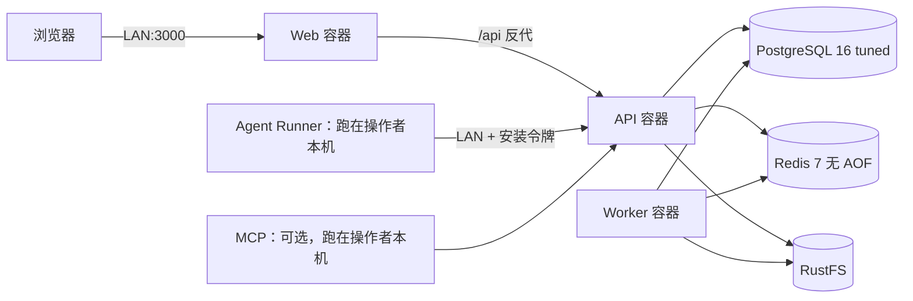

<!-- WM-LITE-20260930:ROADMAP -->
# Lite 轻量单机自托管部署类

状态：设计完成，等待逐项实现。基线日期：2026-09-30。

规格（source of truth）：`docs/adr/0071-lite-single-node-self-hosted-deployment.md`。
本计划每个任务在 WorkMesh 侧对应一个 Issue，描述体即该任务全文，任务的
决策、权衡与取舍回写到该 Issue 的活动流。

## 目标与非目标

**目标**：为「一个人 + 一台低配设备 + 家庭 LAN」提供第二个部署类。设备不需要
仓库、不需要 pnpm、不需要构建、不需要 registry、不需要 CI 证书，就能安装、升级、
回滚 WorkMesh。

**非目标**：

- 不改 `docker-compose.production.yml` 的发布语义，不让 Lite 影响 RC 门禁。
- 不在本轮实现 Tier 0（Worker 内嵌 API 进程、Web 静态导出）。它们各自需要独立
  ADR，本计划只保留接口与验收口径。
- 不引入 native/systemd 安装类。若实测 `dockerd` 开销占比过高再单独立项。
- 不为了省内存而删除 Redis 或对象存储（证据见下）。

## 现状与证据（已核实，非推断）

| 事实 | 证据位置 | 对方案的约束 |
|---|---|---|
| `REDIS_URL` 是必填，realtime 无 Redis 时有 `NoopWakeSource` 兜底 | `packages/config/src/index.ts:256`、`apps/api/src/realtime/wake-source.ts:82` | Redis 不能删；只能瘦身 |
| 认证限流在 store 报错时 **fail-closed** | `apps/api/src/auth-rate-limit/limiter.ts:194` | Redis 不可用 = 登录不可用；因此不给 Redis 设 `maxmemory` 上限 |
| Redis 承担两类易失职责：domain event 唤醒提示（流）、限流令牌桶 | `apps/worker/src/index.ts`、`apps/api/src/realtime/wake-source.ts` | 掉 AOF 只损失唤醒延迟与一次暴力破解窗口 |
| 制品存储只有 S3 一种实现 | `packages/artifact-storage/src/index.ts:480` | RustFS 必须保留 |
| 恢复路径要求 versioning + Object Lock，否则 `RECOVERY_TARGET_OBJECT_LOCK_REQUIRED` | ADR 0070、`@workmesh/recovery` | RustFS 不做功能裁剪 |
| `WORKMESH_SERVICE` 已是角色分发变量，`runtime-guard` 按角色校验配置 | `infra/docker/runtime-guard.mjs` | 单镜像三角色可复用既有机制，无需新抽象 |
| 生产类已有完整硬化基线（read_only / 10001 / cap_drop ALL / no-new-privileges / tmpfs） | `docker-compose.production.yml:3-11` | Lite 保留硬化，只放弃发布溯源 |
| 生产校验器只认 `docker-compose.production.yml` | `scripts/validate-production-images.mjs:39` | 新增 Lite 文件不需要豁免，但也不能被误纳入 |
| Web 已把 `/api`、`/auth`、`/sse`、`/mcp` 反代到 API 上游，保证 cookie 一方化 | `apps/web/next.config.ts` | LAN 直出 Web 即可，不需要反代 |
| 备份/恢复命令假定有仓库 | `package.json` `db:backup` / `db:restore` | 设备上必须提供独立 shell 备份 |

**内存结论（必须先纠正一个常见误解）**：省内存的是 Node 进程，不是容器。合并容器
几乎不省内存。只有把 API/Worker/Web 的运行时数从 3 降到 1 才是真节省，而那是代码
改动。因此本轮把「操作面简化」和「内存下降」分成两件事分别兑现，不混为一谈。

## 目标拓扑

设备上常驻 6 个容器，全部来自**同一个** Lite 镜像（除三个数据服务）。`agent-runner`
与 `mcp` 默认不在设备上：Runner 需要真实 OS 隔离边界，这是安全不变量，同时也是最大
的内存节省项。

## 容量目标（设计目标，不是实测值）

| 角色 | 目标常驻 | 备注 |
|---|---|---|
| PostgreSQL | 60–90 MB | `track_activities=off` 省共享内存 |
| Redis | 8–15 MB | 无 AOF，流由 `MAXLEN=10000` 约束 |
| RustFS | 20–40 MB | 不裁剪 |
| api | 150–250 MB | heap 320 MB，cgroup 640 MB |
| worker | 120–200 MB | heap 256 MB，cgroup 448 MB |
| web | 120–200 MB | heap 256 MB，cgroup 448 MB |
| **合计** | **0.5–0.8 GB** | 峰值约 1.2 GB |

**支持下限：2 GB RAM + 至少 512 MB swap。1 GB 设备在当前架构下不支持**，这个结论
要写进文档，不允许含糊。heap 必须小于 `mem_limit`：V8 在堆压力下 GC，cgroup 上限是
内核 OOM kill，堆触到上限就是无干净收尾被杀。

实测数字的验收落在 W4，产出 `docs/operations/lite-footprint.md`。上表在 W4 之前只能
当目标看。

## 任务链

W0 → W1 → W2 → W3 → W4，串行门禁；W5 为 Tier 0 预留，不在本轮实现。

### W0 — Lite 单镜像（api / worker / web / migrate 四角色）

**目标**：`infra/docker/lite.Dockerfile` 产出一个镜像，内含
`/opt/workmesh/{api,worker,web}`，由 `WORKMESH_SERVICE` 分发；`entrypoint.sh` 扩展
`web` 与 `migrate` 两个角色。复用 `infra/docker/runtime-guard.mjs` 的既有校验，不引入
新抽象层。

**交付物**：`infra/docker/lite.Dockerfile`、扩展后的 `infra/docker/entrypoint.sh`、
角色分发单元测试。

**测试清单**

- 分发单元测试：四种 `WORKMESH_SERVICE` 值各自解析到正确入口；未知角色退出码非 0。
- 分发单元测试：缺角色必需环境变量时 `runtime-guard` 拒绝启动（复用既有校验）。
- 本地构建后 `docker run` 四个角色，各自 `/readyz` 可达。
- 回归：`pnpm validate:production-images` 无需改动仍通过（证明 Lite 未污染发布类）。
- 回归：`pnpm lint && pnpm typecheck && pnpm test` 绿。

**DoD**：一个 tag 覆盖四角色；生产 compose 与其校验器零改动；CI 门禁不变。

### W1 — `docker-compose.lite.yml` 与数据服务调参

**目标**：6 个常驻服务 + `migrate` 一次性服务 + 可选 `agent` profile；按 ADR 写入
PostgreSQL 启动参数、Redis 参数、`mem_limit`、`--max-old-space-size`、`json-file`
日志上限。保留 `x-app-hardening` 全套硬化。

**交付物**：`docker-compose.lite.yml`、`infra/lite/measure.sh` 的初版。

**测试清单**

- `docker compose -f docker-compose.lite.yml config --quiet` 通过（最小与完整两种
  env 组合）。
- 新增 `scripts/validate-lite-compose.mjs`：断言每个服务都有 `mem_limit`、每个 Node
  角色都有 `mem_limit > --max-old-space-size`、每个服务都有日志上限、没有 `latest`
  或浮动 tag、PostgreSQL 保留 `synchronous_commit=on`。
- 单元测试覆盖 `validate-lite-compose` 的每个断言，含故意违规的负例。
- 渲染后配置快照断言：Redis 无 `appendonly yes`、无 `maxmemory`；PostgreSQL 含
  `track_activities=off`。
- 集成：`pnpm test:integration` 全绿（compose 不改变数据库契约）。

**DoD**：验证脚本进 `pnpm ci:validate`；`validate-release-workflows.mjs` 无需豁免。

### W2 — `.env.lite.example` 与安装/运维手册

**目标**：设备上没有仓库，所有变量必须来自一个可复制的 env 文件。手册覆盖：安装、
首次 bootstrap、LAN 暴露、TLS 可选、升级、回滚。

**交付物**：`.env.lite.example`、`deploy/lite/README.md`。

**测试清单**

- 新增一致性校验：Lite compose 里每一个 `${VAR}`（含默认值省略形式）都在
  `.env.lite.example` 中有对应条目；反向也校验一次，避免示例里有过期变量。
- 手册中的每条命令在干净环境实跑过一次（bootstrap:token、migrate、up -d、健康检查）。
- 校验：手册不得出现 `CHANGE_ME` 之外的可复制明文口令；必填项在缺失时报错而非
  使用默认值启动。

**DoD**：一台没装过 WorkMesh 的机器按手册能起服务；校验脚本进 `pnpm ci:validate`。

### W3 — 设备侧备份与恢复

**目标**：`deploy/lite/backup.sh`（`pg_dump -Fc` + RustFS 卷目录打包）与
`restore.sh`。单节点本地盘，复制卷目录即完整制品备份，不需要 S3 客户端。

**交付物**：两个脚本 + 手册中的恢复演练小节。

**测试清单**

- 端到端演练：起 Lite 栈 → 写入数据 → `backup.sh` → 清空 → `restore.sh` → 比对
  关键表行数一致。
- 幂等：重复执行 `backup.sh` 不报错、不产生半截文件（先写临时文件再 rename）。
- 失败可观测：备份目标盘满或权限不足时脚本非 0 退出并打印原因。
- 保留门禁：`pnpm --filter @workmesh/recovery test:integration` 仍绿。

**DoD**：恢复演练记录（含行数比对输出）写入 `docs/operations/lite-footprint.md`。

### W4 — 实测足迹与 2 GB 结论验收

**目标**：在目标设备上跑 `measure.sh`，把上表的目标值换成实测值。**这一项是
「适合低配置设备」这个命题的唯一验收证据。**

**交付物**：`docs/operations/lite-footprint.md`（设备、内存、swap、磁盘、启动耗时、
常驻与峰值 RSS、测量命令与原始输出）。

**测试清单**

- 记录空闲常驻、单机操作、并发 SSE 三种状态下的 RSS。
- 记录 `docker system df` 与数据卷增长速率。
- 结论必须区分「实测支持」与「未测」。1 GB 设备的结论只能写「未支持」，不能写
  「大概可以」。

**DoD**：文档里的每个数字都能用文档里给出的命令复现；ADR 0071 的容量表按实测更新。

### W5 — Tier 0 预留（不在本轮实现）

Worker 内嵌 API 进程（省 1 个 Node 运行时，约 120–200 MB，代价是 API 崩溃同时停
投递，门禁为 outbox-recovery 集成测试）；Web 静态导出并由 API 托管（省 1 个 Node
运行时，走 `WORKMESH_WEB_SAME_ORIGIN_API=1` 既有方向，门禁为 E2E 套件）。两者各自
需要独立 ADR，且都应在 W4 实测之后决策。

## 实施记录（2026-09-30，W0–W2 进行中）

### 已落地并验证

| 项 | 验证方式 | 结果 |
|---|---|---|
| `packages/config/src/service-command.ts` 四角色分发表 | 13 个单测 + config 包全量 | 33/33 通过，`tsc --noEmit` 通过 |
| `infra/docker/lite.Dockerfile` 单镜像四角色 | 实际构建 | 成功，**镜像 512 MB** |
| `infra/docker/lite-dispatch.mjs` 分发器 | 镜像内逐角色运行 | migrate / worker / web 均解析并加载成功 |
| `docker-compose.lite.yml` | `docker compose config --quiet` + 结构校验器 | 8 服务渲染通过，51 个变量双向一致 |
| `scripts/validate-lite-compose.mjs` | 16 个故意违规变体 | 全部被拒且报出预期原因 |
| `.env.lite.example` | 与 compose 变量双向比对 | 无遗漏、无多余 |

`pnpm ci:validate` 已接入 Lite 校验器，全绿。

### 实现中发现、必须记录的三件事

**1. 规格未覆盖的正确性缺口：`web` 角色在同源模式下过不了运行时守卫。**
`runtime-secrets.mjs` 的 `requiredByService.web` 要求 `NEXT_PUBLIC_API_URL` 非空，
而 Lite 必须留空——设备可能通过 LAN 地址、主机名或隧道名访问，这些在构建镜像时
都不可知，留空才能让浏览器用相对基址、由 Next 反代 `/api`（这正是 cookie 保持
一方化的机制）。

不能复用 `WORKMESH_WEB_SAME_ORIGIN_API`：它的语义是**相反**的——置 1 表示不要 Next
反代（由别的东西在同源路由 `/api`）。复用它会引入一个自相矛盾的耦合。

最终以 `next.config.ts` 已经读取的 `NEXT_API_UPSTREAM` 作为声明信号：设置它即表示
「Web 服务自己终结 `/api`」，此时 `NEXT_PUBLIC_API_URL` 不再要求非空；但**若提供
了值，占位符与形状校验照旧**。生产 compose 的 web 服务不设置 `NEXT_API_UPSTREAM`，
因此生产行为逐字节不变。已补 4 个测试。

**2. 只有真跑镜像才能发现的 bug：相对 `COPY` 落在 `WORKDIR` 里。**
`COPY --from=build /out-api ./api` 在 `WORKDIR /opt/workmesh/api` 下解析成
`/opt/workmesh/api/api`，三棵树全部下沉一层，分发表的四个路径全对不上，镜像看起来
完全健康。13 个单测钉的是表结构，compose 校验器钉的是拓扑，**两者都不可能发现
镜像内的路径错误**。改为绝对 `COPY` 目标后修复。

因此新增 `infra/lite/verify-image-roles.sh`：逐角色用真实 entrypoint 跑一遍，要求
「解析到入口 → 加载成功 → 失败在连不上的依赖上」这条链成立。缺入口会表现为
`MODULE_NOT_FOUND`，能加载则会走到连接失败——这个差异就是全部信号。
`migrate` 这一路尤其关键：它的入口在 API 树的 `node_modules` 里，正是该 bug 的靶心。

**3. Lite 镜像必须自带 `HOSTNAME=0.0.0.0`。**
不设置时 Next standalone 绑到容器主机名，日志看着正常（`Local: http://<id>:3000`），
但容器内任何本地请求都连不上。生产 web 镜像本来就设了它，Lite 镜像补上。

### 校验器抓到的自身缺陷（记录，因为负例确实有用）

- 首次运行即误报：Redis 的裸前缀检查 `--maxmemory` 命中了必需的
  `--maxmemory-policy`。改为要求 `--maxmemory` 后必须跟值。
- 自测第 14 例证明「bootstrap 环回逃生口」那条断言是装饰性的：它检查
  `${VAR:-true}` 这种变量默认形式，而 compose 里是硬编码字面量 `"false"`，
  把它翻成 `"true"` 根本不会被发现。改为检查解析后的实际值。
- 负例本身也写错过两次（把 service 追加到了 `volumes:` 之后变成顶层键；把
  `command:` 插进了 `environment:` 块内部产出非法 YAML）。变异写错时校验器
  报的是 YAML 解析错误而不是断言失败——这说明自测对「变异是否合法」也该有
  可见信号。

### 尚未开始

- `infra/lite/measure.sh`（W1 交付物之一）
- `deploy/lite/README.md`（W2 交付物之一）
- W3 备份/恢复、W4 实测足迹
- 未跑 `pnpm lint` / `pnpm test` / `pnpm test:integration` / `pnpm test:e2e` 全量门禁

## 实测纠正（2026-09-30，OpenWrt 网关）

在 `root@192.168.22.1`（x86_64 OpenWrt，3.94 GiB 内存）上对**生产类**做了实测。
生产类比 Lite 更重（多带 MCP 与 webhook bridge），所以这组数字不能直接当作 Lite 的
足迹，但足以证明本计划顶部的容量表**每角色高估了约 2 倍**：

| 服务 | 实测常驻 | 本计划原估值 |
|---|---|---|
| api | 61 MB | 150–250 MB |
| worker | 70 MB | 120–200 MB |
| web | 103 MB | 120–200 MB |
| PostgreSQL（刚跑完迁移） | 186 MB | 60–90 MB |
| 对象存储（RustFS） | 84 MB | 20–40 MB |
| Redis | 7 MB | 8–15 MB |
| **合计** | **621 MB** | 478–795 MB |

合计数字之所以还落在区间内，是因为 PostgreSQL 超估的量大于应用侧少算的量——这个抵消
不可依赖。ADR 0071 已加入对应的 Correction 小节。

**因此 Lite 的立项理由不是内存。** 单镜像、脱离 registry 与 digest 环的运维收益才是
全部理由；W4 的 `docs/operations/lite-footprint.md` 仍是 Lite 自身足迹的唯一验收证据，
在它产出之前 Lite 的容量数字同样只是估计。

## 风险与已知限制

- **AOF 关闭 → 限流令牌桶在 Redis 重启后清零**，形成一个短暂的暴力破解窗口。LAN
  单管理员场景接受，并显式记录。
- **迁移不可自动回滚**：升级步骤 3 前必须先跑一次 `backup.sh`；回滚只回滚镜像。
- **Tier 0 未实现前 1 GB 设备不支持**，不要在文档或销售口径里含糊。
- **Windows 开发机**：`docker compose` 行为与 Linux 设备一致，但 `backup.sh` /
  `restore.sh` 需在 WSL 或 Linux 设备上验证，Windows 上只跑 lint/typecheck/test。
- Lite 不是发布类：无 digest、无 manifest、无 RC 门禁。若日后要对外分发 Lite 镜像，
  那是另一个决定。

## 演示步骤

1. 工作站上 `docker build -f infra/docker/lite.Dockerfile -t workmesh-lite:$(git rev-parse HEAD) .`。
2. `docker save workmesh-lite:<sha> | gzip > lite.tar.gz`，拷贝到设备。
3. 设备上 `docker load`，`cp .env.lite.example .env.lite`，按手册填密钥。
4. `docker compose -f docker-compose.lite.yml run --rm migrate`，
   `docker compose -f docker-compose.lite.yml up -d`。
5. 浏览器打开 `http://<lan-ip>:3000`，用 bootstrap 令牌完成首次安装。
6. `bash deploy/lite/measure.sh` 输出常驻与峰值 RSS，贴进 footprint 文档。

## 规格分歧

- ADR 0071 状态为 `Proposed`。W1 完成后若容量目标被实测推翻，ADR 需按实测修订并转
  `Accepted`，不允许保留「设计目标」措辞当作结论。
- 容量表中的数字在 W4 之前是目标。任何对外材料引用前必须先有 W4 记录。
