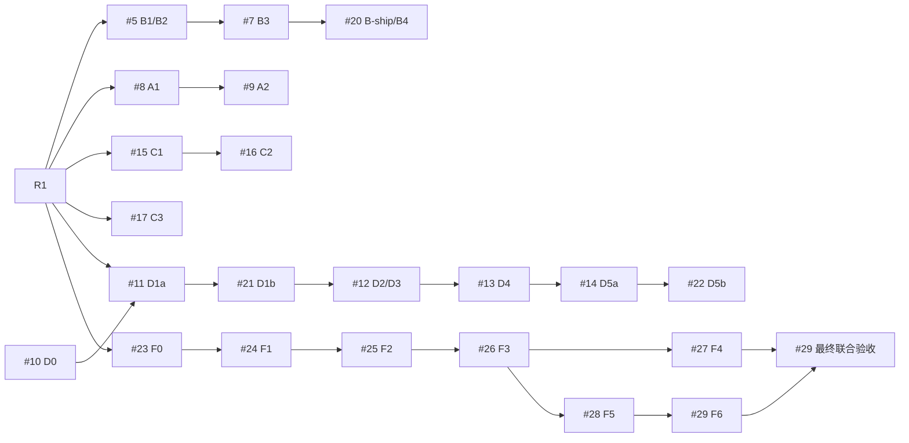

# 工作台就绪面、接入恢复、渠道与模型目录、视觉迁移和总管契约

Status: Proposed。产品链共五条：A/B/C/D/F；P0/P1/G1/D0为各自前置，R1为规格裁决，R2为审查索引，S1为可选流程资产。完整任务正文、测试与DoD在[规格索引](activation-task-specs/index.json)按真实todoId映射；本文件与各规格同属仓库权威，不能只同步摘要。

## 本批执行记录例外与当前门禁

用户已批准仅本批以 Todos 编排和记录执行进度、仓库保存规格及证据，替代AGENTS.md的真实WorkMesh Project/WorkItem双轨记录。没有创建或同步真实WorkMesh记录，其余领域、安全、测试与独审要求保持。所有实现task withPlan=true。必要新需求/设计分歧由Chief交用户裁定，权限、凭证及仓库以外发布不自动授权。

G1已done：最终审查head c7a1af7d7b2e125368b29975867b4d392690fc38在main 72dbd5e862a81edc36b1f0ea59df69e6aa4b01b2，head/main tree diff为空。最终MD/JSON/ZIP/index可读，CI376/run37669698793十job成功为G1的历史证据。最新实际main 5743f027ec86e8726d2cfdd38e0e038bdebeae49追加PR202的7个CI/配置文件，未改G1历史门禁；不把G1成功冒作R1检查。原G1计划段完整存于[历史摘录](../reviews/r1/historical-plan-excerpts.json)，原证据文件不改写。

P1已冻结，D0已完成亮色基线，不代表产品仅亮色。R1本轮已获完整规格修订授权，当前修订不启动产品实现；须最终独审、blocking/high闭合、最新PR必需CI成功并正常合入后，Chief才逐项同步看板和放行对应实现。每次下游开工复读最新main及29卡，核对updatedAt/状态/哈希并归因差异；版本推进不是错误，不再要求与旧dcf正文相等。

## 输入、范围与复用边界

原规划与snapshot保留，执行输入及差异见[29卡全文](../reviews/r1/execution-inputs.json)、[输入差异](../reviews/r1/input-deltas.json)和[主线输入](../reviews/r1/execution-main-inputs.json)。原外部审查、F两轮报告为输入，owner已裁定F2委派内自主分派与F5有审计重新投递，不重新当待选问题。复用authIdempotentTransaction、buildAgentConnectionInstruction、createAutomationWorker.claimNotifications/deliverNotification、registerInboxRoutes/loadAgentItemForUpdate/insertReceipt、toWorkSurfaceItem/单项移动适配器和createEventReader，构件存在不等于新原子/授权组合已实现。

本轮改规格、审查及证据，不改产品代码、OpenAPI/Schema执行契约、数据库迁移，不新增渠道身份桥接、归档、长期记忆、runner活性注册或真实服务探测。后续任务先改contracts/OpenAPI、再按现有policy生成工具链；新migration/SCHEMA和空库升级责任分配给相应实现任务。

## P1：16 条代码事实断言核实台账（2026-10-07）

以下结论以当前工作区代码和文档为准，覆盖原草稿中的错误前提及本计划依赖的
关键代码事实。行号按本次核查时工作树记录；“错误”列出可替代证据，不以关键词
零命中推导全局不存在。

| # | 断言 | 核实结果 | 修正后的表述与证据 |
|---:|---|---|---|
| 1 | 安装令牌只存在于兑换响应，服务端不能恢复响应 | **错误** | 安装令牌明文在兑换响应中生成并返回（`apps/api/src/agent-connections.ts:529-539,553-557`）；完整响应另以 AES-256-GCM 加密存入通用认证幂等表（`apps/api/src/auth-idempotency.ts:128-144,319-339`），不是“只存在于响应”。 |
| 2 | 加密重放没有到期擦除 | **错误** | worker 按 `replay_expires_at` 清空密文、IV、tag 和重放密钥元数据（`apps/worker/src/session-lifecycle.ts:672-690`）。 |
| 3 | 精确重放只检查 caller 的幂等 key | **不完整** | 重放还绑定 subject、operation、规范化 request body、client context，且受重放窗口与已完成状态约束（`apps/api/src/auth-idempotency.ts:210-216,285-304`）。 |
| 4 | 兑换入参带有 claim 标识，可用它恢复凭据 | **错误** | `agentConnectionRedeemInputSchema` 严格只接受 `pairingCode`、`agentSlug`、`client`，无 claim 标识字段（`packages/contracts/src/index.ts:2711-2723`）；当前恢复身份来自原幂等请求身份。 |
| 5 | `POST /api/v1/agent-connections` 只绑定已有 Agent | **错误** | 路由查无定义时会插入 Agent actor 与 `agent_definitions`（`apps/api/src/agent-connections.ts:429-469`）；不可通过文档把现有创建能力描述成不存在。 |
| 6 | 配对码是短码，或不是 32 随机字节载荷 | **错误** | `opaqueToken()` 生成 32 随机字节并编码为无填充 base64url 的 43 字符；配对前缀 `wmp_` 由连接 token 拼接（`packages/db/src/index.ts:41`、`apps/api/src/agent-connections.ts:32-35,358-360`），完整值再加前缀。 |
| 7 | 两个兑换端点共用同一 endpoint/subject 限流预算或失败退避 | **错误** | endpoint 桶按 `operationId`，subject-client 桶也包含 `operationId`；失败键为 `operationId + clientIp + subject`，而两个 operation ID 不同（`apps/api/src/auth-rate-limit/limiter.ts:122-145,154-159`；`apps/api/src/auth-rate-limit/inventory.ts:36-37`）。 |
| 8 | 两个兑换端点完全没有共享限流预算 | **错误** | socket peer 与 client IP 维度不含 operation ID，仍由两个入口共享（`apps/api/src/auth-rate-limit/limiter.ts:129-145`）。准确表述是 endpoint、subject-client 和失败退避按 operation 隔离，IP/socket 预算共享。 |
| 9 | pairing 的 attempts 是错误 code 暴力破解计数 | **错误** | 随机错误 code 在查 pairing 行时失败；仅已知 pairing 的 slug/type mismatch 进入外部 catch 并递增 attempts，达到阈值时拒绝（`apps/api/src/agent-connections.ts:518-525,560-562`）。 |
| 10 | 配对码十分钟有效期覆盖完整七步安装流程 | **错误** | 十分钟 `expiresAt` 创建于 pairing，redeem 时校验；成功兑换后后续本地配置/Skill 校验不再使用该 code（`apps/api/src/agent-connections.ts:358-365,518-523,546-557`）。15 分钟重放窗口独立定义于 `auth-idempotency.ts:248-249`。 |
| 11 | 保存模型连接会向供应商真实请求验证密钥 | **错误** | API 对 URL 做格式/策略规范化（`apps/api/src/workbench-llm-connections.ts:49-69`），ADR 0065 明确当前 API 不向配置目标发请求（`docs/adr/0065-prototype-web-pi-workbench-and-llm-connections.md:48-50`）。 |
| 12 | 模型只要存在就可用于模型支持命令 | **错误** | 授权查询要求 connection `active` 且 model `enabled=true`（`apps/api/src/workbench-conversations.ts:150-166`）。 |
| 13 | Runner 有独立的在线/空闲心跳事实 | **未发现；结论限于已读实现** | runner 在获得 Session assignment 并进入执行流程后才发送 Session heartbeat（`apps/agent-runner/src/run-session.ts:331-357`）；assignment 查询关联 Session/Delegation/grant，而不是 runner 注册（`apps/api/src/workbench-runner.ts:88-109`）；heartbeat 字段属于 `agent_sessions`（`packages/db/src/schema.ts:316-324`）。因此当前就绪项应为 `unknown`，不声称未来不存在此能力。 |
| 14 | 平台完全没有通知投递能力 | **错误** | ADR 0062 已记录人工 Web Push（`docs/adr/0062-autonomous-control-plane-and-agent-lifecycle.md:30-32`），schema 有 notification、delivery 与 browser push subscription（`packages/db/src/schema.ts:523-543`）。缺口应限定为目标生态渠道适配器。 |
| 15 | 企业微信、钉钉、飞书、小程序适配器已存在，或可据“零命中”断定所有生态代码不存在 | **未发现适配器；检索结论有边界** | 本次对 `apps/`、`packages/`、`docs/adr/`、`docs/plan/` 与 `docs/agent-integration.md` 显式纳入检索，命令使用 `rg -n -uu -i`，检索词为 `企业微信|wecom|wechat work|wework|钉钉|dingtalk|飞书|feishu|lark|小程序|mini.?program`；排除 `node_modules/`、`.git/`、`dist/`、`.next/`、`coverage/`。命中仅为计划/ADR规划文字，未找到实现证据；结论只写“未发现渠道适配器”，不外推为国内模型/全部文档不存在。 |
| 16 | Human Attention / Redis wake sink 可直接作为持久通知队列 | **错误** | ADR 0050 将 Attention 定义为派生查询；worker Redis sink 写 cursor/workspace wake hint 并按 `MAXLEN` 裁剪，PostgreSQL outbox 才负责 claim/delivery（`apps/worker/src/index.ts:249-258,291-325`；ADR 0033）。新渠道投递仍需持久契约。 |

核查依据为表中逐项代码/文档定位及第 15 项明确列出的搜索词、目录范围和排除项。
没有发现推翻 ADR 0074–0076 当前决策前提的新证据；本次只补精确事实依据与检索边界，
不改设计决策。交叉引用：[`ADR 0074`](../adr/0074-workspace-configuration-readiness-check-and-first-run-surface.md)、
[`ADR 0075`](../adr/0075-verifiable-and-simplified-agent-connection-onboarding.md)、
[`ADR 0076`](../adr/0076-china-ecosystem-ingress-channel-delivery-contract-and-model-presets.md)。

核查任务清单：

- [x] 16 条断言逐条有结论；
- [x] 每条被推翻的断言都有替代证据；
- [x] 搜索未发现项记录检索词、纳入范围和排除项；
- [x] 结论同步到计划及相关 ADR，计划中的相对链接目标可解析；
- [x] 每项验证均记录测试/检查命令、实际结果与原因；五项必需检查均已通过。首轮失败和修正后重跑结果均保留在下表。

### 必需检查记录

执行环境：Windows PowerShell，Node `v24.20.0`、pnpm `9.15.4`；专用 Docker PostgreSQL 16、Redis 7、RustFS。集成与 E2E 使用本地回环端口和独立 `*_test` 数据库（包括单独的 E2E 重跑库、恢复源/目标库），未连接生产库，也未复用 D0 分支数据库。E2E 的 bootstrap、cursor、限流密钥为进程内生成的测试值；模型相关 live provider 用例按测试默认跳过，未以真实模型调用代替 fake provider。

| 必需检查 | 执行命令 / 对应测试 | 实际结果 | 结论 |
|---|---|---|---|
| lint | `pnpm lint`（Turbo 全仓 lint，18 个任务） | 18/18 任务通过，退出码 0。首次因依赖尚未安装而启动失败；随后按 lockfile 执行 `pnpm install --frozen-lockfile`，重跑通过。 | 通过 |
| typecheck | `pnpm typecheck`（Turbo 全仓类型检查，18 个任务） | 18/18 任务通过，退出码 0。 | 通过 |
| test | `pnpm test`（Turbo 全仓单元测试，29 个任务；含 API、Web Vitest） | 29/29 任务通过，退出码 0；Web 报告 113 个文件 / 776 项通过，API 174 项通过。 | 通过 |
| test:integration | `pnpm test:integration`：DB `@workmesh/db test:integration`（17 文件 / 77 项）；API `@workmesh/api test:integration`（22 文件 / 154 项通过、1 项 live MiniMax 跳过）；Worker `@workmesh/worker test:integration`（8 文件 / 78 项通过、1 项 retention upgrade barrier 跳过）；Recovery `@workmesh/recovery test:integration`（1 文件 / 1 项）。 | 完整命令退出码 0；共 310 项通过、2 项按测试设计跳过。首次 recovery 重跑误指向无 ObjectLock 的预建测试桶而失败；移除桶覆盖配置、由用例创建隔离 ObjectLock 桶后完整重跑通过。 | 通过 |
| test:e2e | `pnpm test:e2e`，对应 `apps/web/e2e/**/*.spec.ts`（Playwright，1 worker） | 首轮 73 通过 / 1 失败：`e2e/documents.spec.ts` 的“Project and Issue documents keep immutable revisions through the real Web and API”超时，未在详情面板找到“讨论”标签。新建隔离库单独重跑该文件：9/9 项通过；再用全新隔离库重跑完整命令：74/74 项通过，退出码 0。首轮失败保留为重跑前观察，不隐去。 | 通过（完整重跑） |

按你的要求，另补跑了默认关闭的 retention upgrade barrier：设置 `RUN_RETENTION_UPGRADE_INTEGRATION=1`，使用独立 `workmesh_retention_upgrade_test` 数据库和启用 Object Lock/versioning 的 `workmesh-retention-upgrade-test` RustFS 桶，执行 `pnpm --filter @workmesh/worker exec vitest run --config ../../vitest.integration.config.ts integration/retention-upgrade-barrier.integration.test.ts`；1/1 项通过，验证一个精确对象版本、versioned HEAD、零 delete marker 及 retention 扩展。此补验与上表完整 `pnpm test:integration` 分开计数。

首轮 E2E 失败未能复现：针对性 9 项组合与完整 74 项重跑均通过。没有因此修改实现或测试。只读静态核查的 16 条断言以台账逐条 `file:line` 证据为准；本任务未新增测试代码。五项本机门禁全部通过。#2 已完成，第二轮独立审查批准合并；PR #192 merge commit `660c74a6247544ffac64e7ef8f968d1025b2a668` 包含修订提交 `735578d8d0733e04cae5640cedfaf0c6181391c7` 与此完整台账；CI run `37614969993`（check 344）8/8 job 成功。P1 16 条事实据此冻结为后续输入；G1 实际 build 可达性仍须单独验证。

### P1 完成定义与依赖

**DoD**：16 条断言全部有核实结论；每条被推翻的断言都有替代 `file:line` 证据；检索零命中项写明检索词、范围及排除项；结论已同步到计划与受影响 ADR 且相对引用可解析；五项仓库必需检查的命令、结果及失败/跳过原因均已记录并通过。满足 DoD 后仍须完成独立复核及冻结，之后 B1、A1、D1、C1 才可开工（本项 `blocks：B1, A1, D1, C1`）。

## 完整任务与无环依赖

| 卡 | 完整spec | 源状态 | 实现requires | 额外最终验收requires |
| --- | --- | --- | --- | --- |
| [#1](todo:reEr9xXt9JXN26e5SbC7Z) | [[P0] 前置：授予 agent 团队最小必要工具权限（需管理员执行）](activation-task-specs/01.md) | done | — | — |
| [#2](todo:qJKk_SAxN29AdBHERBl7u) | [[P1] 核实 16 条代码事实断言（file:line 逐条核对）](activation-task-specs/02.md) | done | — | — |
| [#3](todo:q_1zKPuGsG-2ZRUwOwQx4) | [[R1] 独立规格审查：ADR 0074–0078 与当前任务依赖、验收闭环](activation-task-specs/03.md) | building | #2、#18 | — |
| [#4](todo:FX01PP879WjRSp0LVcoM2) | [[S1] 编写团队 Skill：WorkMesh ADR 与双轨流程](activation-task-specs/04.md) | todo | #3 | — |
| [#5](todo:ti53hOGbvnBNrvjXXveGO) | [[B1/B2] 可恢复连接器：稳定请求身份与完整协议验证（零迁移）](activation-task-specs/05.md) | todo | #1、#2、#18、#3 | — |
| [#6](todo:xym1i0KcnxOLi0T-hxd1j) | [[B2] 连接器：七步到两步，且一步校验不减](activation-task-specs/06.md) | closed | — | — |
| [#7](todo:6EzX6xCA-_m72aQU1BEHX) | [[B3] 接入错误分类与恢复指令（不改限流架构）](activation-task-specs/07.md) | todo | #1、#2、#18、#3、#5 | — |
| [#8](todo:Hxr1xIdh4poZp3F5laGrT) | [[A1] 就绪投影：三态查询，零迁移（Runner 只能 unknown）](activation-task-specs/08.md) | todo | #1、#2、#18、#3 | — |
| [#9](todo:0BkezbmWV6k8vwrlSNuF_) | [[A2] 工作台未满足项列表与空状态主动作（不做向导）](activation-task-specs/09.md) | todo | #1、#2、#18、#3、#8 | — |
| [#10](todo:MPhtZiff23B33m9i2equq) | [[D0] 视觉基线采集（硬门禁，不写实现）](activation-task-specs/10.md) | done | — | — |
| [#11](todo:IJQA_DfxU0hF5e8L5Xb3v) | [[D1a] 新增并存语义 token 与参考实测映射](activation-task-specs/11.md) | todo | #1、#2、#18、#3、#10 | — |
| [#12](todo:MRdRKNdufZ2cFEv3hwaf7) | [[D2] 卡片结构契约 + 单暖色不变量（两条合并，同一组件层）](activation-task-specs/12.md) | todo | #1、#2、#18、#3、#21 | — |
| [#13](todo:O2iz8mb_26RoIlnpfXwxV) | [[D4] 三栏工作台布局：对话与看板并排，状态被记忆](activation-task-specs/13.md) | todo | #1、#2、#18、#3、#12 | — |
| [#14](todo:YLnrl8RaxiZjEjsVQ80B2) | [[D5a] 状态化主动作与菜单：仅领域写入走受治理命令](activation-task-specs/14.md) | todo | #1、#2、#18、#3、#13 | — |
| [#15](todo:kkG9VeT3_uTzREhjnX2ve) | [[C1] 渠道投递契约：投递意图 + 每目标 attempt + fenced ack](activation-task-specs/15.md) | todo | #1、#2、#18、#3 | — |
| [#16](todo:kjOs4t_DtMyrkHTBFmpQ5) | [[C2] 企业微信适配器：只提醒 + 深链，卡片不承载决策](activation-task-specs/16.md) | todo | #2、#18、#3、#15 | — |
| [#17](todo:4DlyrPrDMMtK5JTmFm1t_) | [[C3] 国内模型预置目录：只读、带出处、不声称兼容性](activation-task-specs/17.md) | todo | #2、#18、#3 | — |
| [#18](todo:Tws50k02Pi52R-RJEXP_N) | [[G1] 输入可达性：让隔离构建真的读得到 ADR 与计划（执行前硬前置）](activation-task-specs/18.md) | done | — | — |
| [#19](todo:cPwwV-W_Lkm9DtiQWifXP) | [[R2] gpt-6-astra / high 对抗式审查结论（2026-10-07）](activation-task-specs/19.md) | todo | #3 | — |
| [#20](todo:JfGwKk3prfIie6X2u2J51) | [[B-ship] 连接器版本化分发、B4 文档与无源码安装验收](activation-task-specs/20.md) | todo | #2、#18、#3、#5、#7 | — |
| [#21](todo:2j2sxT5wJ-l001efH_meJ) | [[D1b] 按界面迁移 token 消费方，验证后清理旧值](activation-task-specs/21.md) | todo | #1、#2、#18、#3、#10、#11 | — |
| [#22](todo:gY4n2fZhVLa9FcazFC_bY) | [[D5b] 拖拽、多选逐项结果与恢复、拖卡插入草稿](activation-task-specs/22.md) | todo | #1、#2、#18、#3、#13、#14 | — |
| [#23](todo:hHvBuVEpXQRQhVB12wRgu) | [[F0] 团队房间的完整扩展（blocking，必须最先）](activation-task-specs/23.md) | todo | #2、#18、#3 | — |
| [#24](todo:UQPSqKNzHK_mRc_1wOxBA) | [[F1] 总管任命与能力派生（17 项完整分区）](activation-task-specs/24.md) | todo | #2、#18、#3、#23 | — |
| [#25](todo:edIZ0ybOGMRBI6aupNUhU) | [[F2] 总管委派：一次授权、目标内自主执行、人可修订](activation-task-specs/25.md) | todo | #2、#18、#3、#23、#24 | — |
| [#26](todo:GKJOdaKtOjiTwP637pyM-) | [[F3] 激活与准入命令（三源统一）](activation-task-specs/26.md) | todo | #2、#18、#3、#23、#24、#25 | — |
| [#27](todo:89f9yFnmIg4nszXIBCByh) | [[F4] 消费协议（本链最重的一块）](activation-task-specs/27.md) | todo | #2、#18、#3、#23、#24、#26 | — |
| [#28](todo:YtFHUCHv8l4JZcYd1qHAU) | [[F5] 收件箱跨短会话恢复：有审计的 successor / re-delivery](activation-task-specs/28.md) | todo | #2、#18、#3、#23、#24、#26 | — |
| [#29](todo:RTVGtGBgj-BvazLLjiXKu) | [[F6] 两个薄工具与完整交付链](activation-task-specs/29.md) | todo | #2、#18、#3、#23、#24、#25、#26、#28 | #27 |

产品前置R1/P1/G1/P0按每卡索引核对；已完成前置不重开。#5吸收#6，#20吸收B4及无源码安装；#11/#21拆槽/消费迁移，#12合并D2/D3，#14/#22拆主动作/菜单与拖拽/逐项恢复/草稿。C3独立，C1→C2保留，S1不阻塞实现，悬空C4删除。

## F链共同契约与阶段责任

共同锁序见[锁协议与并发验收](../reviews/r1/lock-contract.md)：无锁定位不授权，先参与者 Session 排序 advisory，再连接生命周期及有 Chief 上下文时的 appointment前缀和既有完整authority rank（Chief委派在delegation rank）；guard 重验后才 root→前驱→后继业务锁。持业务锁不得补低 rank，锁集变化整事务回滚重试；#24/#25 的换届/撤权与 #28 三种根完成路径共用此顺序，#28 更新逐语句锁清单，#29 做交叉并发联合验收。

F4 的消费/结果提交以独立 logical dispatch 记录及幂等身份去重，委派 id/revision 仅表示授权来源。同一 standing revision 下多次合法分派不能合并成一次；同请求重放不重复结果或扣量，显式新 Session retry 是新的分派和用量。#25 交付分派记录/台账，#27 的 checkpoint 引用已提交结果并同事务推进，新增迁移归对应执行者，不修改旧 migration/checksum。

R1冻结恢复身份/资格/幂等/提交协议及F2授权计量；F3 owner交付三源激活与持久结果引用，F4 owner验收baseline/checkpoint与结果同事务接口，F5 owner在既有Inbox fixtures实现恢复底层且不依赖F6。F6实现requires F1/F2/F3/F5；最终联合验收另外消费已验收F4，无反向边。#29 owner对恢复、checkpoint、三条根完成路径、Stop/撤权/换届/重放和REST/SDK/MCP/manifest/adapter/conformance端到端负责。各执行角色由Chief派发前落实，不冒称已任命agent。

F0先枚举entry提交再引用，F1任命事务建Team房间；房间可见不等于exact-recipient私信可见。F2 standing delegation与0062 action Approval合取，不逐次人批；上下游能力两道上限、旧revision全部派生失效、logicaldispatch次数与预算原子记账。F3新输入id不清除同逻辑来源Stop抑制。F5原claim/归因不可变，直接前驱链接与根资源分开；root message resolution在Inbox reply/Work Room answer/Human resolve三条完成路径原子收敛整链。完整共同契约见ADR0078及[任务接口](../reviews/r1/task-contracts.json)，ADR0037旧Consequences逐字保留并限定修订。

## D链基线、主题与旧链交界

### D0 — 视觉基线（硬门禁，不写实现）

- **交付**：受影响界面的**改动前**截图基线（工作台、看板、项目、Agent 详情、
  列表/详情、设置），固定视口与明暗（本任务固定亮色；产品已有明暗切换）。
- **约束**：D0 未完成前**禁止**任何 token 值变更。没有基线就没有评审视觉回归
  的依据，这是本链唯一的硬门禁。
- **测试**：基线本身可重放（同一视口两次产出可重复）；基线纳入 e2e 资产。
- **开工前测试文件与用例映射**：`apps/web/e2e/mocked/d0-visual-baseline.mocked.spec.ts`，
  测试组 `D0 亮色视觉基线`；实际用例为 `工作台：覆盖、两次采集一致、D1 可直接比对`、
  `看板：覆盖、两次采集一致、D1 可直接比对`、`项目总览：覆盖、两次采集一致、D1 可直接比对`、
  `Agent 详情：覆盖、两次采集一致、D1 可直接比对`、`工作项列表：覆盖、两次采集一致、D1 可直接比对`、
  `工作项详情：覆盖、两次采集一致、D1 可直接比对`、`设置：覆盖、两次采集一致、D1 可直接比对`。
  以下三项共用这些用例，在 `desktop-1440x1000` 与 `mobile-390x844` 两项目执行：
  - [x] 覆盖全部受影响界面；看板固定滚动，目标列头及卡片完整进入视口。
  - [x] 同一视口两次采集可重复：固定部分栅格条件后，两个独立上下文的原始 PNG SHA-256 相同；重启后再核对原始哈希。
  - [x] 基线可被 D1 的视觉 diff 直接消费：重启后使用 `--update-snapshots=none`、
    `threshold=0.005`、`maxDiffPixels=0` 直接比较已有 PNG，两轮各 14 项通过；本轮未放宽参数。
- **DoD**：基线产出并可重放；D1 开工前以此为门禁。
- **实际证据**：[基线验证报告](../../apps/web/e2e/baselines/d0/verification.md) 与
  [逐项清单](../../apps/web/e2e/baselines/d0/manifest.json)。14 张基线覆盖 7 个面与 2 个视口；
  两轮各两个上下文的哈希校验，与采用容差比较器的重启重放是分别验证的事实。
  容差依据和历史失败保留在证据中，比较器通过不表示用户已验收产品色彩变化。
  五项必需检查在上一修订轮均成功退出，3 个条件跳过及原因保留；新增入口隔离、看板 viewport 断言及详情栅格 A/B 证据。
  最新审查修订撤回通用 mocked-dev 新增 upstream 默认覆盖，仅保留 D0 专用覆盖；
  [独立验证记录](../../apps/web/e2e/baselines/d0/evidence/upstream-scope-verification.json)另存来源新旧哈希、
  14/14 禁止更新基线重放及 28 次原始字节核验。lint/typecheck/test 本轮重跑成功，
  集成/正式 E2E 沿用历史结果；通用入口 12 项旧失败与 115 项未执行不豁免，不宣称全套通过。
  前两轮各 13 通过/1 失败、旧原始 PNG、全部对照与每项通用 mocked-dev 失败原样保留，不能用比较器通过代替哈希一致。
- **依赖与状态**：[D0](todo:MPhtZiff23B33m9i2equq) 的视觉基线门禁已完成（PR #195、独审及 CI #352 通过）；
  通用 mocked-dev 实际失败仍待逐项处置或总管裁决，不改变已完成的视觉基线结论。blocks
  [D1a](todo:IJQA_DfxU0hF5e8L5Xb3v)，并为 [D1b](todo:2j2sxT5wJ-l001efH_meJ) 提供同一份改动前基线；
  D1a 仍须通过 G1、P1、R1 前置。
  不再因缺真实 WorkMesh 连接阻塞 D0；G1/P1/R1 未验证通过时仍不得放行相应实现。
- **文档引用复核**：提交 `dae4620366f33136d65e533d85823db49b9a3fe1` 已删除过时的
  `WORKMESH_PRD.md`；2026-08-22 运行可靠性计划第 34 行及 2026-09-24 工作台基线第 62 行
  已记录现行文档集合与修正陈旧引用的方案。该输入一致性修正由 G1 处理，D0 不重造 PRD、
  不改产品规范，也不把陈旧引用冒称采集/检查阻塞；原始来源核验见上述基线报告。

D1a只并存新增，D1b逐面评审迁移后最终清理；产品已有且默认暗色，既有暗色token与切换回归分别归#11/#21。参考暗色值迁移延后，不能用D0亮色采样删除暗色。D2/D3以当前人canRespond Attention表示需响应，workflow/execution分维，不捏造awaiting_review。D5本地复制和草稿零mutation，移动逐项独立提交与部分恢复，不承诺全批原子性。

A ready/unknown仅配置查询，不激活授权；D4无任命/feature关闭明确不可用，布局不把整个F链设成旧链前置。A2与D4各自先验收，D4负责整合后的窄屏/焦点/列表组合回归。C渠道ack是提供方发送确认，不是F的Inbox resolve、Approval或授权。

## 验收、处置与待裁定阶段

[九类覆盖矩阵](../reviews/r1/test-coverage.json)按feature标适用/理由、具体文件/用例和原测试DoD去向；待创建测试明确标记，未执行不写通过。原合并前清单完整保留在[旧要求映射](../reviews/r1/legacy-requirements.json)，包括#6/B2、B4、D1/D2/D3/D5；错误的无秘密pending、逐次批准、未来暗色、虚构枚举、全批原子移动、决策回调逐条撤回/替换，不保留相互矛盾的活动要求。

[审查报告](../reviews/r1-spec-review.md)及finding台账记录代码事实、owner/处置/复核；没有证据的疑问标待验证，不将风险接受当用户批准。[decisions.md](../reviews/r1/decisions.md)提交#20设备矩阵与#16协议部署的可审建议，受影响阶段保持裁定关口；#27先实测容量再冻结预算，不发明数字。无Redis/Lite能力按0071/0072的实际Proposed与兼容待验收状态记录，不替代现有标准配置黄金路径。

复用verify-build-input-reachability已核验原44文件/P1/原始ZIP，再扩查ADR0078/两轮报告/latestmain及冻结片段。R1 JSON/校验脚本是CI unknown路径，按实际ci-policy选择full，不借文档身份跳过必需检查。本轮结果另见[检查记录](../reviews/r1/execution-checks.md)；不沿用G1/P1/D0成功替代本轮，不修改旧失败证据。当前改动另一个agent定向复核后，最新PR CI/准确提交复核与正常合入仍由Chief执行，Todos同步后读回逐项全文。

## 演示与完成定义

先运行node docs/reviews/r1/verify-specs.mjs，打开29卡规格索引和矩阵，沿DAG查看每个阶段输入/owner/验收，再逐finding对照实际ADR与代码证据。可从原规划到执行snapshot差异追溯来源；原P1/G1/D0可重算不变段。报告文件可在本次改动审核中预览。R1完整spec修订可评审不等于产品新功能已实现；未裁定/未运行/待同步/待PR检查都保留实际状态。
