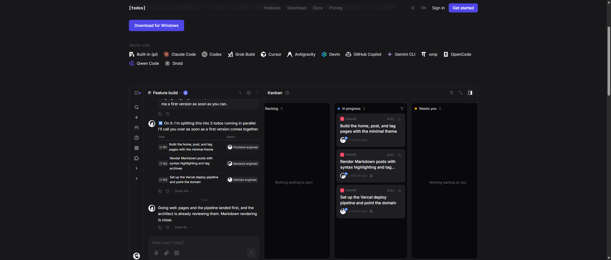

# 看板卡片设计与交互（专项）

取证时间：2026-10-07。两类证据来源，下文逐条标注：

- **【实测】** = 从真实 DOM 取到的 class 名与计算样式（getComputedStyle / getBoundingClientRect）。
- **【指南】** = 产品自带「看板指南」弹窗里产品自己写的交互说明。
- **【推断】** = 我基于前两类做的判断，已明确标出。

> 重要前提：当前团队 `RunXin Xu's team` 里 **一条任务都没有**，看板四列全空，所以真实业务卡片无法从工作台里抓。
> 卡片视觉证据来自官网首页演示看板（`https://todos.dev/`，Inkwell 项目 #151/#152/#153），那是产品官方渲染的真实卡片组件；
> 卡片交互证据来自工作台「看板指南」弹窗的 5 步说明。两者合起来构成完整规格。



## 1. 看板容器

| 项 | 实测值 | 来源 |
|---|---|---|
| 列数与语义 | 4 列：待开始 / 执行中 / 待处理 / 已完成 | 【实测】 |
| 列尺寸 | 260 × 552 px | 【实测】 |
| 列间距 | 12 px（4 列总宽 1178 px） | 【实测】 |
| 列背景 | `--surface-inset` = 深色 `rgb(9,9,11)` / 浅色 `#f2ede6` | 【实测】 |
| 列边框 | `1px solid` `--border-default` = 深色 `#27272a` / 浅色 `#e2dbd1` | 【实测】 |
| 列圆角 | 12 px | 【实测】 |
| 列头 | 高 36–38 px，`padding: 12px 12px 8px`，列名 16px，计数 12px `--text-tertiary` | 【实测】 |
| 状态点 | 8 × 8 px 圆点，实色 | 【实测】 |
| 「已完成」列 | 额外一行「最近 7 天」时间窗 | 【实测】【指南】 |

**四列状态色**（看板圆点实测，明暗两套一致）：

| 列 | 颜色 | 色值 | 语义 |
|---|---|---|---|
| 待开始 | neutral | `#9ca3af` (gray-400) | 未启动 |
| 执行中 | info | `#3b82f6` (blue-500) | agent 正在跑 |
| 待处理 | warning | `#f59e0b` (amber-500) | **卡在人工关口** |
| 已完成 | success | `#22c55e` (green-500) | 已验收 |

这个配色是整个产品信息设计的核心：**只有「待处理」是暖色**。人一眼扫过去，琥珀色那一列就是「现在轮到我」。四个阶段里三个是冷色/中性色，只有人工介入点是暖色——这是在用颜色编码「控制权归属」。

## 2. 卡片结构

实测到的卡片根元素 class（这行 class 本身就是完整的设计规范）：

```html
<div class="flex flex-col gap-1.5 rounded-lg border border-line
            bg-white px-3 py-2.5 dark:bg-surface-secondary">
```

| 区域 | 实测样式 | 内容 |
|---|---|---|
| 容器 | 深色 `rgb(31,31,35)`；`radius 8px`；`padding 10px 12px`；`flex column`；`gap 6px`；242 × 118 px；`cursor: auto` | — |
| 首行 meta | `flex`，`gap 6px` | 项目头像 + 项目名 + 任务编号 + 快捷操作按钮 |
| 项目头像 | `7px` 字号 / `weight 700` / `radius 3px` / 白字 / 品牌色底（示例为 rose-500 `#f2445e`） | 单字母，如 `I` = Inkwell |
| 项目名 | `11px`，`#71717a` | `Inkwell` |
| 任务编号 | `10px`，`#71717a` | `#151` |
| 行内操作按钮 | `padding 6px`，`radius 4px`，`#52525b`，`cursor: pointer` | 图标按钮（无文字） |
| 标题 | `14px` / `weight 500` / `line-height 19.25px` / **`-webkit-line-clamp: 2`** / `overflow: hidden` | 任务标题，最多 2 行截断 |
| 页脚 | `flex`，`gap 8px`，`align-items center` | 相对时间 + Agent 标识 |
| Agent 标识 | `radius 9999px` 胶囊 | Agent 头像/名字 |

**几个值得学的细节：**

1. **卡片本体零阴影。** 深色下卡片靠 `--surface-secondary`（`#1f1f23`）与列底 `--surface-inset`（`#09090b`）的明度差 + 1px 边框分层，不靠投影。阴影预算全留给浮层（弹窗 `rgba(0,0,0,.35) 0 25px 50px -12px`）。这样看板 40 张卡片也不会糊成一片。
2. **元信息极小字号。** 项目名 11px、编号 10px，标题 14px/500。层级靠「字号 + 颜色（`#71717a` 三级文字）+ 权重」三重拉开，不靠框线。
3. **标题两行截断（line-clamp: 2）** 是硬约束，意味着任务标题必须能在 242px 宽的卡里讲清两行——这反过来约束了人怎么写任务标题。
4. **项目头像用品牌色**，让卡片在跨项目混排时也能一眼归属。
5. **卡片 `cursor: auto`**，不是 pointer——卡片本体不是拖拽把手，交互入口另有其物（见下）。**【推断】** 这暗示拖拽由专门的拖拽层/handle 承担，而非整卡可拖。

## 3. 卡片交互规格

### 3.1 状态化主按钮（卡片右下角）【指南】

主按钮文案**随任务状态变化**，这让看板成为唯一的状态机视图：

| 任务状态 | 按钮 |
|---|---|
| 待开始 | 开始 |
| 方案待确认 | 确认 |
| 改动待验收 | 完成 |
| 构建失败 | 重试 |
| 等待回复 | 回复 |
| 已完成 | （无） |

### 3.2 右键菜单【指南】

- **下一步操作排在最前**——菜单是任务相关的，第一项永远是「推进」而不是「编辑」。
- 运行中的任务 → **中断**
- 通用项：编辑、复制、复制链接、关闭、删除
- 已完成的卡片 → **重开**

### 3.3 拖拽【指南】

- 直接拖到目标列即改变阶段。
- **Ctrl / ⌘ + 点选**可多选，一次拖动多张。
- **已开始的卡片拖回「待开始」会重置任务**：中断构建，并清空对话、方案、改动记录。

> 这一条是整个产品里最重的破坏性操作，却没有任何确认弹窗。**【推断】** 靠「反向拖拽 + 目标列语义」降低误触概率，但这是数据丢失路径，如果 WorkMesh 要抄这个交互，建议加一次撤销或软提示。

### 3.4 任务详情页按钮【指南】

右上角主按钮随阶段变化：确认 / 完成 / 重跑；**运行中置灰**（防止中断正在跑的构建）。

### 3.5 筛选与识别【指南】

| 层级 | 维度 | 取值 |
|---|---|---|
| 全局筛选 | 创建者 | 我创建的 / 总管或 Agent 创建的 / 其他成员创建的 |
| 全局筛选 | 项目 | 暂无项目（当前状态） |
| 列内筛选 | 仅「执行中」「待处理」列头有 | 规划与构建 / 待确认的方案 / 待验收的改动 |
| 被动识别 | — | **由总管或 Agent 创建的卡片，编号左侧会显示对应小图标** |

「Agent 创建的任务带图标」是降低人类焦虑的细节：混排的看板里，你需要能立刻分辨哪些是自己派的、哪些是总管自作主张的。

### 3.6 卡片与对话的联动【指南】

- **把卡片拖进对话输入框** → 以任务标签形式插入，补一句说明发给总管。
- **多选的卡片会一并拖入**（与 3.3 的 Ctrl 多选同一套选择状态）。

这条把看板从「只读状态墙」变成了「指挥台」：选卡 → 拖进对话 → 下达指令。**这正是你说的「通过看板让主 agent 或人类控制工作分配」的具体交互实现。**

### 3.7 卡片 → 本机【指南】

点击卡片或任务详情页右上角的**下载图标**：

| 项 | 快捷键 | 作用 |
|---|---|---|
| 同步到机器 | `Ctrl Alt S` | 把任务分支的提交同步到运行 tds 的本机目录，可本地查看运行 |
| Git | — | 复制检出命令，在任意已有克隆里切到该任务分支 |
| 查看全部快捷键 | `Ctrl /` | — |

**每条任务有专属 Git 分支**，这是「人类随时能接管 agent 的活」的物理基础。

## 4. 看板与对话的布局关系【实测 + 指南】

| 行为 | 快捷键 | 说明 |
|---|---|---|
| 侧栏展开/收起 | `Ctrl B` | 侧栏 240px |
| 隐藏/展开看板 | `Ctrl Alt B` | 看板标题栏最右面板图标 |
| 看板全屏 | `Ctrl Shift Enter` | 最大化图标，或把分隔线拖到底；**状态会被记住** |
| 新任务 | `N` | |
| 全部搜索 | `Ctrl K` | |

布局：侧栏（240px）+ 主区，主题/总管对话在左、看板在右，**可拖动分隔线**分栏。实测主区剩余 1917px 时两栏近似各半；四列看板超出右半屏宽度，需要横向查看或收起总管聊天。

## 5. 给 WorkMesh 的可迁移结论

1. **四列语义可以直接映射**：待开始 → `backlog`、执行中 → `executing`、待处理 → WorkMesh 的 `awaiting_review`、已完成 → `completed`。WorkMesh 多出的 `blocked` 在 Todos 里被折叠进「待处理」的列内筛选。
2. **「只有人工关口是暖色」值得抄。** WorkMesh 的 `awaiting_review` / `awaiting_approval` 可以用同一套暖色区分「轮到我」，比现在的状态文字更省认知。
3. **卡片零阴影 + 内凹列底**是低成本高质感的分层法，WorkMesh 看板可以直接换。
4. **拖卡进对话 = 指挥动作**，这是 Todos 里「人控制分配」的核心交互，比 WorkMesh 现在「去 issue 页操作」更轻。
5. **破坏性拖拽无确认**是 Todos 的设计缺陷，不要照抄。
6. **状态化主按钮**（开始/确认/完成/重试/回复）让看板承担状态机职责，避免人还要进详情页才知道下一步做什么——与 WorkMesh「停/暂停/恢复是服务端状态机命令」的思路一致，但 Todos 把它压到了卡片上。
