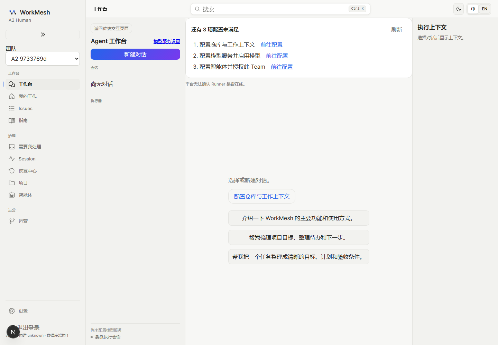
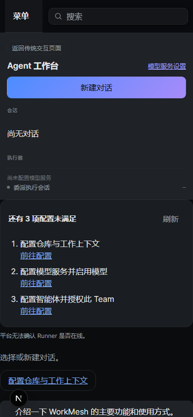
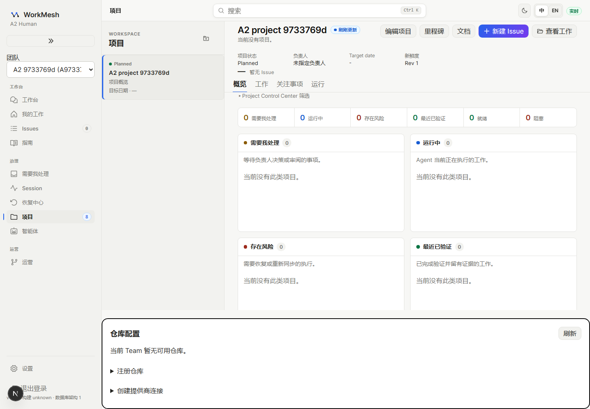
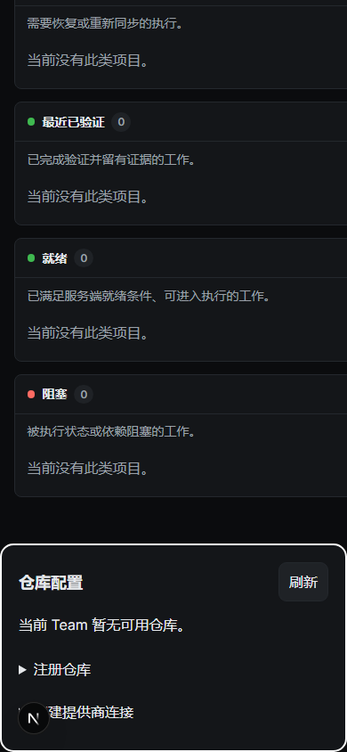

# A2 视觉检查

## 实际采集与查看

截图来自整合 C3 后 `a2-46fe0e21` 的完整浏览器回归。该命令实际 78 项通过、2 项跳过；截图源路径和逐字节复制的 SHA-256 记录在 `visual/source.json`。本轮已直接查看桌面工作台、桌面项目配置、窄屏暗色工作台与项目配置图。

桌面工作台的计数、三个有序缺口及行内链接可见，空状态主动作对应首个缺口，三个提示保持独立按钮。窄屏列表自然换行，链接与刷新可达；Runner 使用未知说明。项目配置保留现有项目面板，深链聚焦配置标题，默认折叠注册及连接创建入口，窄屏通过纵向滚动访问。暗色沿用现有主题，焦点轮廓可见。截图中的空仓库是测试夹具状态，不代表配置成功。

## 基线与判定边界

保留 D0 原件、固定视口、DPR、亮色、UTC、软件栅格参数以及 `threshold=0.005`、`maxDiffPixels=0`。不更新旧截图来消除差异。新增 URL 上下文提示、配置区和固定起始提示属于已批准的设计变化；原页面的错误状态、不可达看板或导航回退不能记作预期变化。

D0 全量实际运行 `a2-6f596da7`：8 项通过、6 项失败。桌面工作台、看板、项目总览以及窄屏工作台、看板共五项为像素比较失败，actual/expected/diff 和原参数均保留。直接查看桌面工作台 diff、看板 actual/diff：前者增加 URL 工作上下文入口提示及真实 Team 选择，后者增加项目仓库配置区并改变内容可视高度；卡片和列标题已通过原可达断言，没有把错误页面当设计差异。窄屏项目总览、Agent 详情、列表、详情与设置均通过原基线；桌面 Agent 详情、列表、设置也通过。

另一项桌面工作项详情因 `page.goto: net::ERR_NO_BUFFER_SPACE` 未完成采集；首败保留，原用例单独重跑 `a2-40208d29` 实际 1 项通过，保持超时、断言、旧基线及两次 PNG 字节一致要求。已直接查看窄屏工作台与看板 actual、桌面项目 actual，新增提示和配置区可见，没有替换原卡片内容。五项像素差异不能填写为通过；失败项在旧截图比较之前退出，没有完成原用例的两次 PNG 字节一致断言，此项证据缺口明确保留。上述直接看图属于实现自检；人类视觉审批仍待确认，不能以自动截图或预期差异说明替代。
