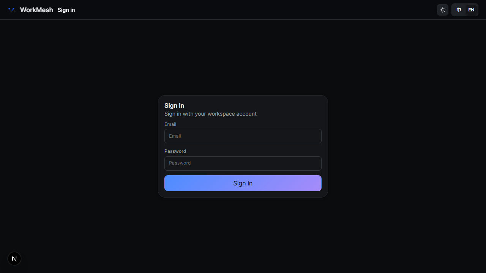
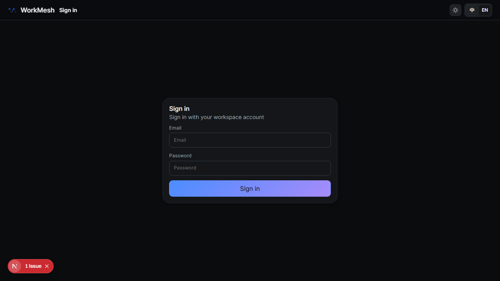
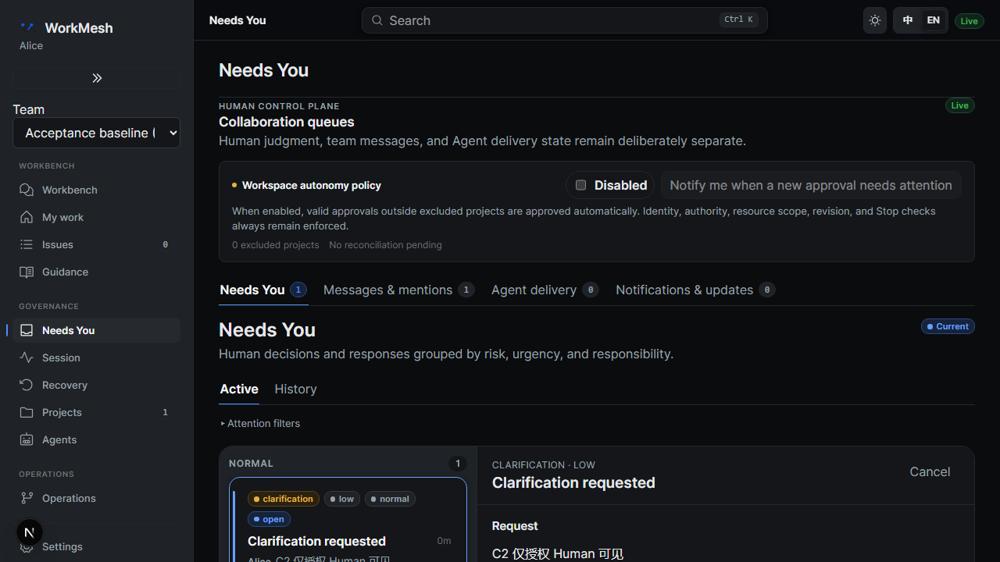
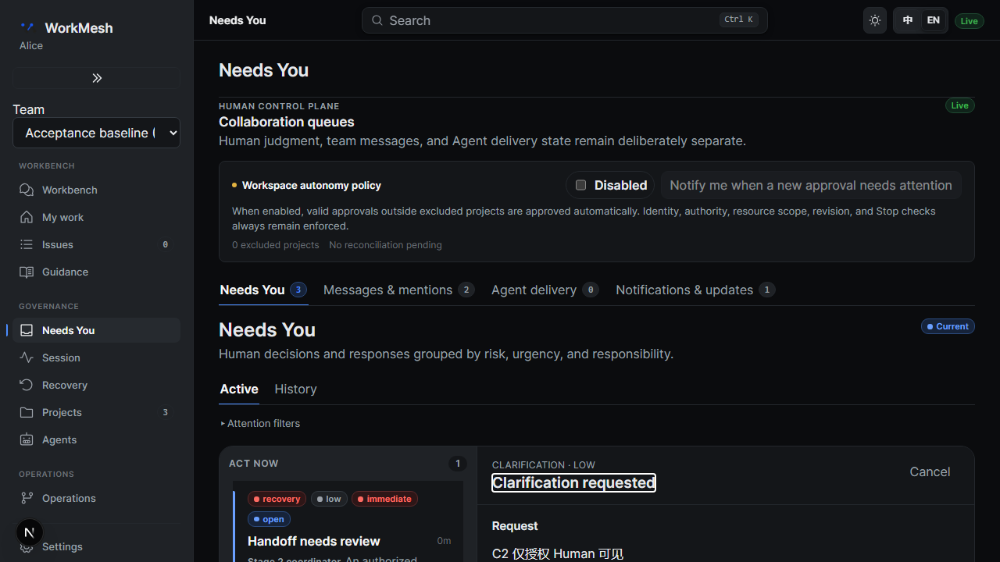
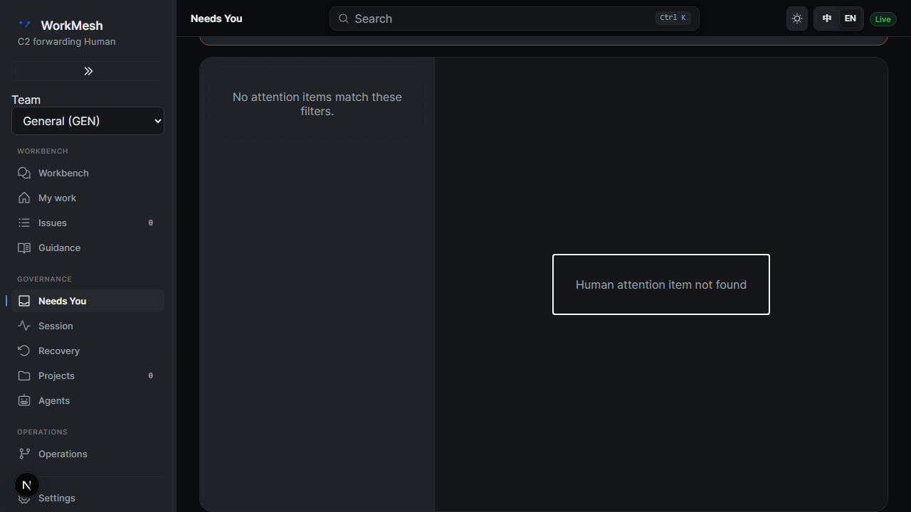

# C2 产品审阅入口

已实现企业微信单向低敏 Markdown 提醒及 canonical 登录安全返回，复用 C1 target、intent、delivery、发送 checkpoint、授权锁、fenced ACK 和 unknown 对账。未新增 target CRUD、队列、身份桥接、回调或决策按钮，未真实外发。

## 实现与配置

- `apps/worker/src/wecom-notifications.ts`：官方端点严格白名单、4096 UTF-8 内容字节、公共 DNS 固定连接、64 KiB 有界响应/Zod、提供方明确拒绝与网络 unknown 分离、秘密 HMAC 频控。额度不按预留时点出窗，最早 D+60 秒；可信完成更晚时按完成+60 秒保留，token 独立释放，Redis 丢失共同冷却 120 秒。
- `apps/worker/src/automation.ts` 与 `packages/db/src/channel-notifications.ts`：许可在精确候选 claim 前取得，锁后重读当前权限并核许可/真实租期，再提交发送 checkpoint；频控等待延后原 delivery，预算不消耗，不确定结果不自动重送。
- Worker registry/API 配置、三份 compose、环境示例和 `docs/production-deployment.md`：渠道默认关闭；启用要求 Redis、HTTPS WEB_ORIGIN、当前 Human 本人安全秘密引用。C3 目录/A1 拒绝/C1 授权语义保留；无数据库迁移或新增 API/领域事件。
- 网页 `safeLoginReturnTo`、登录和 Attention：拒绝外域/协议相对/控制字符/凭据/畸形编码/登录循环；只返回同源路径。登录前 hydration 门禁及 POST 表单防原生 GET 泄露；返回后按当前 Human 重新读取。转发详情 GET 404、失权重新登录；返回、Back/Forward、关闭详情焦点与迟响应取消都有实际断言。

## 验证与复现（61736fa 历史受测源码）

前四项正式必需检查回执：[results.json](product/20261008T160516Z-c88908/results.json)；正式根 `pnpm test:e2e` 回执：[E2E results.json](product/20261008T162342Z-55df46/results.json)。前一轮 E2E 因共享端口已占用在启动前失败，保留原退出码；端口自行释放后只重跑失败的根 E2E，不接管其它任务服务。两轮各自使用独有随机凭据和 PostgreSQL/Redis/S3，五项命令的源码前后及跨轮指纹完全一致，未将不同源码拼成通过。Node `.node-version` 指定的运行时和 pnpm 子进程路径已实读；每个命令记录 UTC 起止、PID、退出码。五项 `pnpm lint`、`pnpm typecheck`、`pnpm test`、`pnpm test:integration`、`pnpm test:e2e` 均退出 0。API/Web 单元先在前四项这一轮同源码、同 env 顺序实际执行，正式 `pnpm test` 复用其本轮绿色 Turbo 缓存并检查全部包，不借历史检查冒当前通过。集成分组实际结果：DB 80 通过、0 skip；API 197 通过、1 skip；Worker 113 通过、1 skip；可选 recovery 1 skip；E2E 71 项通过。Skip 不计通过，未启用的可选 recovery/retention/runner 夹具不冒作实证。

复现完整检查：`python docs/reviews/c2/product/run-checks.py full`；C2 定向：同脚本 `targeted` 或 `e2e`。脚本只创建带本轮随机归属标签的 PostgreSQL/Redis/S3，凭据仅随机环境变量，成功或失败均保全脱敏日志后逐容器退出清理。检查不向企业微信发请求；提供方均注入 fake。API integration 已有 Redis，因此 C2 真实 Lua 用例落在 `apps/api/integration/wecom-notifications.integration.test.ts`，C1 的原 Worker 文件保持不变；CI 工作流和空白门禁保持原样。

六原验收和九类逐条结果：[当前矩阵](../../plan/c2-wecom/test-coverage.json) 的 `currentProductExecution`；旧原文、历史阶段与未运行的规划矩阵保持冻结。补充 `pnpm ci:validate` 成功日志见 [ci-validate-final.log](product/ci-validate-final.log)。此前失败、夹具修正与未运行后续命令见 [verification.json](product/verification.json)，原脱敏日志 ZIP 的 CRC、大小及哈希见 [log-archive-index.json](product/log-archive-index.json)。未放宽断言、timeout、CI 策略；本机单元 forks 仅子进程限为 1，避免默认无限 forks 与同机其它任务竞争。

此前完整 E2E 的焦点及测试清理失败已修正：详情获得焦点后支持 Escape 关闭并恢复触发按钮，原测试新增详情关闭和 URL 清除断言；测试 Human 被登录审计引用时保持停用，追加审计事实随专用数据库整体回收。共用 HTTP helper 保持旧 64 KiB 响应上限，新增不读取正文模式的超限负例。为恢复这一兼容行为而中止的检查另存 [真实停止回执](product/helper-compatibility-stop.json)，不计为通过，不改写原失败日志。

最终完整 PR 空白检查的首次失败见 [首败](product/final-checks-first.json)，复验见 [最终核验](product/final-checks.json)。仅可读日志移除文件末空行，原始 ZIP 未改写；[规范化索引](product/readable-log-normalization.json) 明确区分已有修改前指纹、原始 ZIP 与旧规则重建、本次实读。一次散件日志处理异常导致此前逐项修改回执未持久保存，该缺口保持，不伪补；`extra-checks.json` 的可读副本指纹保留初次生成时含义，当前副本指纹见规范化索引。没有空白豁免或门禁变更。

## UI 与资源

实施前真实 UI 对照回执：[baseline](product/20261008T151908Z-604b0c/results.json)。仅在没有活动产品检查时替换四份 UI 为 f7c226 输入字节，测试后逐份恢复原 SHA；不切分支或创建旧 worktree，不将基线检查当当前通过。可读前后截图见下方图库；视觉停点仍由 Chief 读回。

临时路径保全/逐路径清理见 [temporary-cleanup.json](product/temporary-cleanup.json)。截图、视频和 error-context 保留原字节；可能含测试会话、CSRF 或请求凭据的原 trace/auth 文件未提交，逐文件哈希与排除理由诚实记录。共享镜像、共享网络、当前和旧恢复工作树保留，未 global prune。历史删除操作的未知时间及逐项回执缺口不伪补。

## 尚未齐备的门禁

当前成果停 review，等待另一 Agent 实读成果独审、Chief 视觉停点、最新 PR Required CI、实际 main 合入及最终确认。上一轮 main 输入为 `18252ba8761aa810c3fd12d31ecae83e8b24d985`；不以文档通过、历史 CI 或 fake 消息冒作整卡验收与真实外发验证。

## 前后截图

两轮均插入相同内容的 C2 私有提醒；实施后的完整 E2E 还包含其它场景，因此列表和计数不同，不将这些测试数据差异当作产品改动。返回路径、当前身份和焦点以对应断言为证。

| 场景 | 实施前 | 实施后 |
| --- | --- | --- |
| 登录 |  |  |
| 有权详情 |  |  |

无权转发者实际页面：

截图原字节与来源见 [ui-index.json](product/ui-index.json)；浏览器 URL、当前身份和焦点通过实际 Playwright 断言，截图不冒作路径/授权证明。

<!-- C2-QUOTA-RECOVERY -->

## 当前频控恢复修订

本轮 quota 丢失恢复及真实 Redis 负例见 [当前复审](quota-recovery/review.md)。上文旧绿色/源码指纹/首败保持历史含义，本轮五项检查及最新 main 输入另存独立回执；独审与最终门禁仍待。

<!-- C2-BACKEND-CANDIDATE -->

当前权威交付已收窄为后端独立候选。旧 UI 实现、失败、截图与未接受状态均为历史，五项旧绿色不借给新候选；当前来源/切片/新实测/消费者限制/清理和剩余门禁见 [后端复核入口](backend/review.md)。
